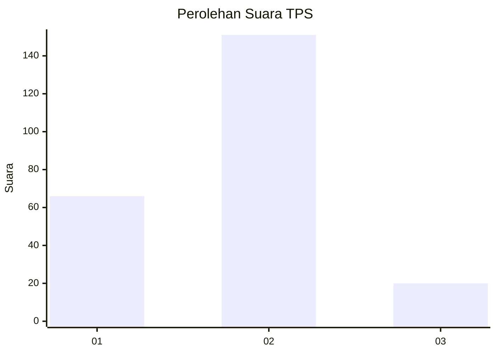
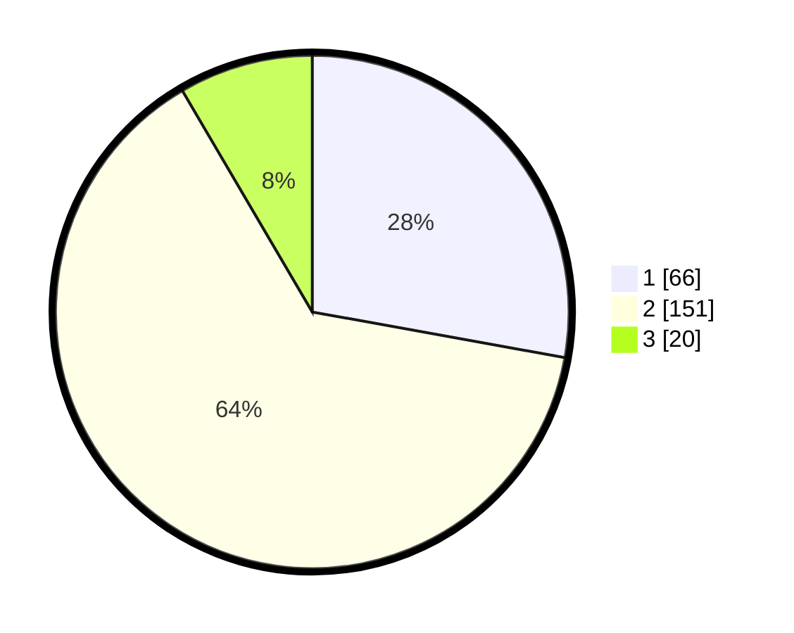

# Hasil

## Grafik

## Tabel

| No. | Nama Paslon    | Suara | Suara (raw) | Persentase |
|:--- |:-------------- | -----:| -----------:| ----------:|
| 1   | ANIES MUHAIMIN | 66    | [66][p-1]   | 27,85      |
| 2   | PRABOWO GIBRAN | 151   | [151][p-2]  | 63,71      |
| 3   | GANJAR MAHFUD  | 20    | [20][p-3]   | 8,44       |

[p-1]: https://github.com/gigit-pemilu/pemilu-2024-62-kalimantan-tengah/blob/main/pilpres/hitung-suara/sub/62-kalimantan-tengah/sub/01-kotawaringin-barat/sub/01-kumai/sub/1011-candi/sub/002-tps/sub/paslon-1.txt
[p-2]: https://github.com/gigit-pemilu/pemilu-2024-62-kalimantan-tengah/blob/main/pilpres/hitung-suara/sub/62-kalimantan-tengah/sub/01-kotawaringin-barat/sub/01-kumai/sub/1011-candi/sub/002-tps/sub/paslon-2.txt
[p-3]: https://github.com/gigit-pemilu/pemilu-2024-62-kalimantan-tengah/blob/main/pilpres/hitung-suara/sub/62-kalimantan-tengah/sub/01-kotawaringin-barat/sub/01-kumai/sub/1011-candi/sub/002-tps/sub/paslon-3.txt

## Foto C Plano

https://sirekap-obj-formc.kpu.go.id/66e3/pemilu/ppwp/62/01/01/10/11/6201011011002-20240215-134039--226de7fe-0467-4c86-a51b-8e4abc32bbec.jpg

https://sirekap-obj-formc.kpu.go.id/66e3/pemilu/ppwp/62/01/01/10/11/6201011011002-20240215-195106--3d640541-9996-4694-9456-a605cabab919.jpg

https://sirekap-obj-formc.kpu.go.id/66e3/pemilu/ppwp/62/01/01/10/11/6201011011002-20240215-145654--158f49c6-ca13-4629-8bea-153748e05719.jpg

## Metadata

| Key        | Value               |
| ---------- | ------------------- |
| Time Stamp | 2024-02-15 21:30:27 |

## DATA PEMILIH TETAP

Jumlah pemilih dalam DPT: **299**.
 * L: **159**.
 * P: **140**.

## DATA PENGGUNA HAK PILIH

Jumlah pengguna hak pilih dalam DPT: **237**.
 * L: **125**.
 * P: **112**.

Jumlah pengguna hak pilih dalam DPTb: **1**.
 * L: **1**.
 * P: **0**.

Jumlah pengguna hak pilih dalam DPK: **4**.
 * L: **3**.
 * P: **1**.

Jumlah pengguna hak pilih: **242**.
 * L: **129**.
 * P: **113**.

## JUMLAH SUARA SAH DAN TIDAK SAH

JUMLAH SELURUH SUARA SAH: **237**.

JUMLAH SUARA TIDAK SAH: **5**.

JUMLAH SELURUH SUARA SAH DAN SUARA TIDAK SAH: **242**.

