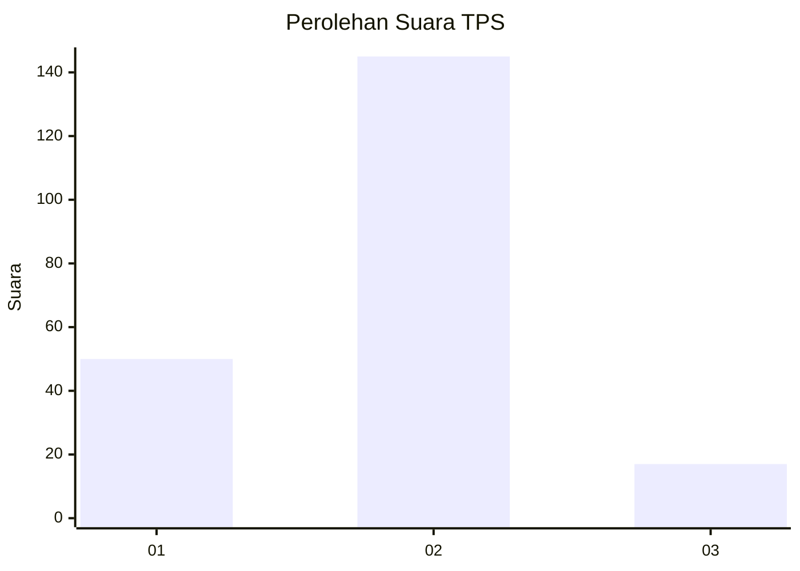
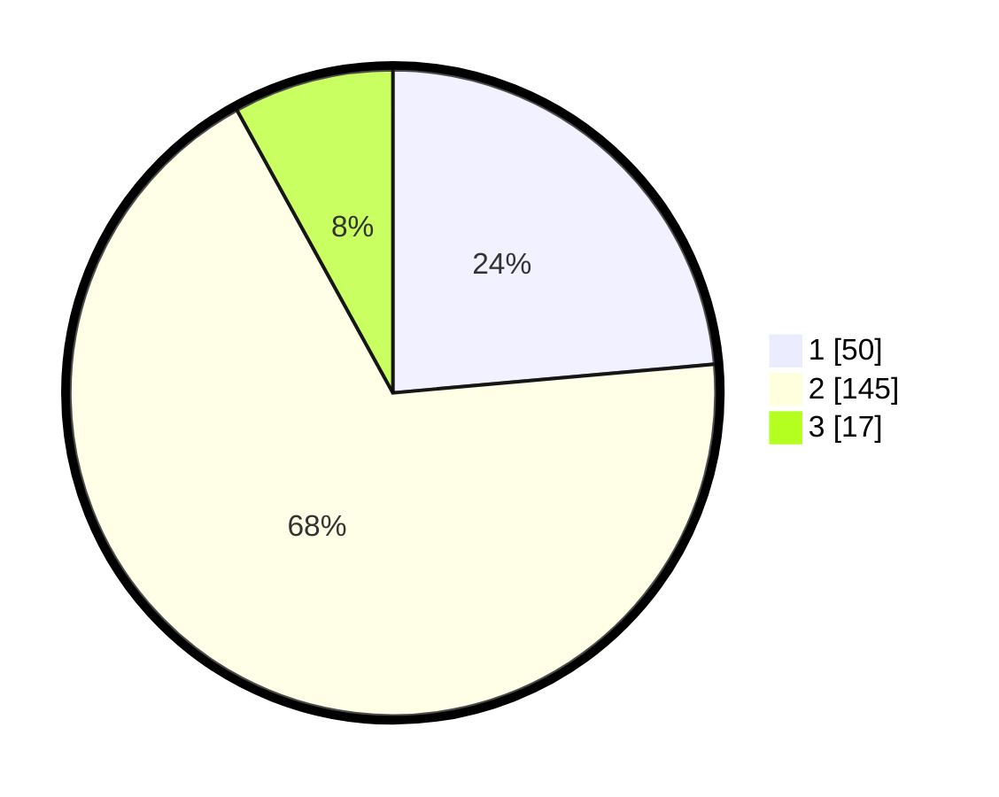

# Hasil

## Grafik

## Tabel

| No. | Nama Paslon    | Suara | Suara (raw) | Persentase |
|:--- |:-------------- | -----:| -----------:| ----------:|
| 1   | ANIES MUHAIMIN | 50    | [50][p-1]   | 23,58      |
| 2   | PRABOWO GIBRAN | 145   | [145][p-2]  | 68,40      |
| 3   | GANJAR MAHFUD  | 17    | [17][p-3]   | 8,02       |

[p-1]: https://github.com/gigit-pemilu/pemilu-2024-62-kalimantan-tengah/blob/main/pilpres/hitung-suara/sub/62-kalimantan-tengah/sub/01-kotawaringin-barat/sub/01-kumai/sub/1011-candi/sub/004-tps/sub/paslon-1.txt
[p-2]: https://github.com/gigit-pemilu/pemilu-2024-62-kalimantan-tengah/blob/main/pilpres/hitung-suara/sub/62-kalimantan-tengah/sub/01-kotawaringin-barat/sub/01-kumai/sub/1011-candi/sub/004-tps/sub/paslon-2.txt
[p-3]: https://github.com/gigit-pemilu/pemilu-2024-62-kalimantan-tengah/blob/main/pilpres/hitung-suara/sub/62-kalimantan-tengah/sub/01-kotawaringin-barat/sub/01-kumai/sub/1011-candi/sub/004-tps/sub/paslon-3.txt

## Foto C Plano

https://sirekap-obj-formc.kpu.go.id/64d4/pemilu/ppwp/62/01/01/10/11/6201011011004-20240214-233909--7cc9ba4c-ca47-4e12-bf9f-cab906f92699.jpg

https://sirekap-obj-formc.kpu.go.id/64d4/pemilu/ppwp/62/01/01/10/11/6201011011004-20240214-162236--6b2e4b7e-3670-463b-8fbd-e907a05cfccc.jpg

https://sirekap-obj-formc.kpu.go.id/64d4/pemilu/ppwp/62/01/01/10/11/6201011011004-20240214-233943--5ffb6236-3afc-4f16-ba78-3c30e3709035.jpg

## Metadata

| Key        | Value               |
| ---------- | ------------------- |
| Time Stamp | 2024-02-15 18:00:26 |

## DATA PEMILIH TETAP

Jumlah pemilih dalam DPT: **270**.
 * L: **138**.
 * P: **132**.

## DATA PENGGUNA HAK PILIH

Jumlah pengguna hak pilih dalam DPT: **212**.
 * L: **108**.
 * P: **104**.

Jumlah pengguna hak pilih dalam DPTb: **1**.
 * L: **1**.
 * P: **0**.

Jumlah pengguna hak pilih dalam DPK: **3**.
 * L: **1**.
 * P: **2**.

Jumlah pengguna hak pilih: **216**.
 * L: **110**.
 * P: **106**.

## JUMLAH SUARA SAH DAN TIDAK SAH

JUMLAH SELURUH SUARA SAH: **212**.

JUMLAH SUARA TIDAK SAH: **4**.

JUMLAH SELURUH SUARA SAH DAN SUARA TIDAK SAH: **216**.

