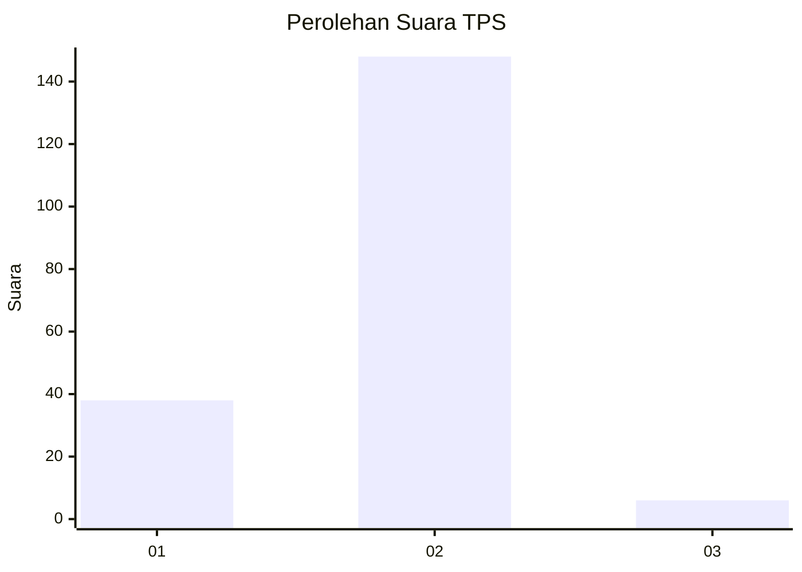
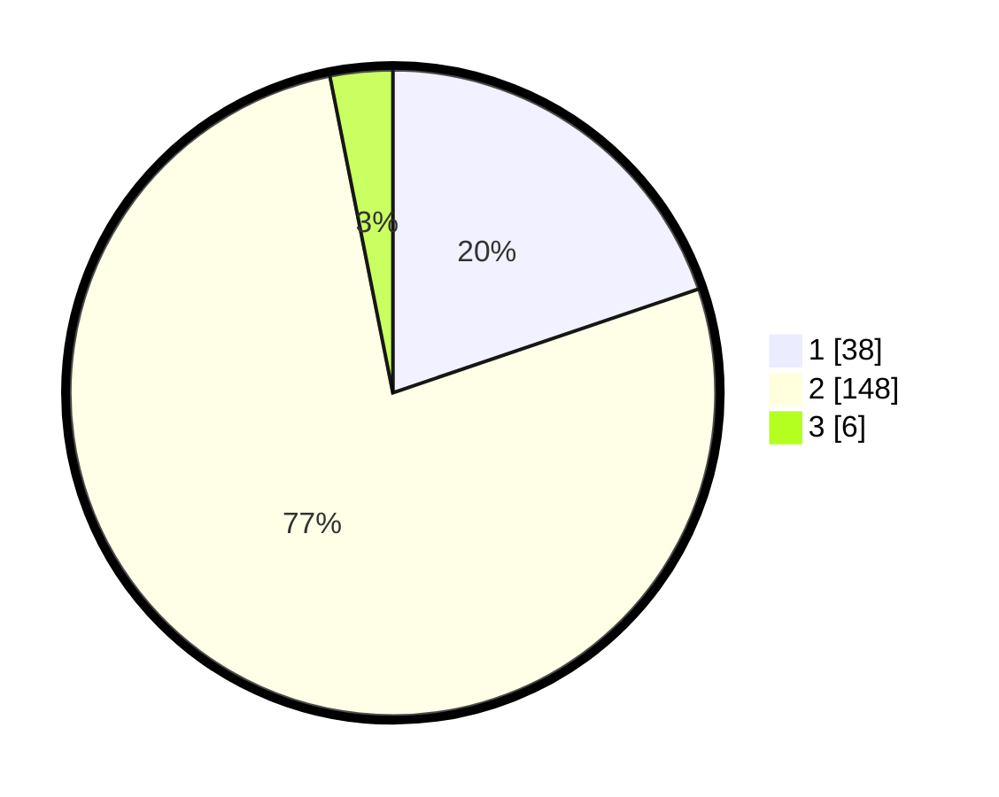

# Hasil

## Grafik

## Tabel

| No. | Nama Paslon    | Suara | Suara (raw) | Persentase |
|:--- |:-------------- | -----:| -----------:| ----------:|
| 1   | ANIES MUHAIMIN | 38    | [38][p-1]   | 19,79      |
| 2   | PRABOWO GIBRAN | 148   | [148][p-2]  | 77,08      |
| 3   | GANJAR MAHFUD  | 6     | [6][p-3]    | 3,13       |

[p-1]: https://github.com/gigit-pemilu/pemilu-2024-62-kalimantan-tengah/blob/main/pilpres/hitung-suara/sub/62-kalimantan-tengah/sub/01-kotawaringin-barat/sub/01-kumai/sub/1011-candi/sub/007-tps/sub/paslon-1.txt
[p-2]: https://github.com/gigit-pemilu/pemilu-2024-62-kalimantan-tengah/blob/main/pilpres/hitung-suara/sub/62-kalimantan-tengah/sub/01-kotawaringin-barat/sub/01-kumai/sub/1011-candi/sub/007-tps/sub/paslon-2.txt
[p-3]: https://github.com/gigit-pemilu/pemilu-2024-62-kalimantan-tengah/blob/main/pilpres/hitung-suara/sub/62-kalimantan-tengah/sub/01-kotawaringin-barat/sub/01-kumai/sub/1011-candi/sub/007-tps/sub/paslon-3.txt

## Foto C Plano

https://sirekap-obj-formc.kpu.go.id/242f/pemilu/ppwp/62/01/01/10/11/6201011011007-20240215-202916--7ab117c0-821f-456c-b7d4-59fb14c74cbb.jpg

https://sirekap-obj-formc.kpu.go.id/242f/pemilu/ppwp/62/01/01/10/11/6201011011007-20240215-203044--1869337e-d68c-4d8c-b5e6-c7bd8f492fac.jpg

https://sirekap-obj-formc.kpu.go.id/242f/pemilu/ppwp/62/01/01/10/11/6201011011007-20240215-203236--3ccb2b8d-fb1e-4c05-83a6-6d40407a15c0.jpg

## Metadata

| Key        | Value               |
| ---------- | ------------------- |
| Time Stamp | 2024-02-16 01:00:27 |

