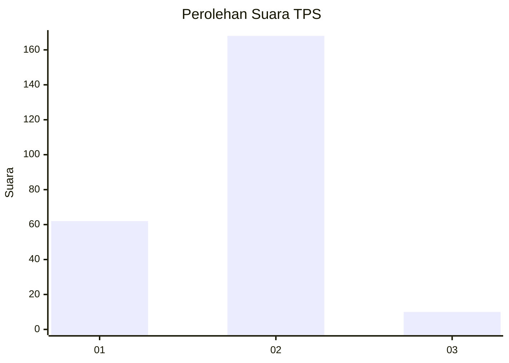
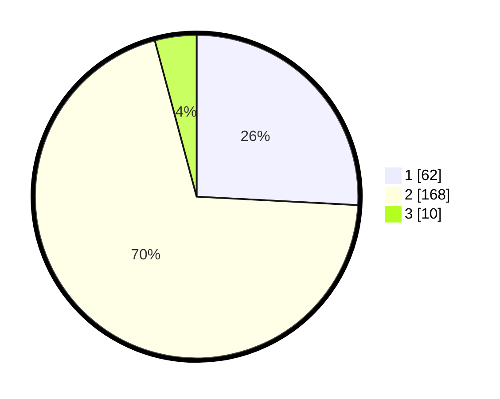

# Hasil

## Grafik

## Tabel

| No. | Nama Paslon    | Suara | Suara (raw) | Persentase |
|:--- |:-------------- | -----:| -----------:| ----------:|
| 1   | ANIES MUHAIMIN | 62    | [62][p-1]   | 25,83      |
| 2   | PRABOWO GIBRAN | 168   | [168][p-2]  | 70,00      |
| 3   | GANJAR MAHFUD  | 10    | [10][p-3]   | 4,17       |

[p-1]: https://github.com/gigit-pemilu/pemilu-2024-62-kalimantan-tengah/blob/main/pilpres/hitung-suara/sub/62-kalimantan-tengah/sub/01-kotawaringin-barat/sub/01-kumai/sub/1011-candi/sub/008-tps/sub/paslon-1.txt
[p-2]: https://github.com/gigit-pemilu/pemilu-2024-62-kalimantan-tengah/blob/main/pilpres/hitung-suara/sub/62-kalimantan-tengah/sub/01-kotawaringin-barat/sub/01-kumai/sub/1011-candi/sub/008-tps/sub/paslon-2.txt
[p-3]: https://github.com/gigit-pemilu/pemilu-2024-62-kalimantan-tengah/blob/main/pilpres/hitung-suara/sub/62-kalimantan-tengah/sub/01-kotawaringin-barat/sub/01-kumai/sub/1011-candi/sub/008-tps/sub/paslon-3.txt

## Foto C Plano

https://sirekap-obj-formc.kpu.go.id/519e/pemilu/ppwp/62/01/01/10/11/6201011011008-20240215-201238--7eab8201-88fa-46de-812b-7e4a7a8ba973.jpg

https://sirekap-obj-formc.kpu.go.id/519e/pemilu/ppwp/62/01/01/10/11/6201011011008-20240215-201547--11c9a60c-e7ba-45ab-8b3d-8b96900d4ada.jpg

https://sirekap-obj-formc.kpu.go.id/519e/pemilu/ppwp/62/01/01/10/11/6201011011008-20240215-201720--c1a40ade-39f6-45d3-b414-b29b6874cc68.jpg

## Metadata

| Key        | Value               |
| ---------- | ------------------- |
| Time Stamp | 2024-02-15 22:00:27 |

