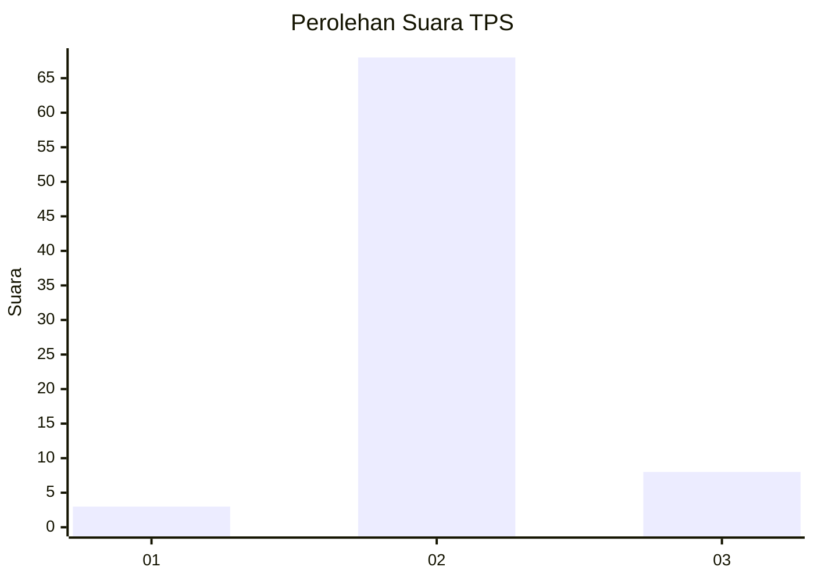
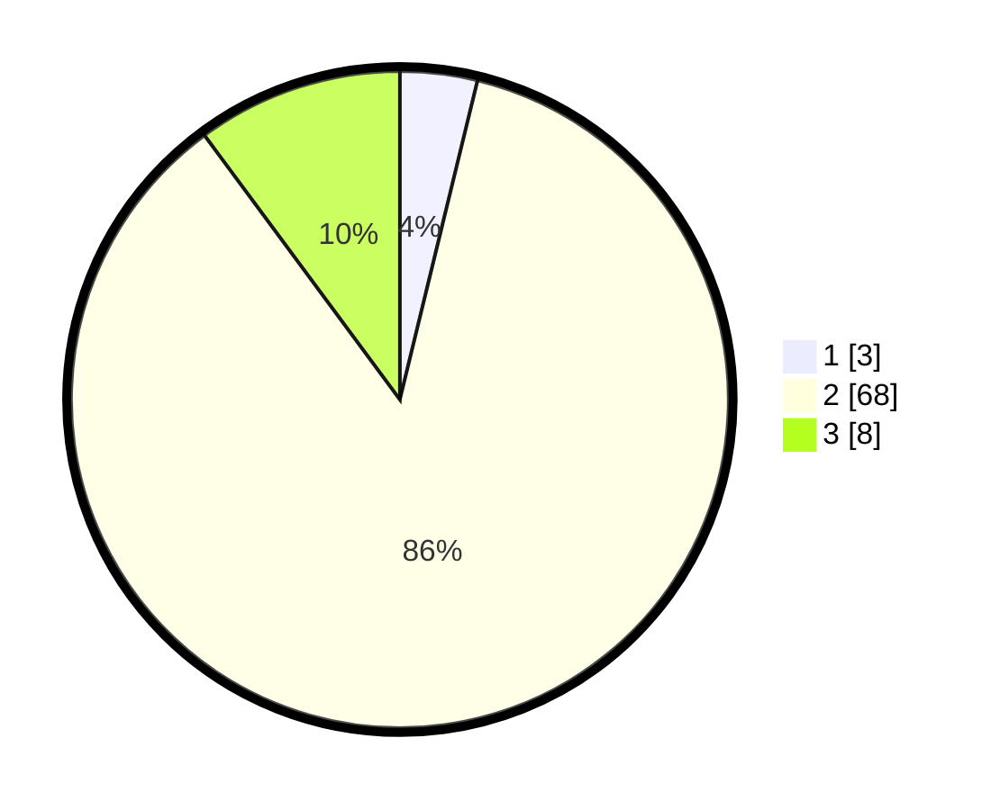

# Hasil

## Grafik

## Tabel

| No. | Nama Paslon    | Suara | Suara (raw) | Persentase |
|:--- |:-------------- | -----:| -----------:| ----------:|
| 1   | ANIES MUHAIMIN | 3     | [3][p-1]    | 3,80       |
| 2   | PRABOWO GIBRAN | 68    | [68][p-2]   | 86,08      |
| 3   | GANJAR MAHFUD  | 8     | [8][p-3]    | 10,13      |

[p-1]: https://github.com/gigit-pemilu/pemilu-2024-62-kalimantan-tengah/blob/main/pilpres/hitung-suara/sub/62-kalimantan-tengah/sub/01-kotawaringin-barat/sub/01-kumai/sub/2015-sungai-bedaun/sub/005-tps/sub/paslon-1.txt
[p-2]: https://github.com/gigit-pemilu/pemilu-2024-62-kalimantan-tengah/blob/main/pilpres/hitung-suara/sub/62-kalimantan-tengah/sub/01-kotawaringin-barat/sub/01-kumai/sub/2015-sungai-bedaun/sub/005-tps/sub/paslon-2.txt
[p-3]: https://github.com/gigit-pemilu/pemilu-2024-62-kalimantan-tengah/blob/main/pilpres/hitung-suara/sub/62-kalimantan-tengah/sub/01-kotawaringin-barat/sub/01-kumai/sub/2015-sungai-bedaun/sub/005-tps/sub/paslon-3.txt

## Foto C Plano

https://sirekap-obj-formc.kpu.go.id/b6b0/pemilu/ppwp/62/01/01/20/15/6201012015005-20240216-085647--a693a557-f8cc-43c3-9e8d-ca18e57ccbfc.jpg

https://sirekap-obj-formc.kpu.go.id/b6b0/pemilu/ppwp/62/01/01/20/15/6201012015005-20240216-085658--d759afe3-ff88-4743-838a-cb1a445c4ea8.jpg

https://sirekap-obj-formc.kpu.go.id/b6b0/pemilu/ppwp/62/01/01/20/15/6201012015005-20240216-085655--b7066212-f396-463f-9328-9542cd45a16d.jpg

## Metadata

| Key        | Value               |
| ---------- | ------------------- |
| Time Stamp | 2024-02-16 22:01:00 |

## DATA PEMILIH TETAP

Jumlah pemilih dalam DPT: **82**.
 * L: **43**.
 * P: **39**.

## DATA PENGGUNA HAK PILIH

Jumlah pengguna hak pilih dalam DPT: **60**.
 * L: **33**.
 * P: **27**.

Jumlah pengguna hak pilih dalam DPTb: **3**.
 * L: **3**.
 * P: **0**.

Jumlah pengguna hak pilih dalam DPK: **16**.
 * L: **12**.
 * P: **4**.

Jumlah pengguna hak pilih: **79**.
 * L: **48**.
 * P: **31**.

## JUMLAH SUARA SAH DAN TIDAK SAH

JUMLAH SELURUH SUARA SAH: **79**.

JUMLAH SUARA TIDAK SAH: **0**.

JUMLAH SELURUH SUARA SAH DAN SUARA TIDAK SAH: **79**.

