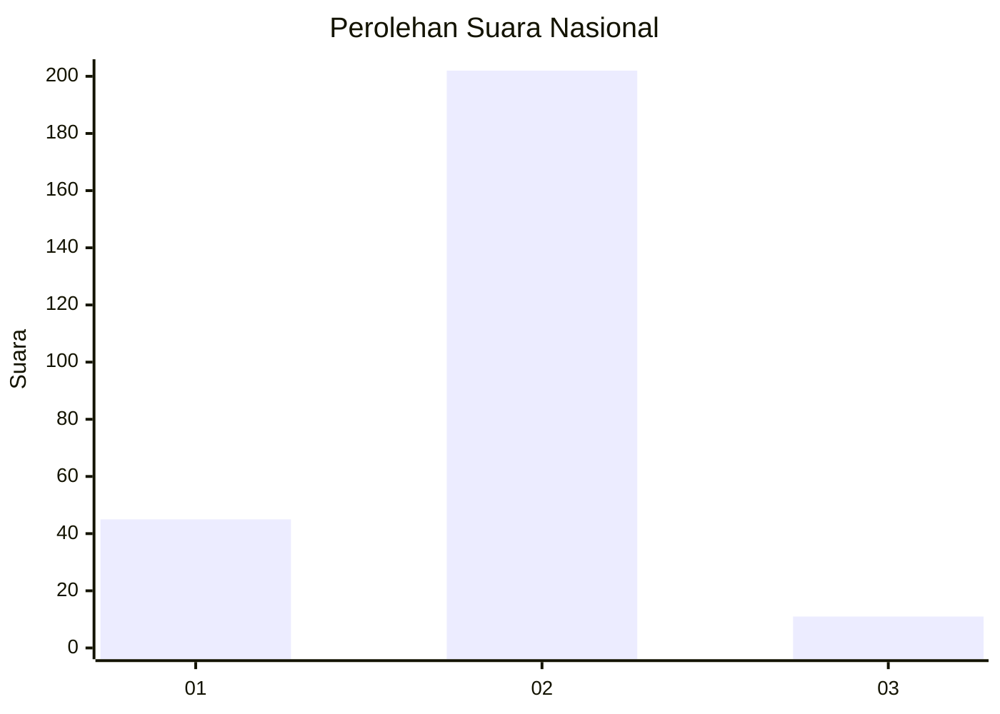
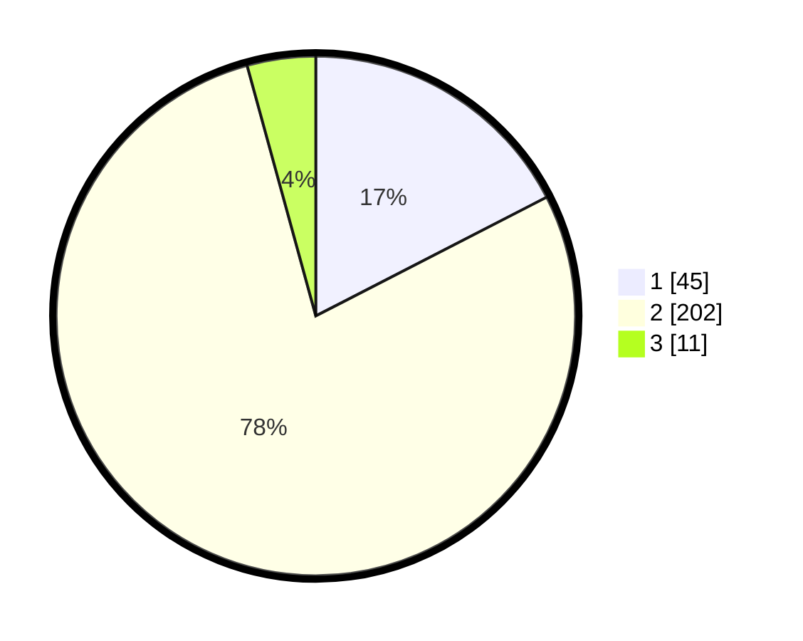

# Hasil

## Grafik

## Tabel

| No. | Nama Paslon    | Suara | Suara (raw) | Persentase |
|:--- |:-------------- | -----:| -----------:| ----------:|
| 1   | ANIES MUHAIMIN | 45    | [45][p-1]   | 17,44      |
| 2   | PRABOWO GIBRAN | 202   | [202][p-2]  | 78,29      |
| 3   | GANJAR MAHFUD  | 11    | [11][p-3]   | 4,26       |

[p-1]: https://github.com/gigit-pemilu/pemilu-2024/blob/main/pilpres/hitung-suara/sub/62-kalimantan-tengah/sub/01-kotawaringin-barat/sub/02-arut-selatan/sub/2001-tanjung-putri/sub/001-tps/sub/paslon-1.txt
[p-2]: https://github.com/gigit-pemilu/pemilu-2024/blob/main/pilpres/hitung-suara/sub/62-kalimantan-tengah/sub/01-kotawaringin-barat/sub/02-arut-selatan/sub/2001-tanjung-putri/sub/001-tps/sub/paslon-2.txt
[p-3]: https://github.com/gigit-pemilu/pemilu-2024/blob/main/pilpres/hitung-suara/sub/62-kalimantan-tengah/sub/01-kotawaringin-barat/sub/02-arut-selatan/sub/2001-tanjung-putri/sub/001-tps/sub/paslon-3.txt

## Foto C Plano

https://sirekap-obj-formc.kpu.go.id/fe2f/pemilu/ppwp/62/01/02/20/01/6201022001001-20240221-235354--2a0cdb77-71ad-44e2-9ced-c1a604c350a6.jpg

https://sirekap-obj-formc.kpu.go.id/fe2f/pemilu/ppwp/62/01/02/20/01/6201022001001-20240221-235407--e1436867-6713-4cb2-abd1-3914ca15eeeb.jpg

https://sirekap-obj-formc.kpu.go.id/fe2f/pemilu/ppwp/62/01/02/20/01/6201022001001-20240221-235416--9c169c1e-7bad-47bc-973f-3967b90dc477.jpg

## Metadata

| Key        | Value               |
| ---------- | ------------------- |
| Time Stamp | 2024-02-22 00:00:00 |

