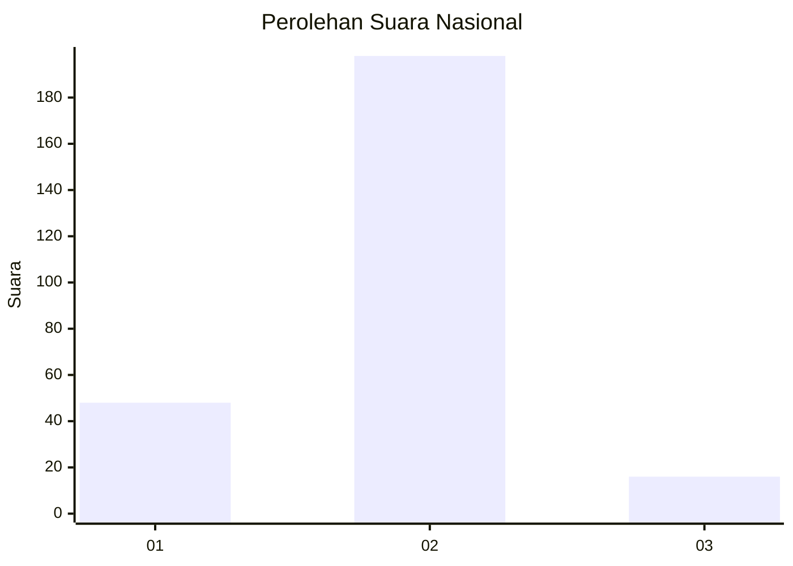
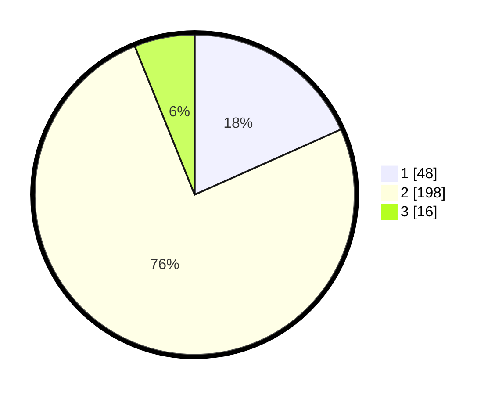

# Hasil

## Grafik

## Tabel

| No. | Nama Paslon    | Suara | Suara (raw) | Persentase |
|:--- |:-------------- | -----:| -----------:| ----------:|
| 1   | ANIES MUHAIMIN | 48    | [48][p-1]   | 18,32      |
| 2   | PRABOWO GIBRAN | 198   | [198][p-2]  | 75,57      |
| 3   | GANJAR MAHFUD  | 16    | [16][p-3]   | 6,11       |

[p-1]: https://github.com/gigit-pemilu/pemilu-2024/blob/main/pilpres/hitung-suara/sub/62-kalimantan-tengah/sub/02-kotawaringin-timur/sub/01-kota-besi/sub/1009-kota-besi-hulu/sub/001-tps/sub/paslon-1.txt
[p-2]: https://github.com/gigit-pemilu/pemilu-2024/blob/main/pilpres/hitung-suara/sub/62-kalimantan-tengah/sub/02-kotawaringin-timur/sub/01-kota-besi/sub/1009-kota-besi-hulu/sub/001-tps/sub/paslon-2.txt
[p-3]: https://github.com/gigit-pemilu/pemilu-2024/blob/main/pilpres/hitung-suara/sub/62-kalimantan-tengah/sub/02-kotawaringin-timur/sub/01-kota-besi/sub/1009-kota-besi-hulu/sub/001-tps/sub/paslon-3.txt

## Foto C Plano

https://sirekap-obj-formc.kpu.go.id/0c08/pemilu/ppwp/62/02/01/10/09/6202011009001-20240220-114929--900e18e2-9b7f-43c8-8f0e-24e4ceeb0c6c.jpg

https://sirekap-obj-formc.kpu.go.id/0c08/pemilu/ppwp/62/02/01/10/09/6202011009001-20240220-115040--9c4f99fc-dda7-4cdc-b920-d4cce86fca8e.jpg

https://sirekap-obj-formc.kpu.go.id/0c08/pemilu/ppwp/62/02/01/10/09/6202011009001-20240220-115132--70e372a5-5205-4b24-bae2-244ed8a51946.jpg

## Metadata

| Key        | Value               |
| ---------- | ------------------- |
| Time Stamp | 2024-02-20 20:00:00 |

