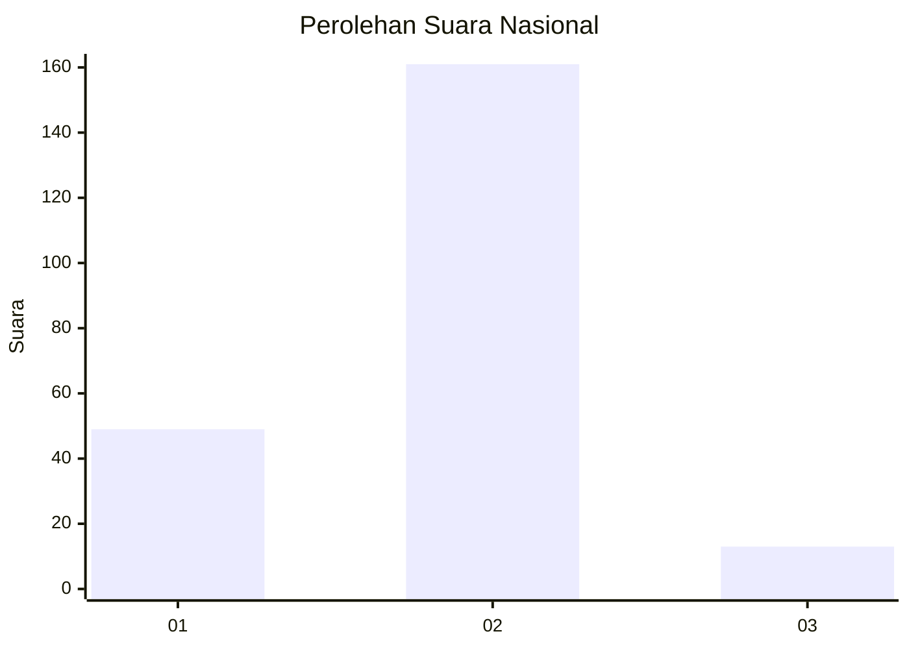

# Hasil

## Grafik

## Tabel

| No. | Nama Paslon    | Suara | Suara (raw) | Persentase |
|:--- |:-------------- | -----:| -----------:| ----------:|
| 1   | ANIES MUHAIMIN | 49    | [49][p-1]   | 21,97      |
| 2   | PRABOWO GIBRAN | 161   | [161][p-2]  | 72,20      |
| 3   | GANJAR MAHFUD  | 13    | [13][p-3]   | 5,83       |

[p-1]: https://github.com/gigit-pemilu/pemilu-2024/blob/main/pilpres/hitung-suara/sub/62-kalimantan-tengah/sub/02-kotawaringin-timur/sub/01-kota-besi/sub/1009-kota-besi-hulu/sub/002-tps/sub/paslon-1.txt
[p-2]: https://github.com/gigit-pemilu/pemilu-2024/blob/main/pilpres/hitung-suara/sub/62-kalimantan-tengah/sub/02-kotawaringin-timur/sub/01-kota-besi/sub/1009-kota-besi-hulu/sub/002-tps/sub/paslon-2.txt
[p-3]: https://github.com/gigit-pemilu/pemilu-2024/blob/main/pilpres/hitung-suara/sub/62-kalimantan-tengah/sub/02-kotawaringin-timur/sub/01-kota-besi/sub/1009-kota-besi-hulu/sub/002-tps/sub/paslon-3.txt

## Foto C Plano

https://sirekap-obj-formc.kpu.go.id/92e5/pemilu/ppwp/62/02/01/10/09/6202011009002-20240220-123511--b51f635f-9c83-4927-b7c3-f54b754c3e46.jpg

https://sirekap-obj-formc.kpu.go.id/92e5/pemilu/ppwp/62/02/01/10/09/6202011009002-20240220-123610--4b07889d-3000-48ed-b9d4-ec050d5a993e.jpg

https://sirekap-obj-formc.kpu.go.id/92e5/pemilu/ppwp/62/02/01/10/09/6202011009002-20240220-123720--b245425d-7b83-4f7b-b0dd-44ac5480c039.jpg

## Metadata

| Key        | Value               |
| ---------- | ------------------- |
| Time Stamp | 2024-02-20 20:00:00 |

