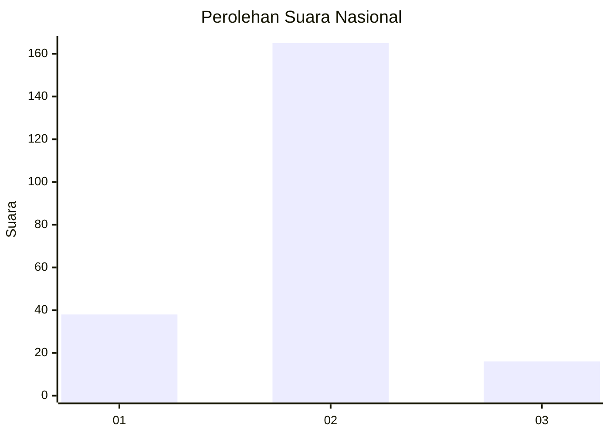
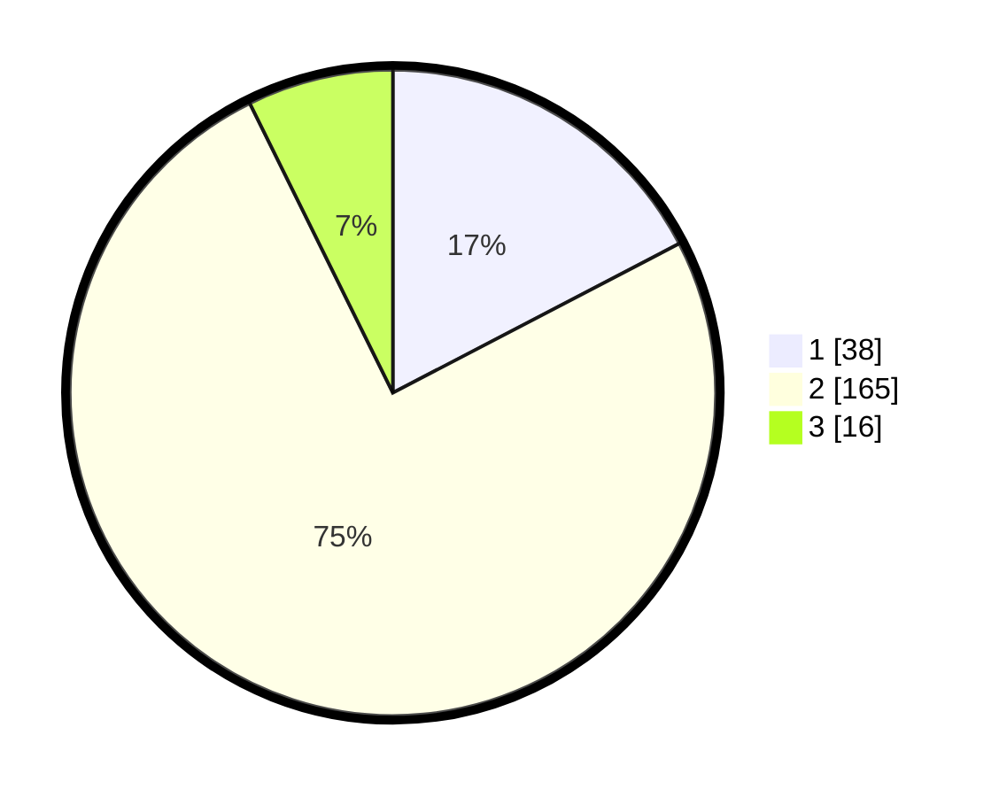

# Hasil

## Grafik

## Tabel

| No. | Nama Paslon    | Suara | Suara (raw) | Persentase |
|:--- |:-------------- | -----:| -----------:| ----------:|
| 1   | ANIES MUHAIMIN | 38    | [38][p-1]   | 17,35      |
| 2   | PRABOWO GIBRAN | 165   | [165][p-2]  | 75,34      |
| 3   | GANJAR MAHFUD  | 16    | [16][p-3]   | 7,31       |

[p-1]: https://github.com/gigit-pemilu/pemilu-2024/blob/main/pilpres/hitung-suara/sub/62-kalimantan-tengah/sub/02-kotawaringin-timur/sub/01-kota-besi/sub/1009-kota-besi-hulu/sub/003-tps/sub/paslon-1.txt
[p-2]: https://github.com/gigit-pemilu/pemilu-2024/blob/main/pilpres/hitung-suara/sub/62-kalimantan-tengah/sub/02-kotawaringin-timur/sub/01-kota-besi/sub/1009-kota-besi-hulu/sub/003-tps/sub/paslon-2.txt
[p-3]: https://github.com/gigit-pemilu/pemilu-2024/blob/main/pilpres/hitung-suara/sub/62-kalimantan-tengah/sub/02-kotawaringin-timur/sub/01-kota-besi/sub/1009-kota-besi-hulu/sub/003-tps/sub/paslon-3.txt

## Foto C Plano

https://sirekap-obj-formc.kpu.go.id/6491/pemilu/ppwp/62/02/01/10/09/6202011009003-20240220-124910--12776409-7236-437e-bae2-ef4e140e642e.jpg

https://sirekap-obj-formc.kpu.go.id/6491/pemilu/ppwp/62/02/01/10/09/6202011009003-20240220-124927--1dec6962-8c50-42e8-8fdc-be19a158ed86.jpg

https://sirekap-obj-formc.kpu.go.id/6491/pemilu/ppwp/62/02/01/10/09/6202011009003-20240220-124955--30119e4c-a771-4137-b40e-2d9a6153f0ca.jpg

## Metadata

| Key        | Value               |
| ---------- | ------------------- |
| Time Stamp | 2024-02-20 20:00:00 |

