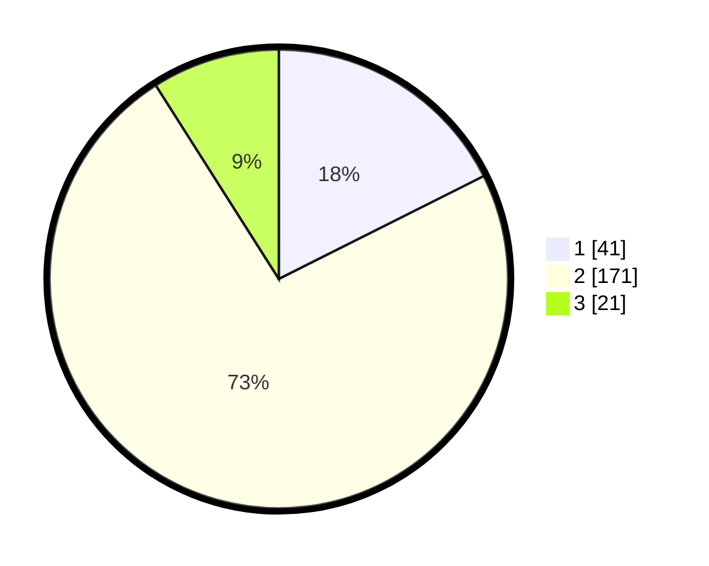

# Hasil

## Grafik

## Tabel

| No. | Nama Paslon    | Suara | Suara (raw) | Persentase |
|:--- |:-------------- | -----:| -----------:| ----------:|
| 1   | ANIES MUHAIMIN | 41    | [41][p-1]   | 17,60      |
| 2   | PRABOWO GIBRAN | 171   | [171][p-2]  | 73,39      |
| 3   | GANJAR MAHFUD  | 21    | [21][p-3]   | 9,01       |

[p-1]: https://github.com/gigit-pemilu/pemilu-2024/blob/main/pilpres/hitung-suara/sub/62-kalimantan-tengah/sub/02-kotawaringin-timur/sub/01-kota-besi/sub/1009-kota-besi-hulu/sub/004-tps/sub/paslon-1.txt
[p-2]: https://github.com/gigit-pemilu/pemilu-2024/blob/main/pilpres/hitung-suara/sub/62-kalimantan-tengah/sub/02-kotawaringin-timur/sub/01-kota-besi/sub/1009-kota-besi-hulu/sub/004-tps/sub/paslon-2.txt
[p-3]: https://github.com/gigit-pemilu/pemilu-2024/blob/main/pilpres/hitung-suara/sub/62-kalimantan-tengah/sub/02-kotawaringin-timur/sub/01-kota-besi/sub/1009-kota-besi-hulu/sub/004-tps/sub/paslon-3.txt

## Foto C Plano

https://sirekap-obj-formc.kpu.go.id/a673/pemilu/ppwp/62/02/01/10/09/6202011009004-20240220-152459--a3c48a1a-1fc1-4be7-bfd6-6aa1b12ac9ff.jpg

https://sirekap-obj-formc.kpu.go.id/a673/pemilu/ppwp/62/02/01/10/09/6202011009004-20240220-152532--e5875264-449f-442c-916c-ba3393ccf506.jpg

https://sirekap-obj-formc.kpu.go.id/a673/pemilu/ppwp/62/02/01/10/09/6202011009004-20240220-152601--ee745e4f-1bb3-41e7-bb6c-2cd0558ed2ec.jpg

## Metadata

| Key        | Value               |
| ---------- | ------------------- |
| Time Stamp | 2024-02-20 20:00:00 |

