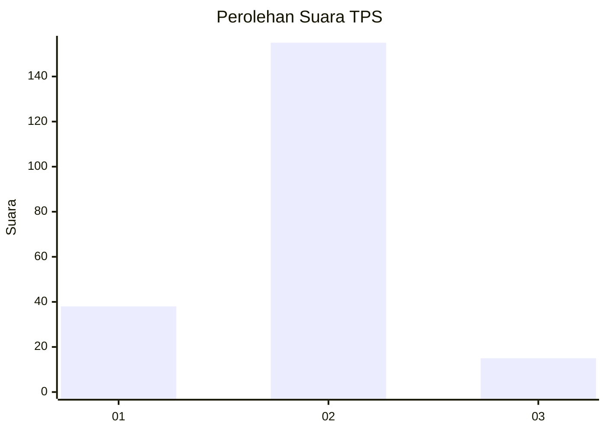
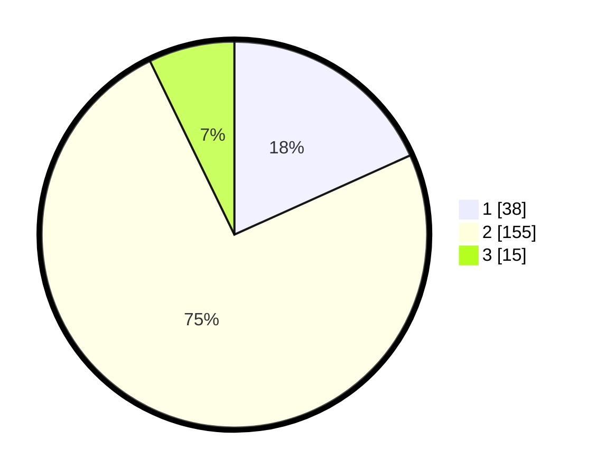

# Hasil

## Grafik

## Tabel

| No. | Nama Paslon    | Suara | Suara (raw) | Persentase |
|:--- |:-------------- | -----:| -----------:| ----------:|
| 1   | ANIES MUHAIMIN | 38    | [38][p-1]   | 18,27      |
| 2   | PRABOWO GIBRAN | 155   | [155][p-2]  | 74,52      |
| 3   | GANJAR MAHFUD  | 15    | [15][p-3]   | 7,21       |

[p-1]: https://github.com/gigit-pemilu/pemilu-2024-62-kalimantan-tengah/blob/main/pilpres/hitung-suara/sub/62-kalimantan-tengah/sub/02-kotawaringin-timur/sub/01-kota-besi/sub/1009-kota-besi-hulu/sub/005-tps/sub/paslon-1.txt
[p-2]: https://github.com/gigit-pemilu/pemilu-2024-62-kalimantan-tengah/blob/main/pilpres/hitung-suara/sub/62-kalimantan-tengah/sub/02-kotawaringin-timur/sub/01-kota-besi/sub/1009-kota-besi-hulu/sub/005-tps/sub/paslon-2.txt
[p-3]: https://github.com/gigit-pemilu/pemilu-2024-62-kalimantan-tengah/blob/main/pilpres/hitung-suara/sub/62-kalimantan-tengah/sub/02-kotawaringin-timur/sub/01-kota-besi/sub/1009-kota-besi-hulu/sub/005-tps/sub/paslon-3.txt

## Foto C Plano

https://sirekap-obj-formc.kpu.go.id/a228/pemilu/ppwp/62/02/01/10/09/6202011009005-20240220-134446--fac52ecb-a980-46dc-bf7d-b243b317c673.jpg

https://sirekap-obj-formc.kpu.go.id/a228/pemilu/ppwp/62/02/01/10/09/6202011009005-20240220-134551--18baa3c2-811c-4c28-a907-b8d81a5a4f5e.jpg

https://sirekap-obj-formc.kpu.go.id/a228/pemilu/ppwp/62/02/01/10/09/6202011009005-20240220-134628--212bf63e-8378-46f7-9bf5-862584cb565d.jpg

## Metadata

| Key        | Value               |
| ---------- | ------------------- |
| Time Stamp | 2024-02-20 21:00:00 |

