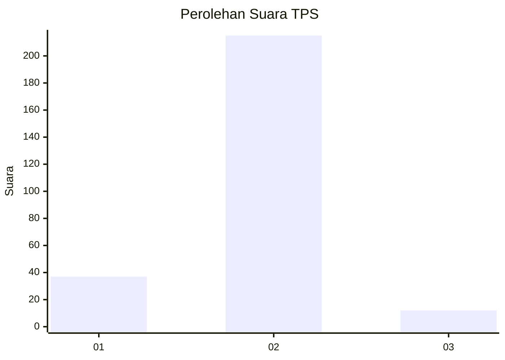
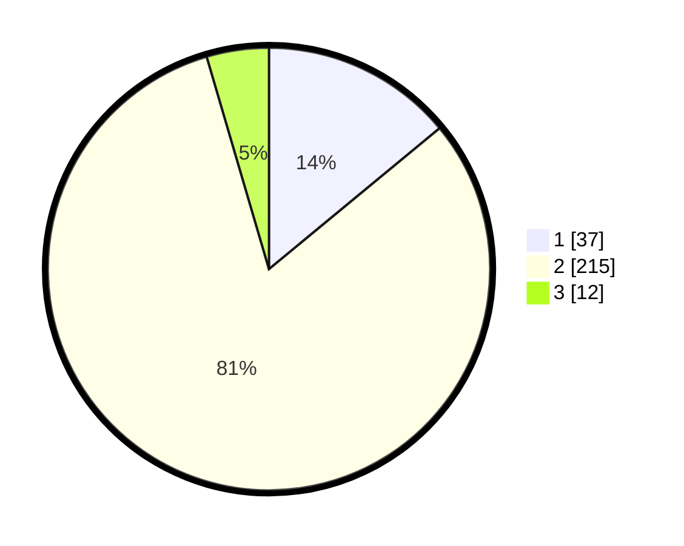

# Hasil

## Grafik

## Tabel

| No. | Nama Paslon    | Suara | Suara (raw) | Persentase |
|:--- |:-------------- | -----:| -----------:| ----------:|
| 1   | ANIES MUHAIMIN | 37    | [37][p-1]   | 14,02      |
| 2   | PRABOWO GIBRAN | 215   | [215][p-2]  | 81,44      |
| 3   | GANJAR MAHFUD  | 12    | [12][p-3]   | 4,55       |

[p-1]: https://github.com/gigit-pemilu/pemilu-2024-62-kalimantan-tengah/blob/main/pilpres/hitung-suara/sub/62-kalimantan-tengah/sub/02-kotawaringin-timur/sub/01-kota-besi/sub/1009-kota-besi-hulu/sub/008-tps/sub/paslon-1.txt
[p-2]: https://github.com/gigit-pemilu/pemilu-2024-62-kalimantan-tengah/blob/main/pilpres/hitung-suara/sub/62-kalimantan-tengah/sub/02-kotawaringin-timur/sub/01-kota-besi/sub/1009-kota-besi-hulu/sub/008-tps/sub/paslon-2.txt
[p-3]: https://github.com/gigit-pemilu/pemilu-2024-62-kalimantan-tengah/blob/main/pilpres/hitung-suara/sub/62-kalimantan-tengah/sub/02-kotawaringin-timur/sub/01-kota-besi/sub/1009-kota-besi-hulu/sub/008-tps/sub/paslon-3.txt

## Foto C Plano

https://sirekap-obj-formc.kpu.go.id/6b43/pemilu/ppwp/62/02/01/10/09/6202011009008-20240220-162634--c838ec8c-908b-4cfc-9533-ba6b0be10f29.jpg

https://sirekap-obj-formc.kpu.go.id/6b43/pemilu/ppwp/62/02/01/10/09/6202011009008-20240220-162716--547c3314-b86b-445d-ae7c-6d62fe50fbd1.jpg

https://sirekap-obj-formc.kpu.go.id/6b43/pemilu/ppwp/62/02/01/10/09/6202011009008-20240220-162747--8b308e7e-c78f-4d3d-98fb-27945ff97a2d.jpg

## Metadata

| Key        | Value               |
| ---------- | ------------------- |
| Time Stamp | 2024-02-20 21:00:00 |

