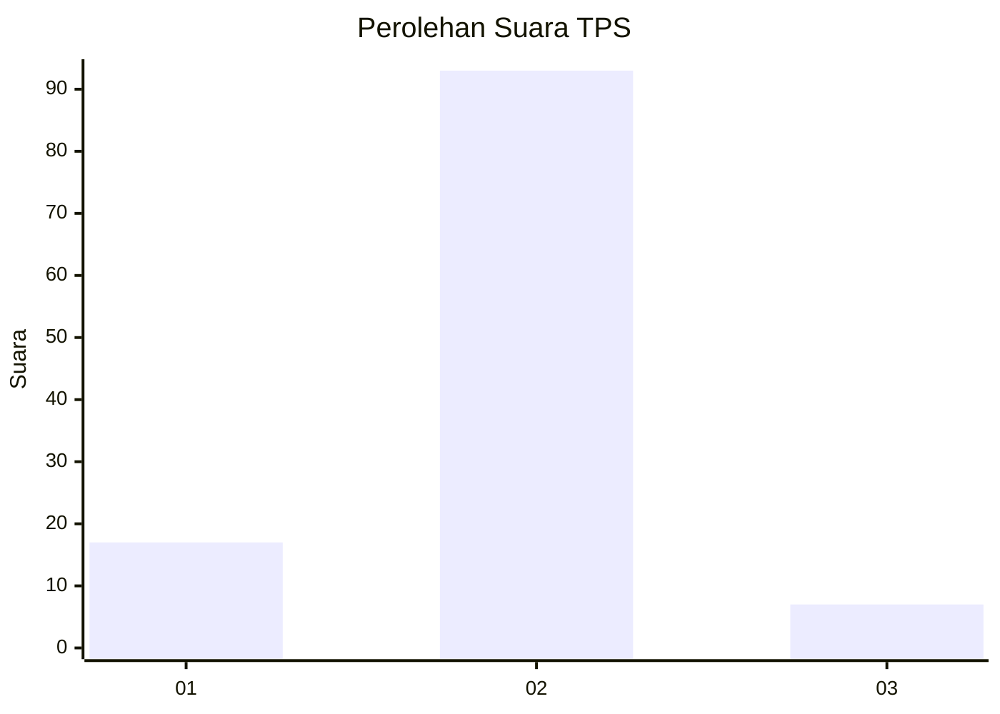
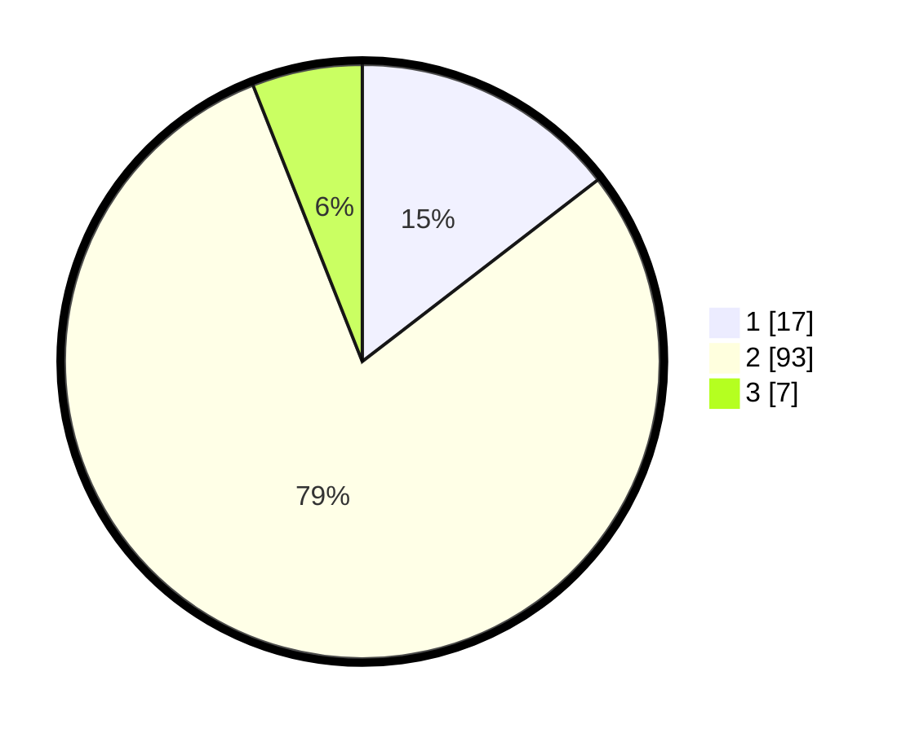

# Hasil

## Grafik

## Tabel

| No. | Nama Paslon    | Suara | Suara (raw) | Persentase |
|:--- |:-------------- | -----:| -----------:| ----------:|
| 1   | ANIES MUHAIMIN | 17    | [17][p-1]   | 14,53      |
| 2   | PRABOWO GIBRAN | 93    | [93][p-2]   | 79,49      |
| 3   | GANJAR MAHFUD  | 7     | [7][p-3]    | 5,98       |

[p-1]: https://github.com/gigit-pemilu/pemilu-2024-62-kalimantan-tengah/blob/main/pilpres/hitung-suara/sub/62-kalimantan-tengah/sub/02-kotawaringin-timur/sub/01-kota-besi/sub/1009-kota-besi-hulu/sub/012-tps/sub/paslon-1.txt
[p-2]: https://github.com/gigit-pemilu/pemilu-2024-62-kalimantan-tengah/blob/main/pilpres/hitung-suara/sub/62-kalimantan-tengah/sub/02-kotawaringin-timur/sub/01-kota-besi/sub/1009-kota-besi-hulu/sub/012-tps/sub/paslon-2.txt
[p-3]: https://github.com/gigit-pemilu/pemilu-2024-62-kalimantan-tengah/blob/main/pilpres/hitung-suara/sub/62-kalimantan-tengah/sub/02-kotawaringin-timur/sub/01-kota-besi/sub/1009-kota-besi-hulu/sub/012-tps/sub/paslon-3.txt

## Foto C Plano

https://sirekap-obj-formc.kpu.go.id/00e2/pemilu/ppwp/62/02/01/10/09/6202011009012-20240220-180040--677f6861-f190-4814-a01e-c307b421cf29.jpg

https://sirekap-obj-formc.kpu.go.id/00e2/pemilu/ppwp/62/02/01/10/09/6202011009012-20240220-180156--79e1c6d8-665e-4773-8e12-156176dbf618.jpg

https://sirekap-obj-formc.kpu.go.id/00e2/pemilu/ppwp/62/02/01/10/09/6202011009012-20240220-180247--69590a83-0850-4b62-80fc-5fe7b0440cb1.jpg

## Metadata

| Key        | Value               |
| ---------- | ------------------- |
| Time Stamp | 2024-02-20 21:00:00 |

