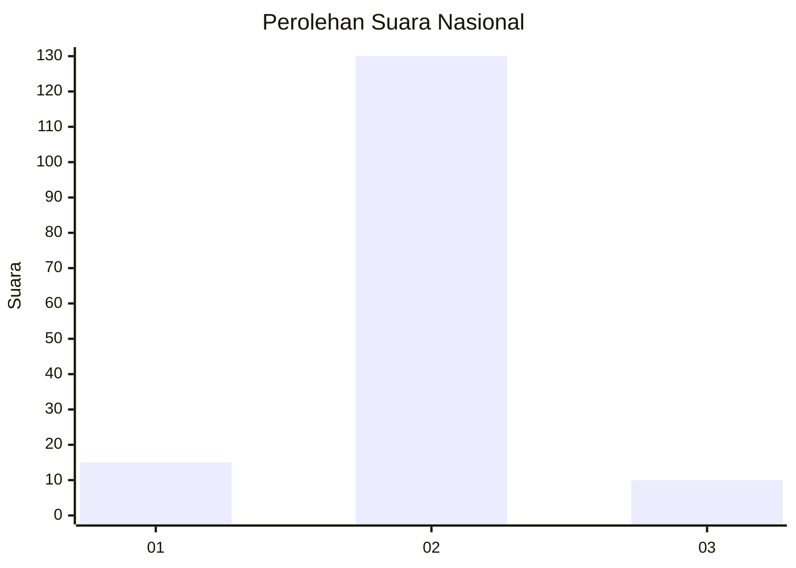
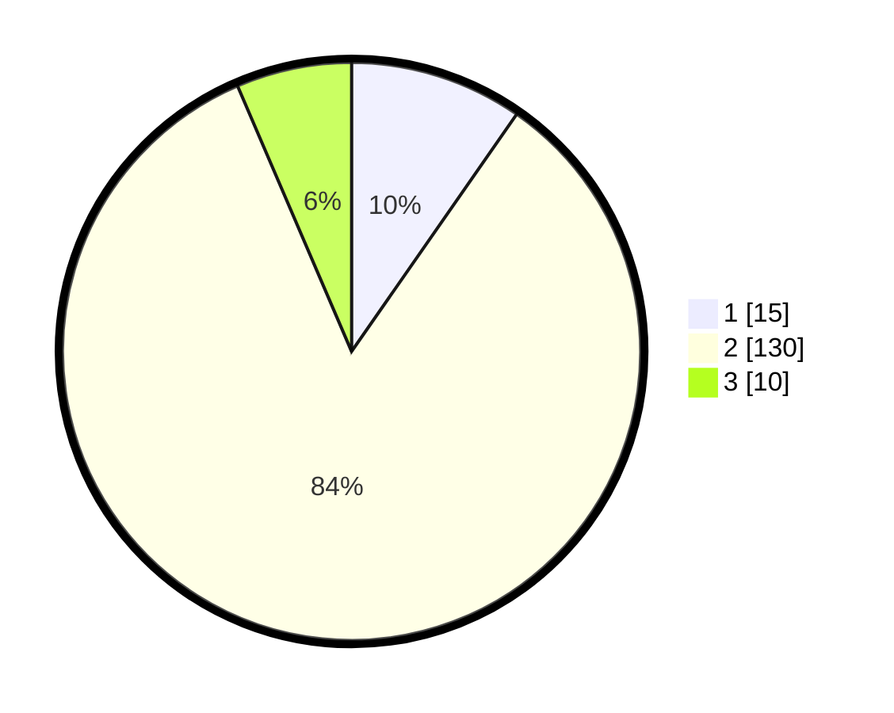

# Hasil

## Grafik

## Tabel

| No. | Nama Paslon    | Suara | Suara (raw) | Persentase |
|:--- |:-------------- | -----:| -----------:| ----------:|
| 1   | ANIES MUHAIMIN | 15    | [15][p-1]   | 9,68       |
| 2   | PRABOWO GIBRAN | 130   | [130][p-2]  | 83,87      |
| 3   | GANJAR MAHFUD  | 10    | [10][p-3]   | 6,45       |

[p-1]: https://github.com/gigit-pemilu/pemilu-2024/blob/main/pilpres/hitung-suara/sub/62-kalimantan-tengah/sub/02-kotawaringin-timur/sub/01-kota-besi/sub/2007-camba/sub/004-tps/sub/paslon-1.txt
[p-2]: https://github.com/gigit-pemilu/pemilu-2024/blob/main/pilpres/hitung-suara/sub/62-kalimantan-tengah/sub/02-kotawaringin-timur/sub/01-kota-besi/sub/2007-camba/sub/004-tps/sub/paslon-2.txt
[p-3]: https://github.com/gigit-pemilu/pemilu-2024/blob/main/pilpres/hitung-suara/sub/62-kalimantan-tengah/sub/02-kotawaringin-timur/sub/01-kota-besi/sub/2007-camba/sub/004-tps/sub/paslon-3.txt

## Foto C Plano

https://sirekap-obj-formc.kpu.go.id/8357/pemilu/ppwp/62/02/01/20/07/6202012007004-20240219-171456--3fbb9f2d-0b1a-4796-9cdc-6e6b16d36c50.jpg

https://sirekap-obj-formc.kpu.go.id/8357/pemilu/ppwp/62/02/01/20/07/6202012007004-20240219-171510--3258162d-a9a0-4994-aeaa-153772b08ce1.jpg

https://sirekap-obj-formc.kpu.go.id/8357/pemilu/ppwp/62/02/01/20/07/6202012007004-20240219-171440--466be6e7-5fd3-430a-b657-4fb0324b60c2.jpg

## Metadata

| Key        | Value               |
| ---------- | ------------------- |
| Time Stamp | 2024-02-20 21:00:00 |

