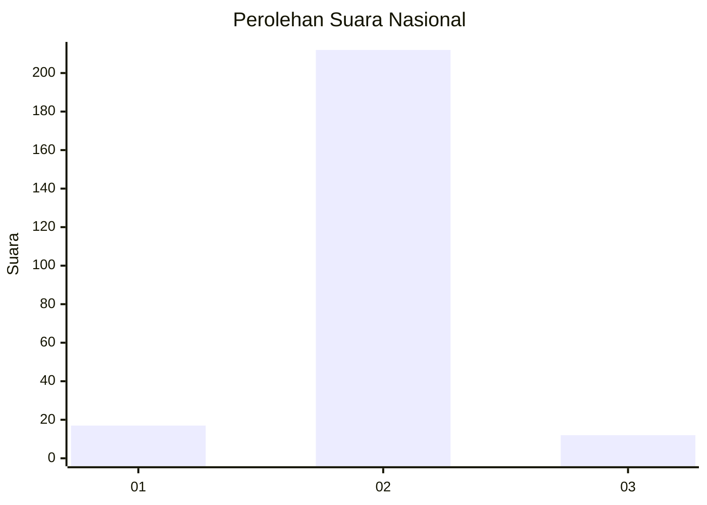
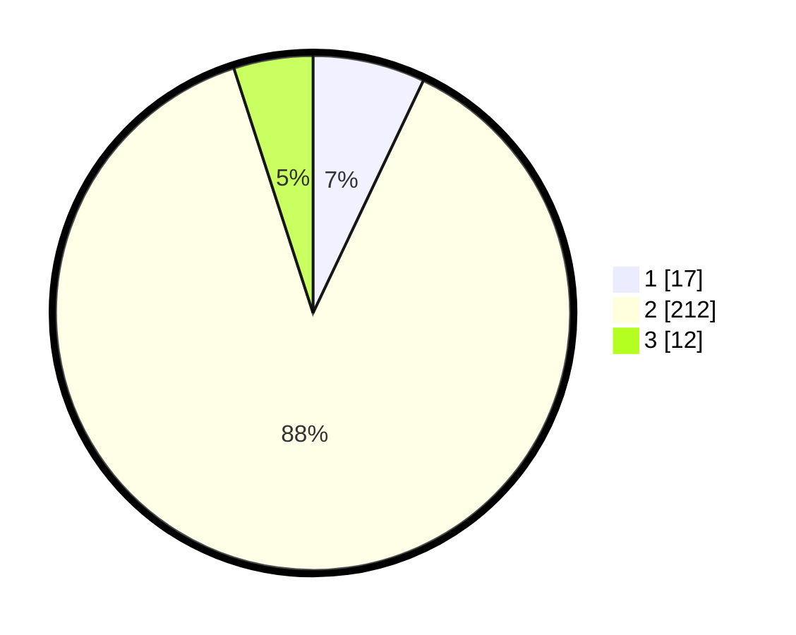

# Hasil

## Grafik

## Tabel

| No. | Nama Paslon    | Suara | Suara (raw) | Persentase |
|:--- |:-------------- | -----:| -----------:| ----------:|
| 1   | ANIES MUHAIMIN | 17    | [17][p-1]   | 7,05       |
| 2   | PRABOWO GIBRAN | 212   | [212][p-2]  | 87,97      |
| 3   | GANJAR MAHFUD  | 12    | [12][p-3]   | 4,98       |

[p-1]: https://github.com/gigit-pemilu/pemilu-2024/blob/main/pilpres/hitung-suara/sub/62-kalimantan-tengah/sub/02-kotawaringin-timur/sub/01-kota-besi/sub/2008-kandan/sub/004-tps/sub/paslon-1.txt
[p-2]: https://github.com/gigit-pemilu/pemilu-2024/blob/main/pilpres/hitung-suara/sub/62-kalimantan-tengah/sub/02-kotawaringin-timur/sub/01-kota-besi/sub/2008-kandan/sub/004-tps/sub/paslon-2.txt
[p-3]: https://github.com/gigit-pemilu/pemilu-2024/blob/main/pilpres/hitung-suara/sub/62-kalimantan-tengah/sub/02-kotawaringin-timur/sub/01-kota-besi/sub/2008-kandan/sub/004-tps/sub/paslon-3.txt

## Foto C Plano

https://sirekap-obj-formc.kpu.go.id/89b1/pemilu/ppwp/62/02/01/20/08/6202012008004-20240220-114945--7fede1d1-5d3f-4e77-a2f1-d3a636394d4d.jpg

https://sirekap-obj-formc.kpu.go.id/89b1/pemilu/ppwp/62/02/01/20/08/6202012008004-20240220-114913--7a73f575-e1a2-4727-a8ce-d34ba1529916.jpg

https://sirekap-obj-formc.kpu.go.id/89b1/pemilu/ppwp/62/02/01/20/08/6202012008004-20240220-114831--c4dddd3b-9784-476c-8651-ce936d6445d7.jpg

## Metadata

| Key        | Value               |
| ---------- | ------------------- |
| Time Stamp | 2024-02-20 21:00:00 |

