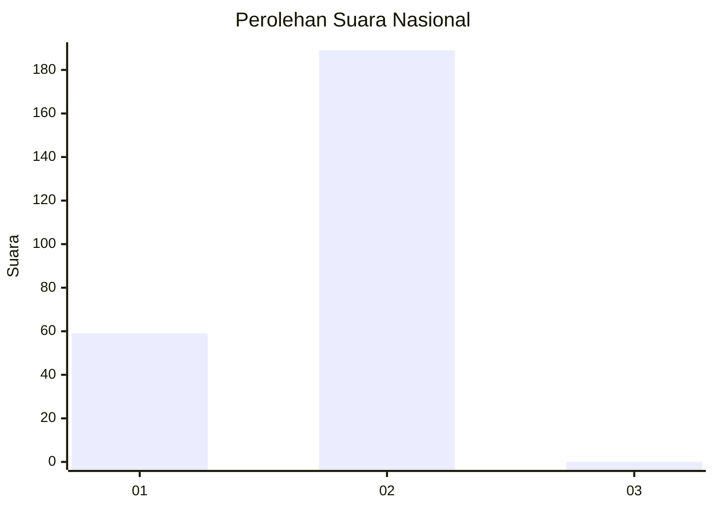
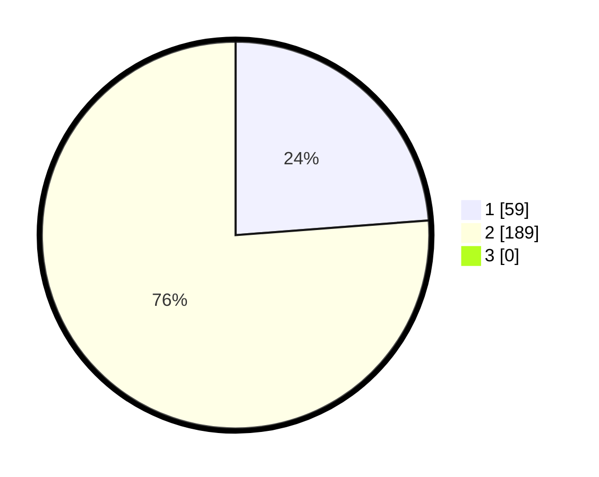

# Hasil

## Grafik

## Tabel

| No. | Nama Paslon    | Suara | Suara (raw) | Persentase |
|:--- |:-------------- | -----:| -----------:| ----------:|
| 1   | ANIES MUHAIMIN | 59    | [59][p-1]   | 23,79      |
| 2   | PRABOWO GIBRAN | 189   | [189][p-2]  | 76,21      |
| 3   | GANJAR MAHFUD  | 0     | [0][p-3]    | 0,00       |

[p-1]: https://github.com/gigit-pemilu/pemilu-2024/blob/main/pilpres/hitung-suara/sub/62-kalimantan-tengah/sub/02-kotawaringin-timur/sub/02-cempaga/sub/2006-luwuk-ranggan/sub/005-tps/sub/paslon-1.txt
[p-2]: https://github.com/gigit-pemilu/pemilu-2024/blob/main/pilpres/hitung-suara/sub/62-kalimantan-tengah/sub/02-kotawaringin-timur/sub/02-cempaga/sub/2006-luwuk-ranggan/sub/005-tps/sub/paslon-2.txt
[p-3]: https://github.com/gigit-pemilu/pemilu-2024/blob/main/pilpres/hitung-suara/sub/62-kalimantan-tengah/sub/02-kotawaringin-timur/sub/02-cempaga/sub/2006-luwuk-ranggan/sub/005-tps/sub/paslon-3.txt

## Foto C Plano

https://sirekap-obj-formc.kpu.go.id/4c01/pemilu/ppwp/62/02/02/20/06/6202022006005-20240221-070507--39a313ce-23a0-4ce0-b7ff-61d0f9976c2f.jpg

https://sirekap-obj-formc.kpu.go.id/4c01/pemilu/ppwp/62/02/02/20/06/6202022006005-20240214-215821--34e19fc4-5bba-4cb0-9f93-ee5af4c8e150.jpg

https://sirekap-obj-formc.kpu.go.id/4c01/pemilu/ppwp/62/02/02/20/06/6202022006005-20240221-092614--f37bb0ed-9af8-4cb1-8edf-525f0223122f.jpg

## Metadata

| Key        | Value               |
| ---------- | ------------------- |
| Time Stamp | 2024-02-21 10:00:00 |

## DATA PEMILIH TETAP

Jumlah pemilih dalam DPT: **86**.
 * L: **404**.
 * P: **462**.

## DATA PENGGUNA HAK PILIH

Jumlah pengguna hak pilih dalam DPT: **220**.
 * L: **224**.
 * P: **554**.

Jumlah pengguna hak pilih dalam DPTb: **20**.
 * L: **551**.
 * P: **0**.

Jumlah pengguna hak pilih dalam DPK: **110**.
 * L: **551**.
 * P: **70**.

Jumlah pengguna hak pilih: **41**.
 * L: **222**.
 * P: **552**.

## JUMLAH SUARA SAH DAN TIDAK SAH

JUMLAH SELURUH SUARA SAH: **0**.

JUMLAH SUARA TIDAK SAH: **0**.

JUMLAH SELURUH SUARA SAH DAN SUARA TIDAK SAH: **0**.

