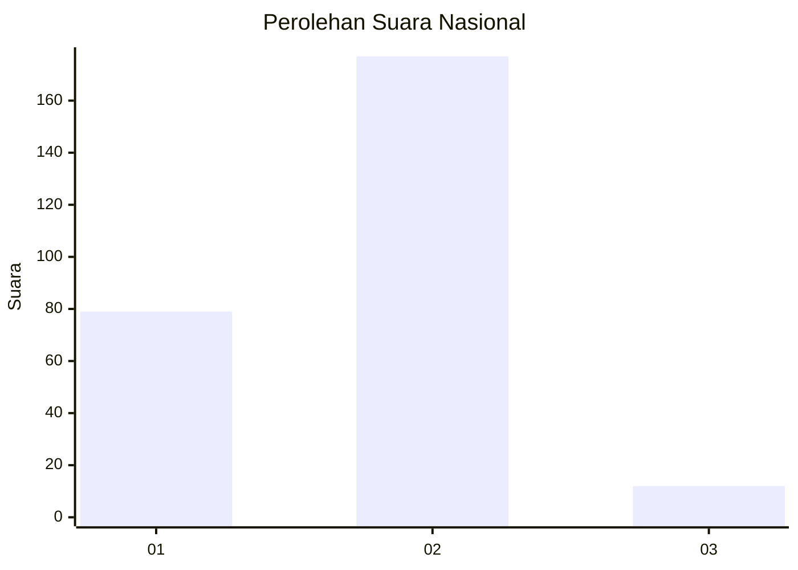
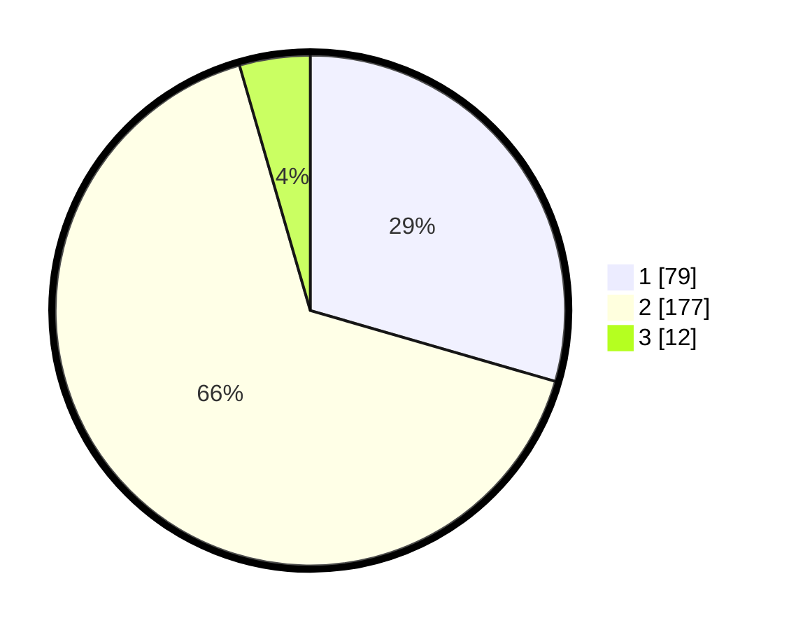

# Hasil

## Grafik

## Tabel

| No. | Nama Paslon    | Suara | Suara (raw) | Persentase |
|:--- |:-------------- | -----:| -----------:| ----------:|
| 1   | ANIES MUHAIMIN | 79    | [79][p-1]   | 29,48      |
| 2   | PRABOWO GIBRAN | 177   | [177][p-2]  | 66,04      |
| 3   | GANJAR MAHFUD  | 12    | [12][p-3]   | 4,48       |

[p-1]: https://github.com/gigit-pemilu/pemilu-2024/blob/main/pilpres/hitung-suara/sub/62-kalimantan-tengah/sub/02-kotawaringin-timur/sub/02-cempaga/sub/2009-cempaka-mulia-barat/sub/002-tps/sub/paslon-1.txt
[p-2]: https://github.com/gigit-pemilu/pemilu-2024/blob/main/pilpres/hitung-suara/sub/62-kalimantan-tengah/sub/02-kotawaringin-timur/sub/02-cempaga/sub/2009-cempaka-mulia-barat/sub/002-tps/sub/paslon-2.txt
[p-3]: https://github.com/gigit-pemilu/pemilu-2024/blob/main/pilpres/hitung-suara/sub/62-kalimantan-tengah/sub/02-kotawaringin-timur/sub/02-cempaga/sub/2009-cempaka-mulia-barat/sub/002-tps/sub/paslon-3.txt

## Foto C Plano

https://sirekap-obj-formc.kpu.go.id/d8ff/pemilu/ppwp/62/02/02/20/09/6202022009002-20240221-084637--1d28f69d-cd63-45cc-85e2-a49359ebee8e.jpg

https://sirekap-obj-formc.kpu.go.id/d8ff/pemilu/ppwp/62/02/02/20/09/6202022009002-20240221-090540--b5da9fe7-cd16-4c43-b936-b0a558074ce8.jpg

https://sirekap-obj-formc.kpu.go.id/d8ff/pemilu/ppwp/62/02/02/20/09/6202022009002-20240221-090708--9aa51b3f-41d4-4eb1-b0c7-57636f36e2f3.jpg

## Metadata

| Key        | Value               |
| ---------- | ------------------- |
| Time Stamp | 2024-02-21 10:00:00 |

