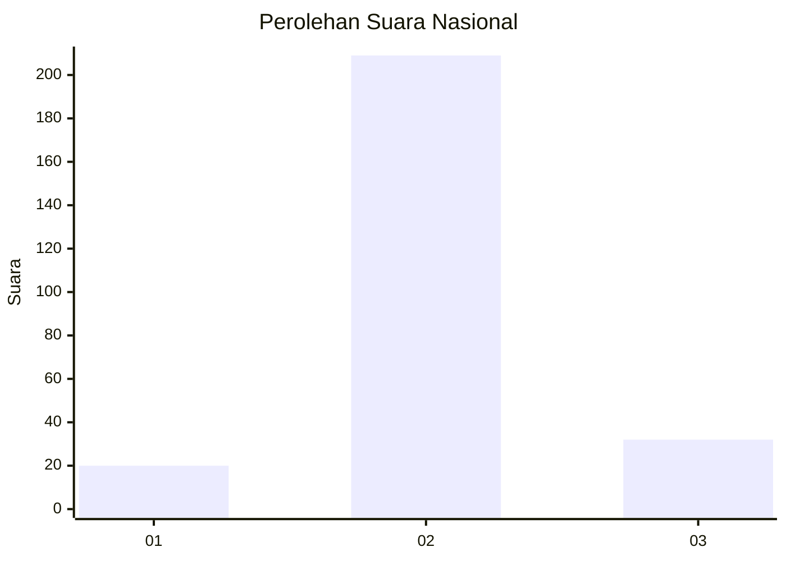
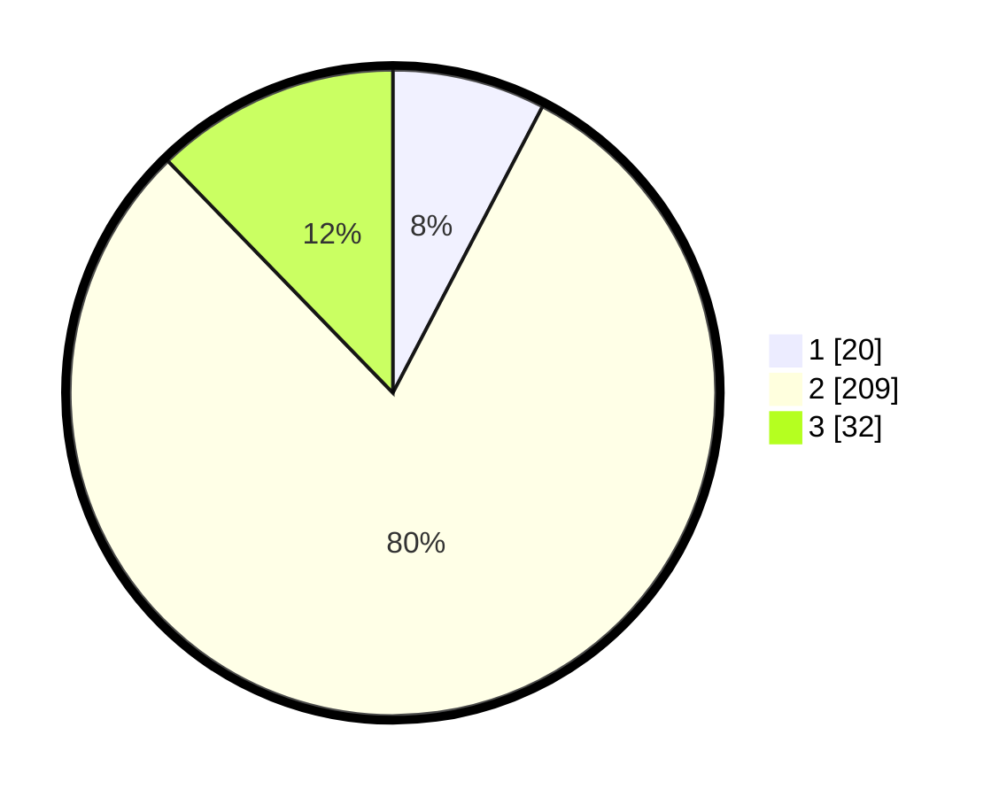

# Hasil

## Grafik

## Tabel

| No. | Nama Paslon    | Suara | Suara (raw) | Persentase |
|:--- |:-------------- | -----:| -----------:| ----------:|
| 1   | ANIES MUHAIMIN | 20    | [20][p-1]   | 7,66       |
| 2   | PRABOWO GIBRAN | 209   | [209][p-2]  | 80,08      |
| 3   | GANJAR MAHFUD  | 32    | [32][p-3]   | 12,26      |

[p-1]: https://github.com/gigit-pemilu/pemilu-2024/blob/main/pilpres/hitung-suara/sub/62-kalimantan-tengah/sub/02-kotawaringin-timur/sub/03-mentaya-hulu/sub/2004-tanjung-bantur/sub/002-tps/sub/paslon-1.txt
[p-2]: https://github.com/gigit-pemilu/pemilu-2024/blob/main/pilpres/hitung-suara/sub/62-kalimantan-tengah/sub/02-kotawaringin-timur/sub/03-mentaya-hulu/sub/2004-tanjung-bantur/sub/002-tps/sub/paslon-2.txt
[p-3]: https://github.com/gigit-pemilu/pemilu-2024/blob/main/pilpres/hitung-suara/sub/62-kalimantan-tengah/sub/02-kotawaringin-timur/sub/03-mentaya-hulu/sub/2004-tanjung-bantur/sub/002-tps/sub/paslon-3.txt

## Foto C Plano

https://sirekap-obj-formc.kpu.go.id/e810/pemilu/ppwp/62/02/03/20/04/6202032004002-20240223-175327--c0dc0fc5-d78d-47db-be5f-db214581b1d3.jpg

https://sirekap-obj-formc.kpu.go.id/e810/pemilu/ppwp/62/02/03/20/04/6202032004002-20240223-175359--d9347277-bdc5-45ef-b975-0387c2f1ac9c.jpg

https://sirekap-obj-formc.kpu.go.id/e810/pemilu/ppwp/62/02/03/20/04/6202032004002-20240223-175435--fe2d0548-37d9-4dd8-a94e-cce9497219cb.jpg

## Metadata

| Key        | Value               |
| ---------- | ------------------- |
| Time Stamp | 2024-02-24 22:31:28 |

