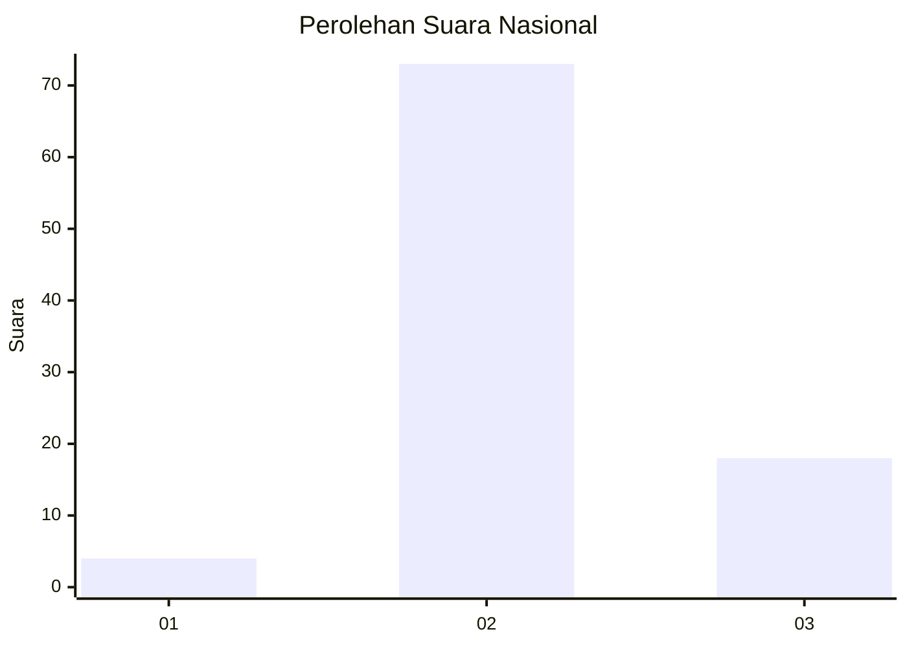
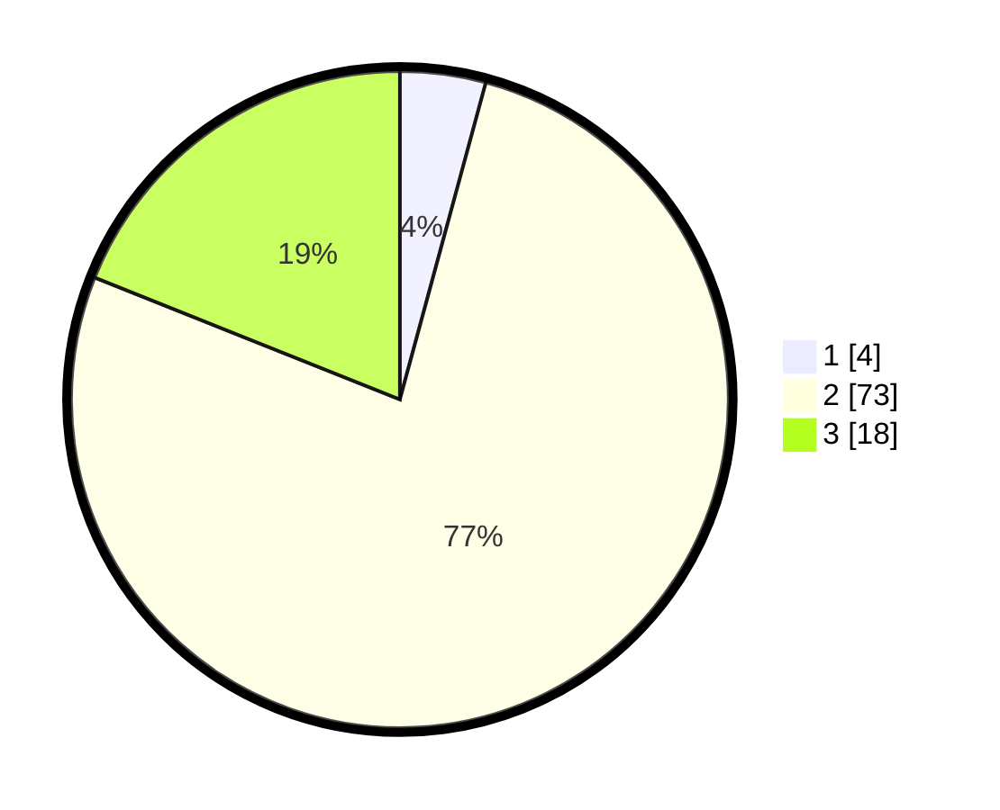

# Hasil

## Grafik

## Tabel

| No. | Nama Paslon    | Suara | Suara (raw) | Persentase |
|:--- |:-------------- | -----:| -----------:| ----------:|
| 1   | ANIES MUHAIMIN | 4     | [4][p-1]    | 4,21       |
| 2   | PRABOWO GIBRAN | 73    | [73][p-2]   | 76,84      |
| 3   | GANJAR MAHFUD  | 18    | [18][p-3]   | 18,95      |

[p-1]: https://github.com/gigit-pemilu/pemilu-2024/blob/main/pilpres/hitung-suara/sub/62-kalimantan-tengah/sub/02-kotawaringin-timur/sub/03-mentaya-hulu/sub/2010-pemantang/sub/004-tps/sub/paslon-1.txt
[p-2]: https://github.com/gigit-pemilu/pemilu-2024/blob/main/pilpres/hitung-suara/sub/62-kalimantan-tengah/sub/02-kotawaringin-timur/sub/03-mentaya-hulu/sub/2010-pemantang/sub/004-tps/sub/paslon-2.txt
[p-3]: https://github.com/gigit-pemilu/pemilu-2024/blob/main/pilpres/hitung-suara/sub/62-kalimantan-tengah/sub/02-kotawaringin-timur/sub/03-mentaya-hulu/sub/2010-pemantang/sub/004-tps/sub/paslon-3.txt

## Foto C Plano

https://sirekap-obj-formc.kpu.go.id/84c3/pemilu/ppwp/62/02/03/20/10/6202032010004-20240223-193604--e5374c70-ae50-4749-9e58-3ad18992a810.jpg

https://sirekap-obj-formc.kpu.go.id/84c3/pemilu/ppwp/62/02/03/20/10/6202032010004-20240223-193649--b0fd94b1-e35d-4e80-a763-9db2ddf39c59.jpg

https://sirekap-obj-formc.kpu.go.id/84c3/pemilu/ppwp/62/02/03/20/10/6202032010004-20240223-193736--15b8864f-d679-4ac3-88ff-76ff23f98ccf.jpg

## Metadata

| Key        | Value               |
| ---------- | ------------------- |
| Time Stamp | 2024-02-25 21:00:00 |

