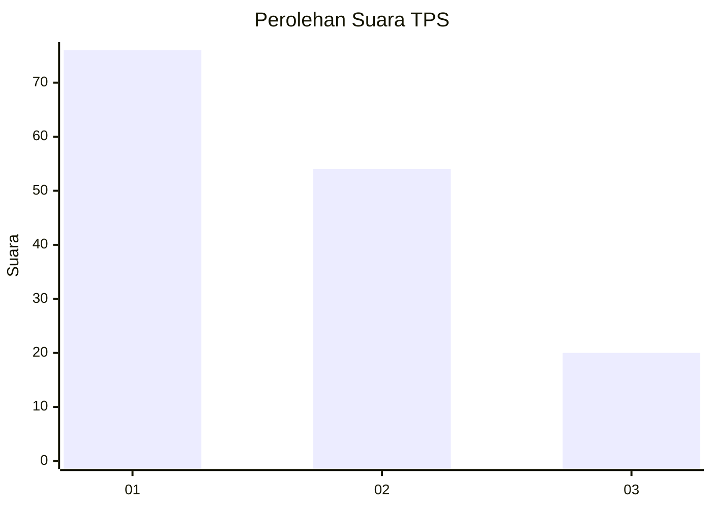
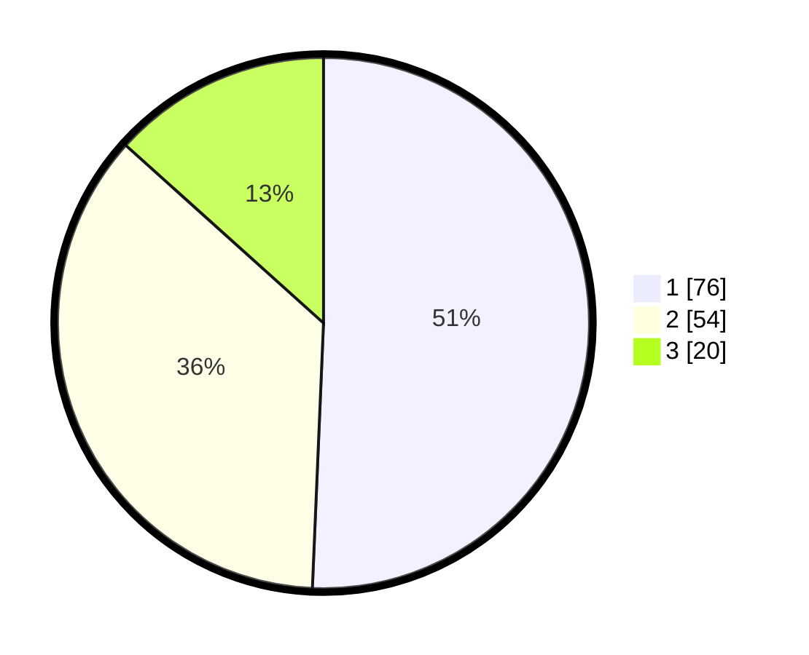

# Hasil

## Grafik

## Tabel

| No. | Nama Paslon    | Suara | Suara (raw) | Persentase |
|:--- |:-------------- | -----:| -----------:| ----------:|
| 1   | ANIES MUHAIMIN | 76    | [76][p-1]   | 50,67      |
| 2   | PRABOWO GIBRAN | 54    | [54][p-2]   | 36,00      |
| 3   | GANJAR MAHFUD  | 20    | [20][p-3]   | 13,33      |

[p-1]: https://github.com/gigit-pemilu/pemilu-2024-62-kalimantan-tengah/blob/main/pilpres/hitung-suara/sub/62-kalimantan-tengah/sub/02-kotawaringin-timur/sub/04-parenggean/sub/1004-parenggean/sub/002-tps/sub/paslon-1.txt
[p-2]: https://github.com/gigit-pemilu/pemilu-2024-62-kalimantan-tengah/blob/main/pilpres/hitung-suara/sub/62-kalimantan-tengah/sub/02-kotawaringin-timur/sub/04-parenggean/sub/1004-parenggean/sub/002-tps/sub/paslon-2.txt
[p-3]: https://github.com/gigit-pemilu/pemilu-2024-62-kalimantan-tengah/blob/main/pilpres/hitung-suara/sub/62-kalimantan-tengah/sub/02-kotawaringin-timur/sub/04-parenggean/sub/1004-parenggean/sub/002-tps/sub/paslon-3.txt

## Foto C Plano

https://sirekap-obj-formc.kpu.go.id/c83a/pemilu/ppwp/62/02/04/10/04/6202041004002-20240221-201045--c35a3417-f19b-40cd-803b-571980c3cd01.jpg

https://sirekap-obj-formc.kpu.go.id/c83a/pemilu/ppwp/62/02/04/10/04/6202041004002-20240221-201233--c9ad897d-5ce7-4068-bb65-0ad72ceb7a78.jpg

https://sirekap-obj-formc.kpu.go.id/c83a/pemilu/ppwp/62/02/04/10/04/6202041004002-20240221-201351--95fc6418-d5a6-4091-9b2e-fbc29b4b3860.jpg

## Metadata

| Key        | Value               |
| ---------- | ------------------- |
| Time Stamp | 2024-02-21 21:00:04 |

## DATA PEMILIH TETAP

Jumlah pemilih dalam DPT: **363**.
 * L: **818**.
 * P: **349**.

## DATA PENGGUNA HAK PILIH

Jumlah pengguna hak pilih dalam DPT: **175**.
 * L: **850**.
 * P: **47**.

Jumlah pengguna hak pilih dalam DPTb: **7**.
 * L: **5**.
 * P: **2**.

Jumlah pengguna hak pilih dalam DPK: **1**.
 * L: **4**.
 * P: **0**.

Jumlah pengguna hak pilih: **197**.
 * L: **6**.
 * P: **106**.

## JUMLAH SUARA SAH DAN TIDAK SAH

JUMLAH SELURUH SUARA SAH: **501**.

JUMLAH SUARA TIDAK SAH: **778**.

JUMLAH SELURUH SUARA SAH DAN SUARA TIDAK SAH: **701**.

