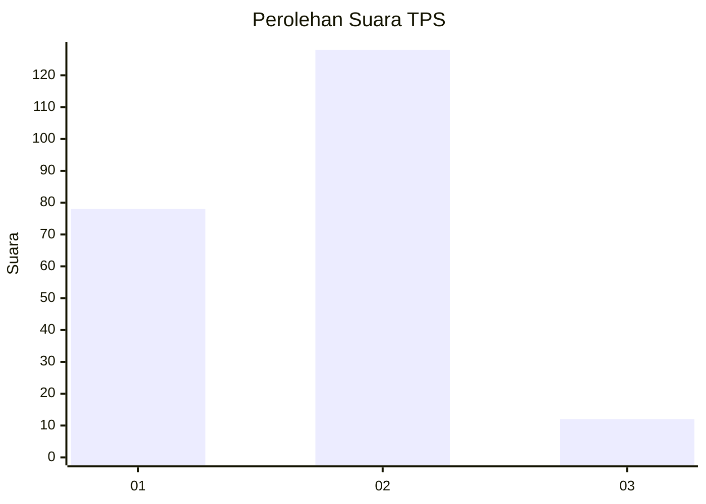
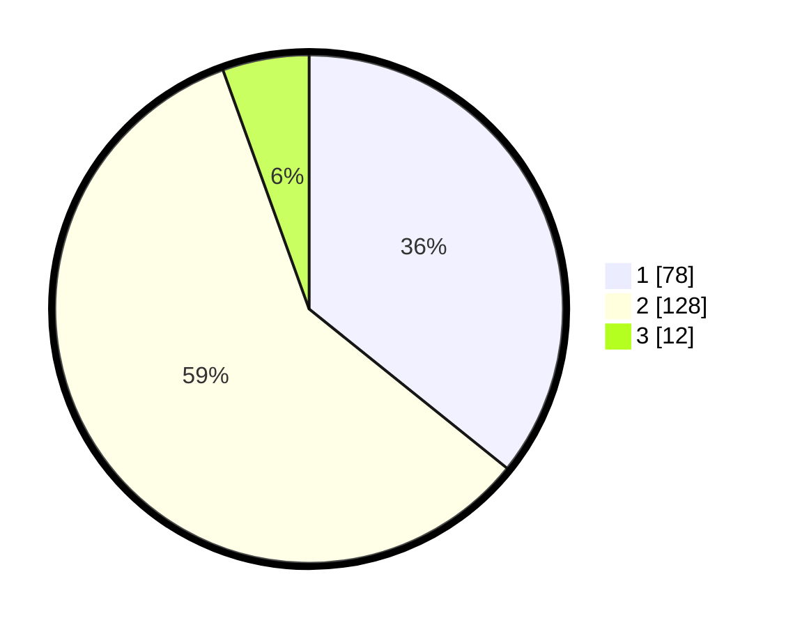

# Hasil

## Grafik

## Tabel

| No. | Nama Paslon    | Suara | Suara (raw) | Persentase |
|:--- |:-------------- | -----:| -----------:| ----------:|
| 1   | ANIES MUHAIMIN | 78    | [78][p-1]   | 35,78      |
| 2   | PRABOWO GIBRAN | 128   | [128][p-2]  | 58,72      |
| 3   | GANJAR MAHFUD  | 12    | [12][p-3]   | 5,50       |

[p-1]: https://github.com/gigit-pemilu/pemilu-2024-62-kalimantan-tengah/blob/main/pilpres/hitung-suara/sub/62-kalimantan-tengah/sub/02-kotawaringin-timur/sub/04-parenggean/sub/1004-parenggean/sub/004-tps/sub/paslon-1.txt
[p-2]: https://github.com/gigit-pemilu/pemilu-2024-62-kalimantan-tengah/blob/main/pilpres/hitung-suara/sub/62-kalimantan-tengah/sub/02-kotawaringin-timur/sub/04-parenggean/sub/1004-parenggean/sub/004-tps/sub/paslon-2.txt
[p-3]: https://github.com/gigit-pemilu/pemilu-2024-62-kalimantan-tengah/blob/main/pilpres/hitung-suara/sub/62-kalimantan-tengah/sub/02-kotawaringin-timur/sub/04-parenggean/sub/1004-parenggean/sub/004-tps/sub/paslon-3.txt

## Foto C Plano

https://sirekap-obj-formc.kpu.go.id/d584/pemilu/ppwp/62/02/04/10/04/6202041004004-20240221-220141--aa10fb8c-308c-4d59-9557-6f983371b406.jpg

https://sirekap-obj-formc.kpu.go.id/d584/pemilu/ppwp/62/02/04/10/04/6202041004004-20240221-220216--6ed00c5a-86e7-43de-b50d-c5f5d8e9888c.jpg

https://sirekap-obj-formc.kpu.go.id/d584/pemilu/ppwp/62/02/04/10/04/6202041004004-20240221-220247--4bd1de99-848f-4c91-a5d9-a4cc10c37412.jpg

## Metadata

| Key        | Value               |
| ---------- | ------------------- |
| Time Stamp | 2024-02-25 11:00:00 |

