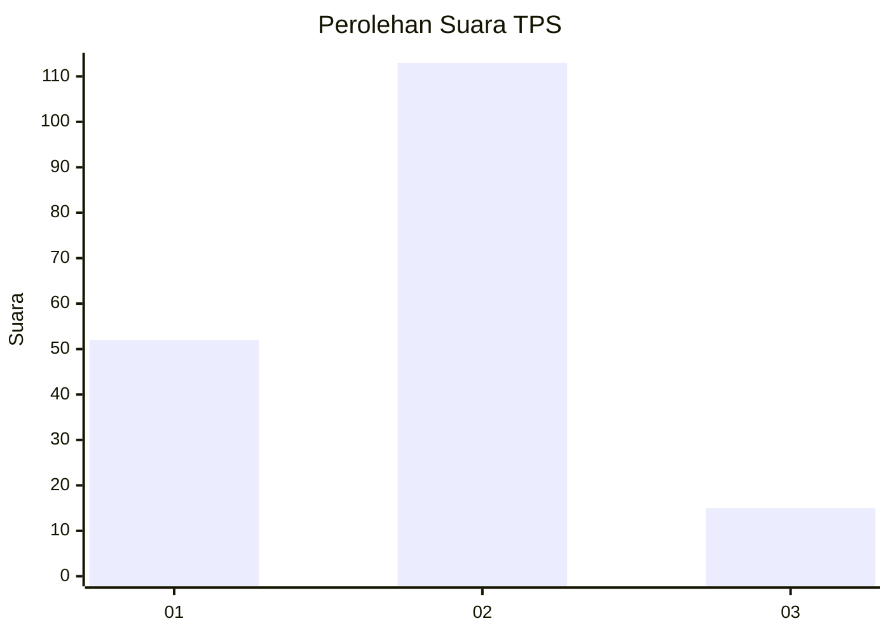
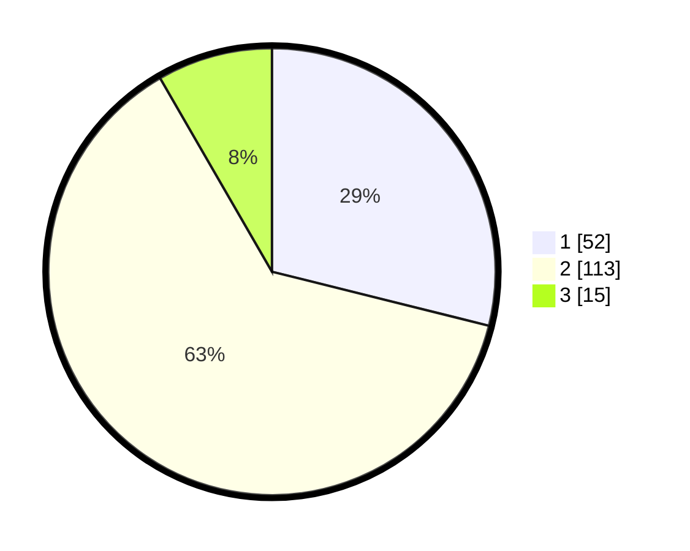

# Hasil

## Grafik

## Tabel

| No. | Nama Paslon    | Suara | Suara (raw) | Persentase |
|:--- |:-------------- | -----:| -----------:| ----------:|
| 1   | ANIES MUHAIMIN | 52    | [52][p-1]   | 28,89      |
| 2   | PRABOWO GIBRAN | 113   | [113][p-2]  | 62,78      |
| 3   | GANJAR MAHFUD  | 15    | [15][p-3]   | 8,33       |

[p-1]: https://github.com/gigit-pemilu/pemilu-2024-62-kalimantan-tengah/blob/main/pilpres/hitung-suara/sub/62-kalimantan-tengah/sub/02-kotawaringin-timur/sub/04-parenggean/sub/1004-parenggean/sub/007-tps/sub/paslon-1.txt
[p-2]: https://github.com/gigit-pemilu/pemilu-2024-62-kalimantan-tengah/blob/main/pilpres/hitung-suara/sub/62-kalimantan-tengah/sub/02-kotawaringin-timur/sub/04-parenggean/sub/1004-parenggean/sub/007-tps/sub/paslon-2.txt
[p-3]: https://github.com/gigit-pemilu/pemilu-2024-62-kalimantan-tengah/blob/main/pilpres/hitung-suara/sub/62-kalimantan-tengah/sub/02-kotawaringin-timur/sub/04-parenggean/sub/1004-parenggean/sub/007-tps/sub/paslon-3.txt

## Foto C Plano

https://sirekap-obj-formc.kpu.go.id/ef83/pemilu/ppwp/62/02/04/10/04/6202041004007-20240221-204926--6df9b9f3-0d40-49de-8f93-173c08f440c8.jpg

https://sirekap-obj-formc.kpu.go.id/ef83/pemilu/ppwp/62/02/04/10/04/6202041004007-20240221-204706--5fed8b2e-13ec-4284-8a19-e37df2320fc1.jpg

https://sirekap-obj-formc.kpu.go.id/ef83/pemilu/ppwp/62/02/04/10/04/6202041004007-20240221-205255--9334b2ac-b504-4042-8fca-06889ee4dfd9.jpg

## Metadata

| Key        | Value               |
| ---------- | ------------------- |
| Time Stamp | 2024-02-24 22:31:28 |

## DATA PEMILIH TETAP

Jumlah pemilih dalam DPT: **232**.
 * L: **335**.
 * P: **293**.

## DATA PENGGUNA HAK PILIH

Jumlah pengguna hak pilih dalam DPT: **424**.
 * L: **896**.
 * P: **833**.

Jumlah pengguna hak pilih dalam DPTb: **200**.
 * L: **8**.
 * P: **8**.

Jumlah pengguna hak pilih dalam DPK: **886**.
 * L: **883**.
 * P: **883**.

Jumlah pengguna hak pilih: **230**.
 * L: **54**.
 * P: **885**.

## JUMLAH SUARA SAH DAN TIDAK SAH

JUMLAH SELURUH SUARA SAH: **180**.

JUMLAH SUARA TIDAK SAH: **0**.

JUMLAH SELURUH SUARA SAH DAN SUARA TIDAK SAH: **180**.

