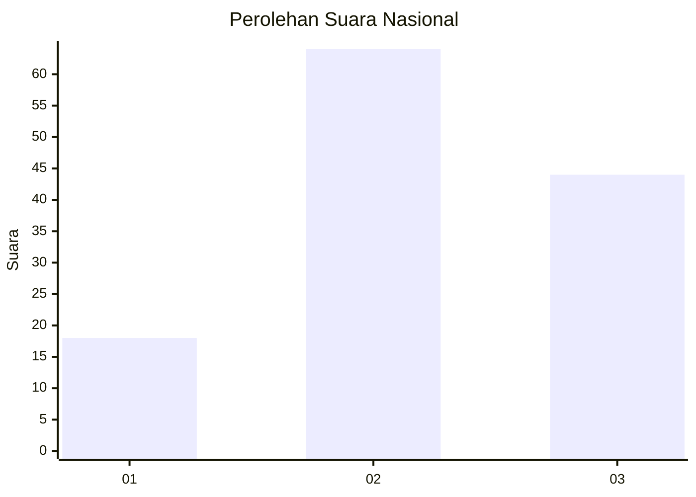
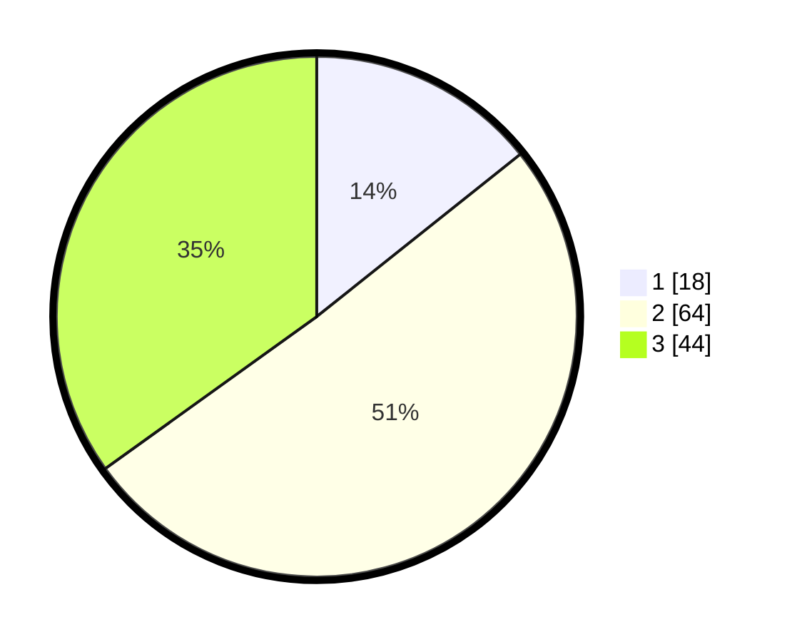

# Hasil

## Grafik

## Tabel

| No. | Nama Paslon    | Suara | Suara (raw) | Persentase |
|:--- |:-------------- | -----:| -----------:| ----------:|
| 1   | ANIES MUHAIMIN | 18    | [18][p-1]   | 14,29      |
| 2   | PRABOWO GIBRAN | 64    | [64][p-2]   | 50,79      |
| 3   | GANJAR MAHFUD  | 44    | [44][p-3]   | 34,92      |

[p-1]: https://github.com/gigit-pemilu/pemilu-2024/blob/main/pilpres/hitung-suara/sub/62-kalimantan-tengah/sub/02-kotawaringin-timur/sub/04-parenggean/sub/1004-parenggean/sub/016-tps/sub/paslon-1.txt
[p-2]: https://github.com/gigit-pemilu/pemilu-2024/blob/main/pilpres/hitung-suara/sub/62-kalimantan-tengah/sub/02-kotawaringin-timur/sub/04-parenggean/sub/1004-parenggean/sub/016-tps/sub/paslon-2.txt
[p-3]: https://github.com/gigit-pemilu/pemilu-2024/blob/main/pilpres/hitung-suara/sub/62-kalimantan-tengah/sub/02-kotawaringin-timur/sub/04-parenggean/sub/1004-parenggean/sub/016-tps/sub/paslon-3.txt

## Foto C Plano

https://sirekap-obj-formc.kpu.go.id/f10c/pemilu/ppwp/62/02/04/10/04/6202041004016-20240220-233639--3cfaa200-cd75-4ea5-a65c-87dbe0d5386e.jpg

https://sirekap-obj-formc.kpu.go.id/f10c/pemilu/ppwp/62/02/04/10/04/6202041004016-20240220-233113--88741cc5-a175-4b12-83ec-71dce7d0c6d4.jpg

https://sirekap-obj-formc.kpu.go.id/f10c/pemilu/ppwp/62/02/04/10/04/6202041004016-20240220-233222--4b4f97aa-05d2-4f61-8cd0-7c63684d5e1b.jpg

## Metadata

| Key        | Value               |
| ---------- | ------------------- |
| Time Stamp | 2024-02-21 11:00:00 |

## DATA PEMILIH TETAP

Jumlah pemilih dalam DPT: **275**.
 * L: **171**.
 * P: **144**.

## DATA PENGGUNA HAK PILIH

Jumlah pengguna hak pilih dalam DPT: **215**.
 * L: **101**.
 * P: **114**.

Jumlah pengguna hak pilih dalam DPTb: **7**.
 * L: **707**.
 * P: **4**.

Jumlah pengguna hak pilih dalam DPK: **5**.
 * L: **77**.
 * P: **7**.

Jumlah pengguna hak pilih: **227**.
 * L: **177**.
 * P: **124**.

## JUMLAH SUARA SAH DAN TIDAK SAH

JUMLAH SELURUH SUARA SAH: **725**.

JUMLAH SUARA TIDAK SAH: **1**.

JUMLAH SELURUH SUARA SAH DAN SUARA TIDAK SAH: **777**.

