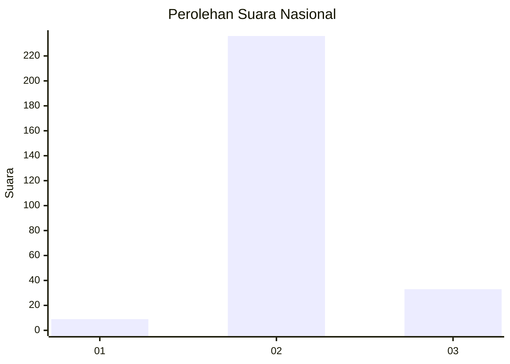
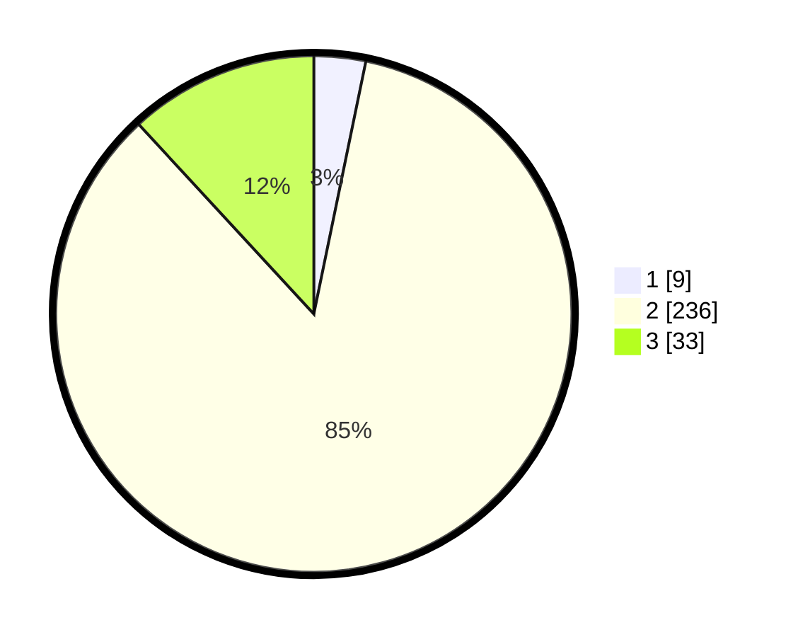

# Hasil

## Grafik

## Tabel

| No. | Nama Paslon    | Suara | Suara (raw) | Persentase |
|:--- |:-------------- | -----:| -----------:| ----------:|
| 1   | ANIES MUHAIMIN | 9     | [9][p-1]    | 3,24       |
| 2   | PRABOWO GIBRAN | 236   | [236][p-2]  | 84,89      |
| 3   | GANJAR MAHFUD  | 33    | [33][p-3]   | 11,87      |

[p-1]: https://github.com/gigit-pemilu/pemilu-2024/blob/main/pilpres/hitung-suara/sub/62-kalimantan-tengah/sub/02-kotawaringin-timur/sub/04-parenggean/sub/2001-tehang/sub/001-tps/sub/paslon-1.txt
[p-2]: https://github.com/gigit-pemilu/pemilu-2024/blob/main/pilpres/hitung-suara/sub/62-kalimantan-tengah/sub/02-kotawaringin-timur/sub/04-parenggean/sub/2001-tehang/sub/001-tps/sub/paslon-2.txt
[p-3]: https://github.com/gigit-pemilu/pemilu-2024/blob/main/pilpres/hitung-suara/sub/62-kalimantan-tengah/sub/02-kotawaringin-timur/sub/04-parenggean/sub/2001-tehang/sub/001-tps/sub/paslon-3.txt

## Foto C Plano

https://sirekap-obj-formc.kpu.go.id/583b/pemilu/ppwp/62/02/04/20/01/6202042001001-20240227-184213--f953fdf1-0b5c-46ec-8ced-c0082e4e179d.jpg

https://sirekap-obj-formc.kpu.go.id/583b/pemilu/ppwp/62/02/04/20/01/6202042001001-20240218-111919--707d3ffa-4a7a-4350-bf76-ac86c60e6bc8.jpg

https://sirekap-obj-formc.kpu.go.id/583b/pemilu/ppwp/62/02/04/20/01/6202042001001-20240218-112008--0a134391-7c57-4792-9f95-dd9252b57b3c.jpg

## Metadata

| Key        | Value               |
| ---------- | ------------------- |
| Time Stamp | 2024-02-27 19:00:00 |

