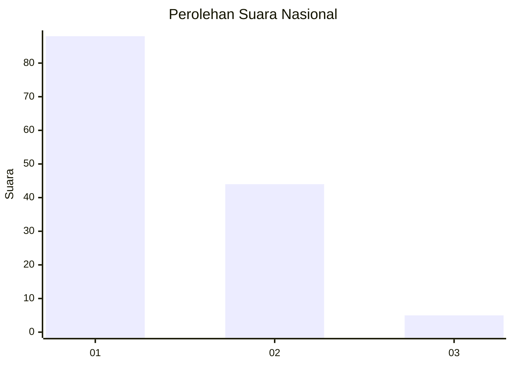
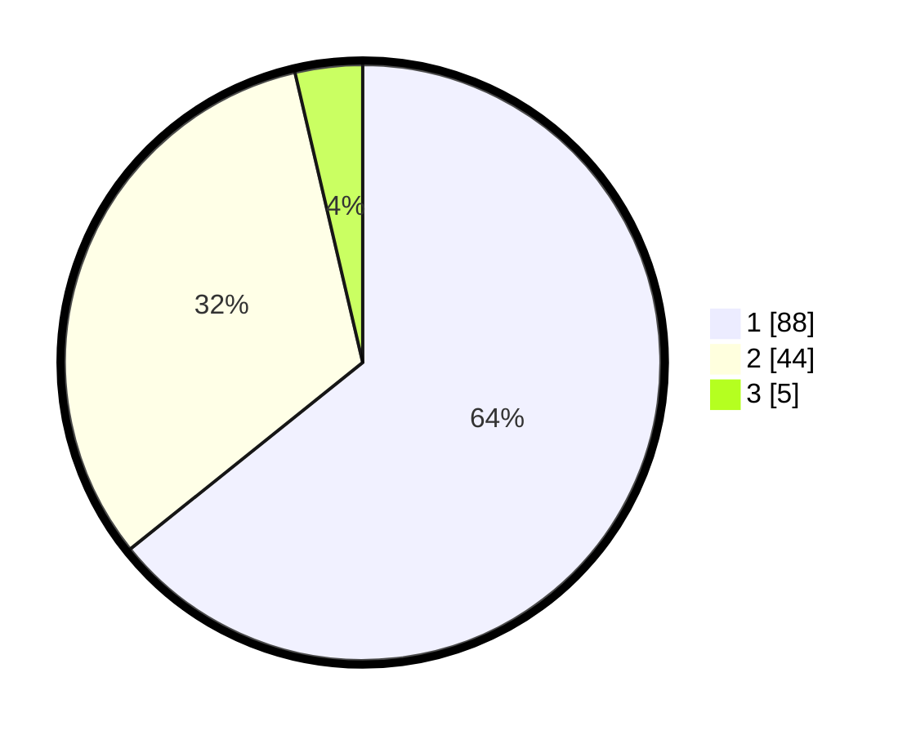

# Hasil

## Grafik

## Tabel

| No. | Nama Paslon    | Suara | Suara (raw) | Persentase |
|:--- |:-------------- | -----:| -----------:| ----------:|
| 1   | ANIES MUHAIMIN | 88    | [88][p-1]   | 64,23      |
| 2   | PRABOWO GIBRAN | 44    | [44][p-2]   | 32,12      |
| 3   | GANJAR MAHFUD  | 5     | [5][p-3]    | 3,65       |

[p-1]: https://github.com/gigit-pemilu/pemilu-2024/blob/main/pilpres/hitung-suara/sub/62-kalimantan-tengah/sub/02-kotawaringin-timur/sub/04-parenggean/sub/2002-kabuau/sub/006-tps/sub/paslon-1.txt
[p-2]: https://github.com/gigit-pemilu/pemilu-2024/blob/main/pilpres/hitung-suara/sub/62-kalimantan-tengah/sub/02-kotawaringin-timur/sub/04-parenggean/sub/2002-kabuau/sub/006-tps/sub/paslon-2.txt
[p-3]: https://github.com/gigit-pemilu/pemilu-2024/blob/main/pilpres/hitung-suara/sub/62-kalimantan-tengah/sub/02-kotawaringin-timur/sub/04-parenggean/sub/2002-kabuau/sub/006-tps/sub/paslon-3.txt

## Foto C Plano

https://sirekap-obj-formc.kpu.go.id/47ee/pemilu/ppwp/62/02/04/20/02/6202042002006-20240222-153237--6c81f407-8b2f-4290-8978-3a86f03dccb6.jpg

https://sirekap-obj-formc.kpu.go.id/47ee/pemilu/ppwp/62/02/04/20/02/6202042002006-20240222-153351--4897c8ac-0656-4932-a7d9-12b9544bd10c.jpg

https://sirekap-obj-formc.kpu.go.id/47ee/pemilu/ppwp/62/02/04/20/02/6202042002006-20240222-153435--df8e9c6d-68cf-4e16-8f3e-f2fdeb369447.jpg

## Metadata

| Key        | Value               |
| ---------- | ------------------- |
| Time Stamp | 2024-02-22 16:00:00 |

## DATA PEMILIH TETAP

Jumlah pemilih dalam DPT: **286**.
 * L: **894**.
 * P: **82**.

## DATA PENGGUNA HAK PILIH

Jumlah pengguna hak pilih dalam DPT: **254**.
 * L: **53**.
 * P: **848**.

Jumlah pengguna hak pilih dalam DPTb: **883**.
 * L: **3**.
 * P: **6**.

Jumlah pengguna hak pilih dalam DPK: **860**.
 * L: **5**.
 * P: **5**.

Jumlah pengguna hak pilih: **820**.
 * L: **867**.
 * P: **859**.

## JUMLAH SUARA SAH DAN TIDAK SAH

JUMLAH SELURUH SUARA SAH: **115**.

JUMLAH SUARA TIDAK SAH: **2**.

JUMLAH SELURUH SUARA SAH DAN SUARA TIDAK SAH: **520**.

