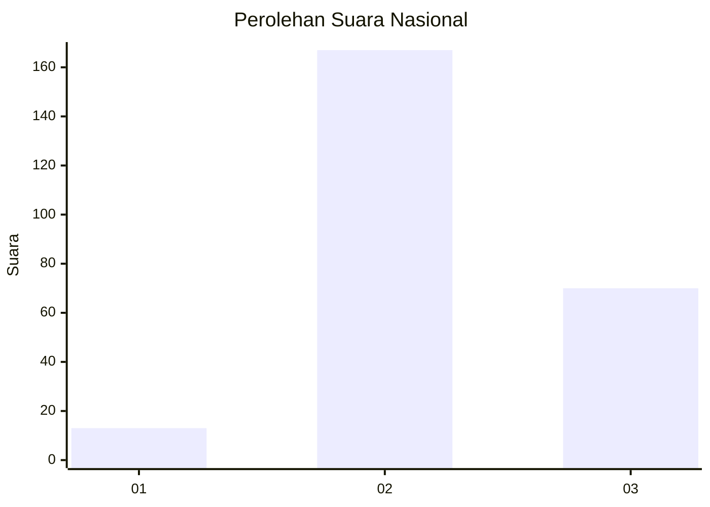
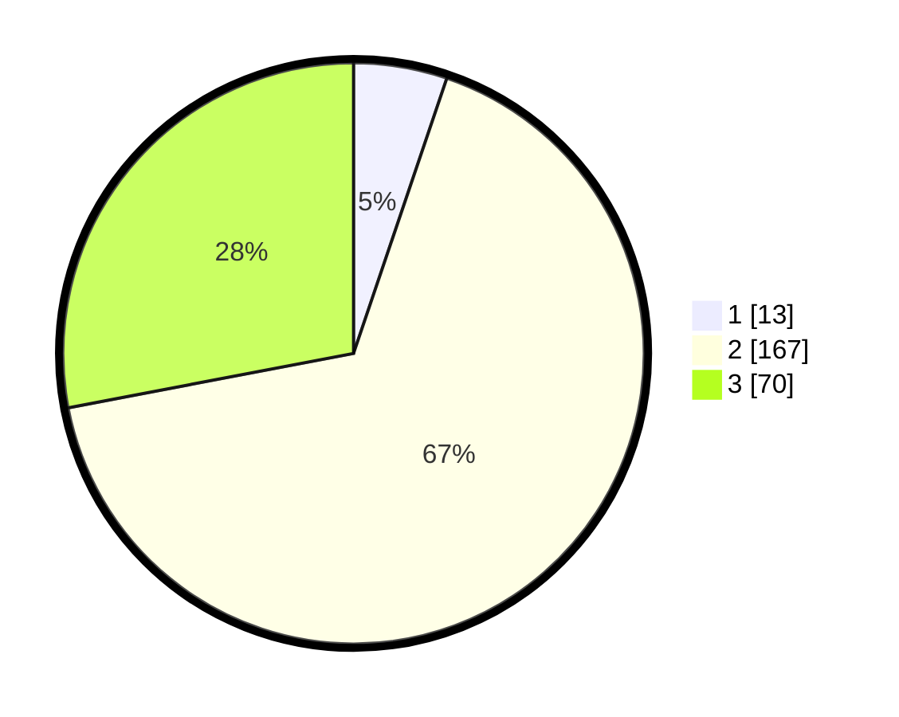

# Hasil

## Grafik

## Tabel

| No. | Nama Paslon    | Suara | Suara (raw) | Persentase |
|:--- |:-------------- | -----:| -----------:| ----------:|
| 1   | ANIES MUHAIMIN | 13    | [13][p-1]   | 5,20       |
| 2   | PRABOWO GIBRAN | 167   | [167][p-2]  | 66,80      |
| 3   | GANJAR MAHFUD  | 70    | [70][p-3]   | 28,00      |

[p-1]: https://github.com/gigit-pemilu/pemilu-2024/blob/main/pilpres/hitung-suara/sub/62-kalimantan-tengah/sub/02-kotawaringin-timur/sub/04-parenggean/sub/2010-mekar-jaya/sub/007-tps/sub/paslon-1.txt
[p-2]: https://github.com/gigit-pemilu/pemilu-2024/blob/main/pilpres/hitung-suara/sub/62-kalimantan-tengah/sub/02-kotawaringin-timur/sub/04-parenggean/sub/2010-mekar-jaya/sub/007-tps/sub/paslon-2.txt
[p-3]: https://github.com/gigit-pemilu/pemilu-2024/blob/main/pilpres/hitung-suara/sub/62-kalimantan-tengah/sub/02-kotawaringin-timur/sub/04-parenggean/sub/2010-mekar-jaya/sub/007-tps/sub/paslon-3.txt

## Foto C Plano

https://sirekap-obj-formc.kpu.go.id/7649/pemilu/ppwp/62/02/04/20/10/6202042010007-20240221-163705--a4115d4a-932d-4744-a8fb-339bd2d7d2f2.jpg

https://sirekap-obj-formc.kpu.go.id/7649/pemilu/ppwp/62/02/04/20/10/6202042010007-20240221-163800--e6b090d2-624c-47d1-9b4d-3919d9e1b81d.jpg

https://sirekap-obj-formc.kpu.go.id/7649/pemilu/ppwp/62/02/04/20/10/6202042010007-20240221-163906--8853ced3-c075-4ad0-b395-10bc8248ca49.jpg

## Metadata

| Key        | Value               |
| ---------- | ------------------- |
| Time Stamp | 2024-02-24 22:31:28 |

## DATA PEMILIH TETAP

Jumlah pemilih dalam DPT: **334**.
 * L: **43**.
 * P: **236**.

## DATA PENGGUNA HAK PILIH

Jumlah pengguna hak pilih dalam DPT: **338**.
 * L: **220**.
 * P: **230**.

Jumlah pengguna hak pilih dalam DPTb: **808**.
 * L: **880**.
 * P: **888**.

Jumlah pengguna hak pilih dalam DPK: **24**.
 * L: **889**.
 * P: **45**.

Jumlah pengguna hak pilih: **224**.
 * L: **339**.
 * P: **523**.

## JUMLAH SUARA SAH DAN TIDAK SAH

JUMLAH SELURUH SUARA SAH: **250**.

JUMLAH SUARA TIDAK SAH: **4**.

JUMLAH SELURUH SUARA SAH DAN SUARA TIDAK SAH: **254**.

