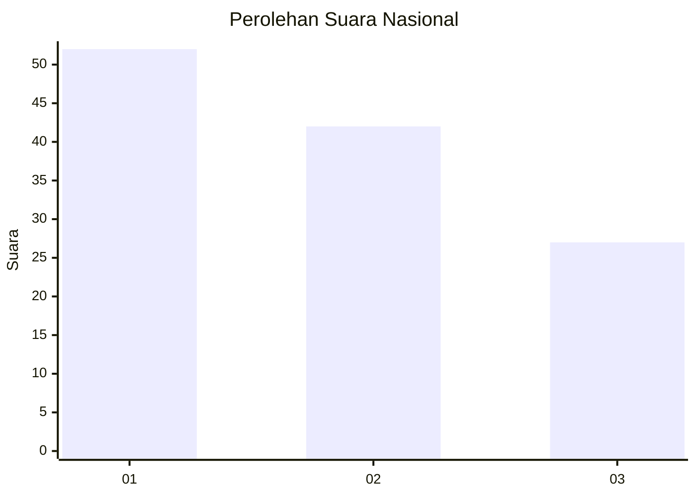
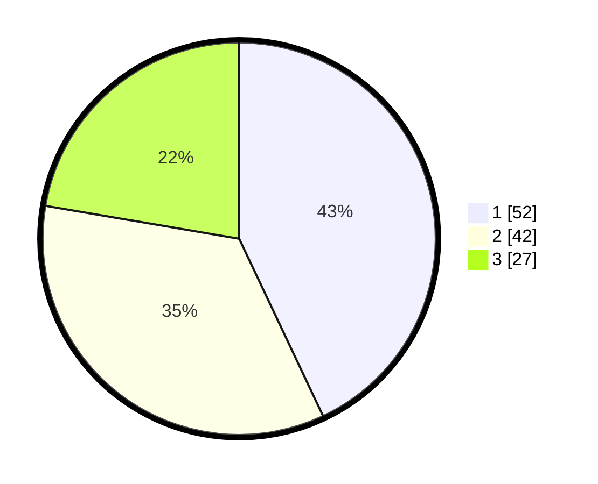

# Hasil

## Grafik

## Tabel

| No. | Nama Paslon    | Suara | Suara (raw) | Persentase |
|:--- |:-------------- | -----:| -----------:| ----------:|
| 1   | ANIES MUHAIMIN | 52    | [52][p-1]   | 42,98      |
| 2   | PRABOWO GIBRAN | 42    | [42][p-2]   | 34,71      |
| 3   | GANJAR MAHFUD  | 27    | [27][p-3]   | 22,31      |

[p-1]: https://github.com/gigit-pemilu/pemilu-2024/blob/main/pilpres/hitung-suara/sub/62-kalimantan-tengah/sub/02-kotawaringin-timur/sub/04-parenggean/sub/2019-bajarau/sub/901-tps/sub/paslon-1.txt
[p-2]: https://github.com/gigit-pemilu/pemilu-2024/blob/main/pilpres/hitung-suara/sub/62-kalimantan-tengah/sub/02-kotawaringin-timur/sub/04-parenggean/sub/2019-bajarau/sub/901-tps/sub/paslon-2.txt
[p-3]: https://github.com/gigit-pemilu/pemilu-2024/blob/main/pilpres/hitung-suara/sub/62-kalimantan-tengah/sub/02-kotawaringin-timur/sub/04-parenggean/sub/2019-bajarau/sub/901-tps/sub/paslon-3.txt

## Foto C Plano

https://sirekap-obj-formc.kpu.go.id/f744/pemilu/ppwp/62/02/04/20/19/6202042019901-20240220-161212--b7ab912e-163c-40e8-a569-509bdf890853.jpg

https://sirekap-obj-formc.kpu.go.id/f744/pemilu/ppwp/62/02/04/20/19/6202042019901-20240220-161425--b313f7fa-3b68-460c-937a-a7c89caa6da2.jpg

https://sirekap-obj-formc.kpu.go.id/f744/pemilu/ppwp/62/02/04/20/19/6202042019901-20240220-161458--f845b882-374c-4613-bc98-5b615a4eab76.jpg

## Metadata

| Key        | Value               |
| ---------- | ------------------- |
| Time Stamp | 2024-02-20 17:00:00 |

## DATA PEMILIH TETAP

Jumlah pemilih dalam DPT: **213**.
 * L: **303**.
 * P: **89**.

## DATA PENGGUNA HAK PILIH

Jumlah pengguna hak pilih dalam DPT: **145**.
 * L: **637**.
 * P: **804**.

Jumlah pengguna hak pilih dalam DPTb: **220**.
 * L: **70**.
 * P: **80**.

Jumlah pengguna hak pilih dalam DPK: **20**.
 * L: **800**.
 * P: **0**.

Jumlah pengguna hak pilih: **675**.
 * L: **657**.
 * P: **8**.

## JUMLAH SUARA SAH DAN TIDAK SAH

JUMLAH SELURUH SUARA SAH: **162**.

JUMLAH SUARA TIDAK SAH: **803**.

JUMLAH SELURUH SUARA SAH DAN SUARA TIDAK SAH: **665**.

