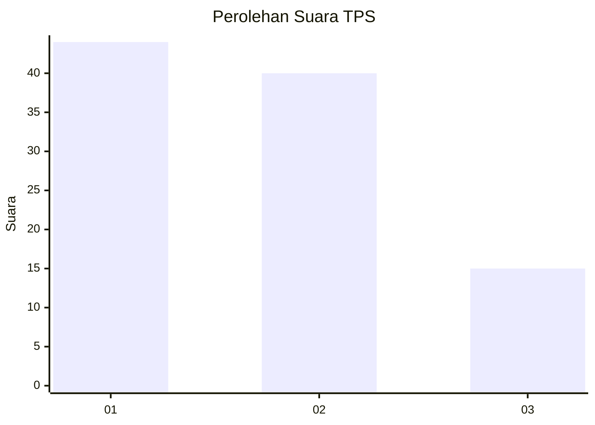
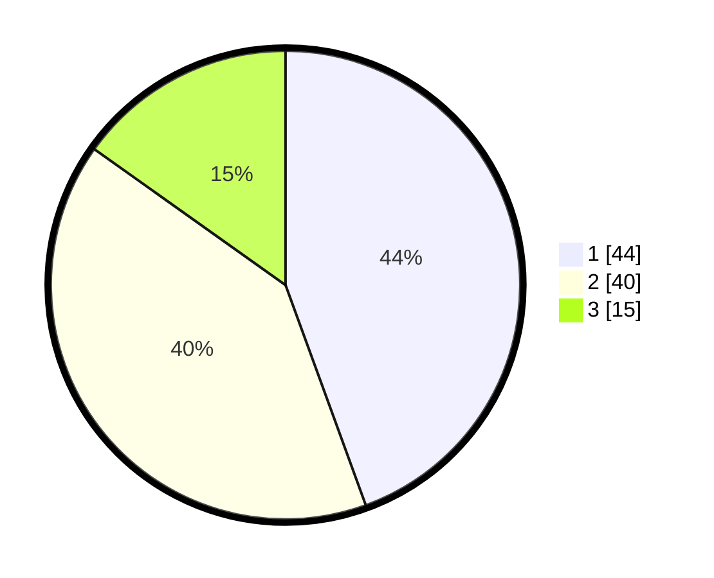

# Hasil

## Grafik

## Tabel

| No. | Nama Paslon    | Suara | Suara (raw) | Persentase |
|:--- |:-------------- | -----:| -----------:| ----------:|
| 1   | ANIES MUHAIMIN | 44    | [44][p-1]   | 44,44      |
| 2   | PRABOWO GIBRAN | 40    | [40][p-2]   | 40,40      |
| 3   | GANJAR MAHFUD  | 15    | [15][p-3]   | 15,15      |

[p-1]: https://github.com/gigit-pemilu/pemilu-2024-62-kalimantan-tengah/blob/main/pilpres/hitung-suara/sub/62-kalimantan-tengah/sub/02-kotawaringin-timur/sub/05-baamang/sub/1002-baamang-tengah/sub/010-tps/sub/paslon-1.txt
[p-2]: https://github.com/gigit-pemilu/pemilu-2024-62-kalimantan-tengah/blob/main/pilpres/hitung-suara/sub/62-kalimantan-tengah/sub/02-kotawaringin-timur/sub/05-baamang/sub/1002-baamang-tengah/sub/010-tps/sub/paslon-2.txt
[p-3]: https://github.com/gigit-pemilu/pemilu-2024-62-kalimantan-tengah/blob/main/pilpres/hitung-suara/sub/62-kalimantan-tengah/sub/02-kotawaringin-timur/sub/05-baamang/sub/1002-baamang-tengah/sub/010-tps/sub/paslon-3.txt

## Foto C Plano

https://sirekap-obj-formc.kpu.go.id/f7bb/pemilu/ppwp/62/02/05/10/02/6202051002010-20240224-150811--beb2bb34-88b9-4c66-a87f-7fac14542936.jpg

https://sirekap-obj-formc.kpu.go.id/f7bb/pemilu/ppwp/62/02/05/10/02/6202051002010-20240224-151118--a052cbff-088d-49eb-977e-358bfd76fd17.jpg

https://sirekap-obj-formc.kpu.go.id/f7bb/pemilu/ppwp/62/02/05/10/02/6202051002010-20240224-151305--da688863-65dd-45a8-8f77-d9057a68583d.jpg

## Metadata

| Key        | Value               |
| ---------- | ------------------- |
| Time Stamp | 2024-02-24 22:31:28 |

## DATA PEMILIH TETAP

Jumlah pemilih dalam DPT: **255**.
 * L: **137**.
 * P: **718**.

## DATA PENGGUNA HAK PILIH

Jumlah pengguna hak pilih dalam DPT: **553**.
 * L: **715**.
 * P: **55**.

Jumlah pengguna hak pilih dalam DPTb: **90**.
 * L: **0**.
 * P: **80**.

Jumlah pengguna hak pilih dalam DPK: **0**.
 * L: **0**.
 * P: **0**.

Jumlah pengguna hak pilih: **203**.
 * L: **115**.
 * P: **88**.

## JUMLAH SUARA SAH DAN TIDAK SAH

JUMLAH SELURUH SUARA SAH: **699**.

JUMLAH SUARA TIDAK SAH: **5**.

JUMLAH SELURUH SUARA SAH DAN SUARA TIDAK SAH: **203**.

