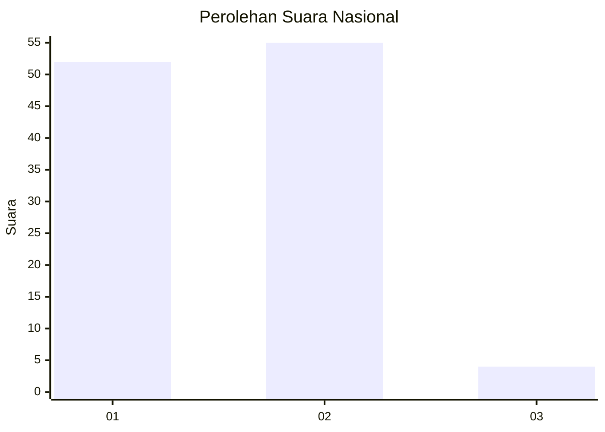
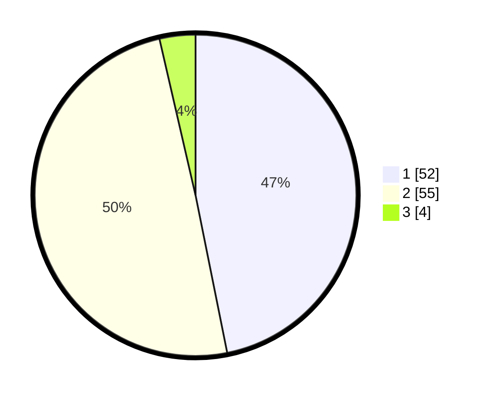

# Hasil

## Grafik

## Tabel

| No. | Nama Paslon    | Suara | Suara (raw) | Persentase |
|:--- |:-------------- | -----:| -----------:| ----------:|
| 1   | ANIES MUHAIMIN | 52    | [52][p-1]   | 46,85      |
| 2   | PRABOWO GIBRAN | 55    | [55][p-2]   | 49,55      |
| 3   | GANJAR MAHFUD  | 4     | [4][p-3]    | 3,60       |

[p-1]: https://github.com/gigit-pemilu/pemilu-2024/blob/main/pilpres/hitung-suara/sub/62-kalimantan-tengah/sub/02-kotawaringin-timur/sub/05-baamang/sub/1002-baamang-tengah/sub/017-tps/sub/paslon-1.txt
[p-2]: https://github.com/gigit-pemilu/pemilu-2024/blob/main/pilpres/hitung-suara/sub/62-kalimantan-tengah/sub/02-kotawaringin-timur/sub/05-baamang/sub/1002-baamang-tengah/sub/017-tps/sub/paslon-2.txt
[p-3]: https://github.com/gigit-pemilu/pemilu-2024/blob/main/pilpres/hitung-suara/sub/62-kalimantan-tengah/sub/02-kotawaringin-timur/sub/05-baamang/sub/1002-baamang-tengah/sub/017-tps/sub/paslon-3.txt

## Foto C Plano

https://sirekap-obj-formc.kpu.go.id/fade/pemilu/ppwp/62/02/05/10/02/6202051002017-20240224-154837--52b26cf1-1360-428b-b92b-8feb8fbe7ac9.jpg

https://sirekap-obj-formc.kpu.go.id/fade/pemilu/ppwp/62/02/05/10/02/6202051002017-20240224-155028--fda76963-915e-4782-8074-f19fc91c431c.jpg

https://sirekap-obj-formc.kpu.go.id/fade/pemilu/ppwp/62/02/05/10/02/6202051002017-20240224-155130--d1db8e76-1892-4ad1-8e7b-493051c91d48.jpg

## Metadata

| Key        | Value               |
| ---------- | ------------------- |
| Time Stamp | 2024-02-24 22:31:28 |

## DATA PEMILIH TETAP

Jumlah pemilih dalam DPT: **0**.
 * L: **0**.
 * P: **0**.

## DATA PENGGUNA HAK PILIH

Jumlah pengguna hak pilih dalam DPT: **422**.
 * L: **555**.
 * P: **554**.

Jumlah pengguna hak pilih dalam DPTb: **566**.
 * L: **555**.
 * P: **555**.

Jumlah pengguna hak pilih dalam DPK: **550**.
 * L: **2**.
 * P: **4**.

Jumlah pengguna hak pilih: **225**.
 * L: **109**.
 * P: **116**.

## JUMLAH SUARA SAH DAN TIDAK SAH

JUMLAH SELURUH SUARA SAH: **221**.

JUMLAH SUARA TIDAK SAH: **4**.

JUMLAH SELURUH SUARA SAH DAN SUARA TIDAK SAH: **225**.

