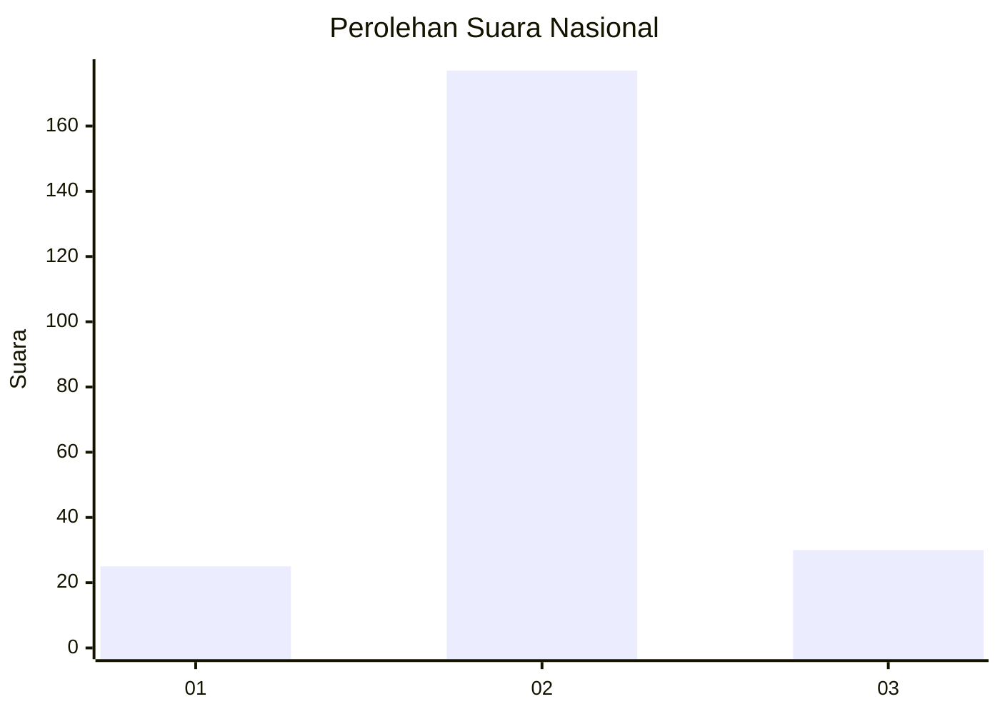
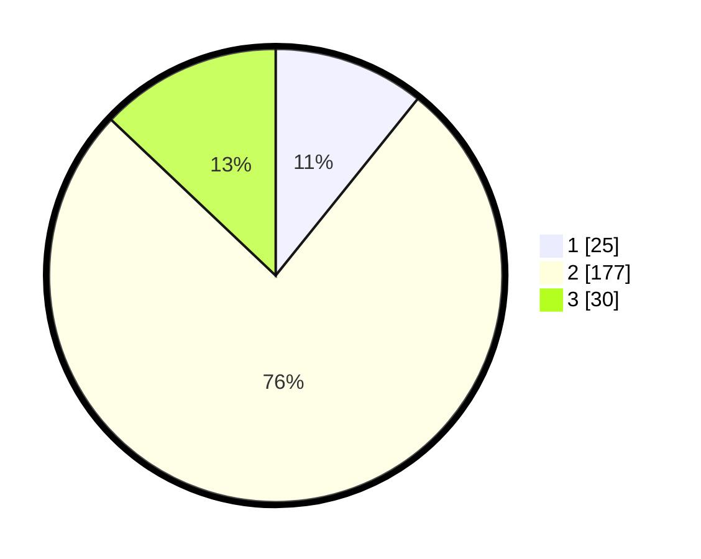

# Hasil

## Grafik

## Tabel

| No. | Nama Paslon    | Suara | Suara (raw) | Persentase |
|:--- |:-------------- | -----:| -----------:| ----------:|
| 1   | ANIES MUHAIMIN | 25    | [25][p-1]   | 10,78      |
| 2   | PRABOWO GIBRAN | 177   | [177][p-2]  | 76,29      |
| 3   | GANJAR MAHFUD  | 30    | [30][p-3]   | 12,93      |

[p-1]: https://github.com/gigit-pemilu/pemilu-2024/blob/main/pilpres/hitung-suara/sub/62-kalimantan-tengah/sub/02-kotawaringin-timur/sub/05-baamang/sub/1007-tanah-mas/sub/002-tps/sub/paslon-1.txt
[p-2]: https://github.com/gigit-pemilu/pemilu-2024/blob/main/pilpres/hitung-suara/sub/62-kalimantan-tengah/sub/02-kotawaringin-timur/sub/05-baamang/sub/1007-tanah-mas/sub/002-tps/sub/paslon-2.txt
[p-3]: https://github.com/gigit-pemilu/pemilu-2024/blob/main/pilpres/hitung-suara/sub/62-kalimantan-tengah/sub/02-kotawaringin-timur/sub/05-baamang/sub/1007-tanah-mas/sub/002-tps/sub/paslon-3.txt

## Foto C Plano

https://sirekap-obj-formc.kpu.go.id/31b0/pemilu/ppwp/62/02/05/10/07/6202051007002-20240228-181850--e6d66ff9-1dd0-478f-a96f-4859cdf03f61.jpg

https://sirekap-obj-formc.kpu.go.id/31b0/pemilu/ppwp/62/02/05/10/07/6202051007002-20240228-182300--07a74613-0f3b-44b2-bfb1-7fdc3467bfb0.jpg

https://sirekap-obj-formc.kpu.go.id/31b0/pemilu/ppwp/62/02/05/10/07/6202051007002-20240228-182403--d50b8311-65a5-4b8e-9466-d7dd52888e46.jpg

## Metadata

| Key        | Value               |
| ---------- | ------------------- |
| Time Stamp | 2024-02-28 19:00:00 |

## DATA PEMILIH TETAP

Jumlah pemilih dalam DPT: **0**.
 * L: **20**.
 * P: **0**.

## DATA PENGGUNA HAK PILIH

Jumlah pengguna hak pilih dalam DPT: **551**.
 * L: **0**.
 * P: **555**.

Jumlah pengguna hak pilih dalam DPTb: **551**.
 * L: **55**.
 * P: **555**.

Jumlah pengguna hak pilih dalam DPK: **556**.
 * L: **55**.
 * P: **522**.

Jumlah pengguna hak pilih: **51**.
 * L: **0**.
 * P: **0**.

## JUMLAH SUARA SAH DAN TIDAK SAH

JUMLAH SELURUH SUARA SAH: **258**.

JUMLAH SUARA TIDAK SAH: **4**.

JUMLAH SELURUH SUARA SAH DAN SUARA TIDAK SAH: **271**.

