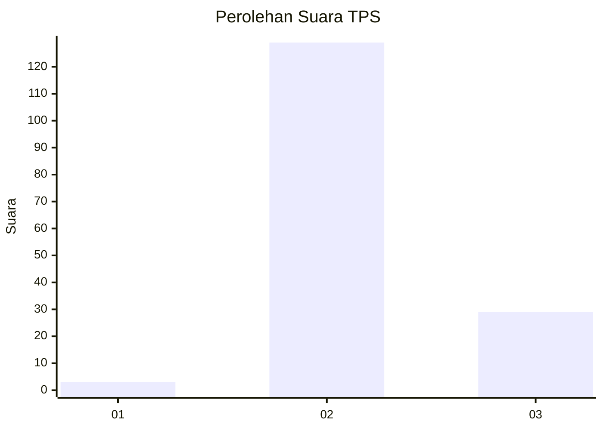
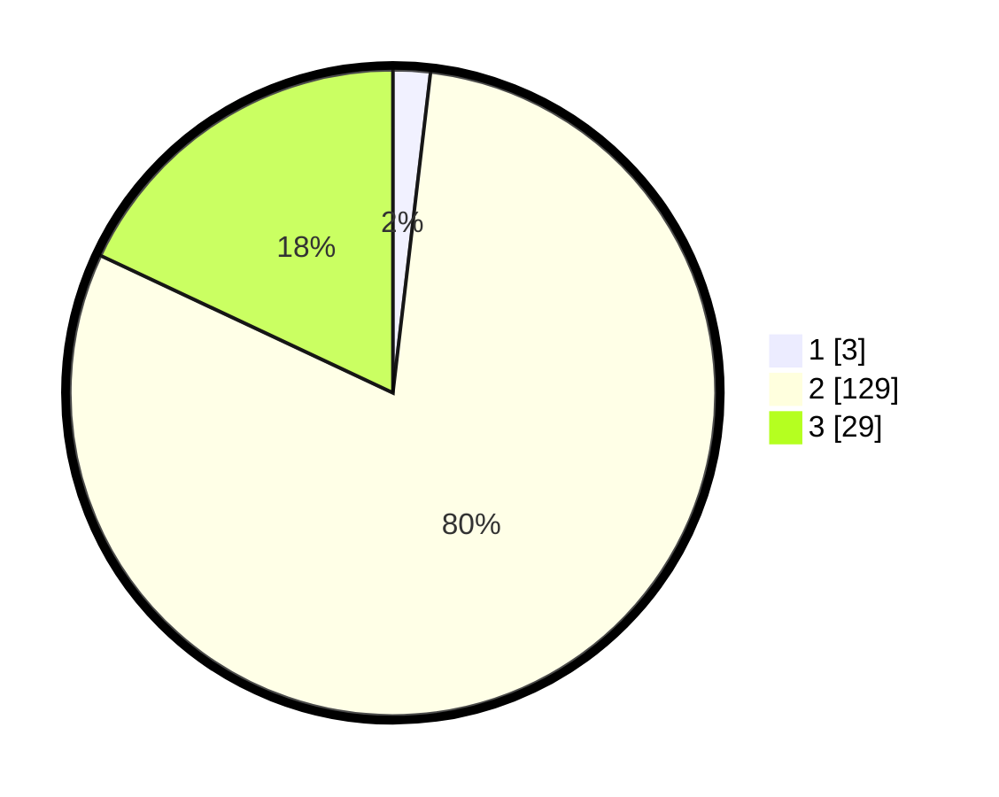

# Hasil

## Grafik

## Tabel

| No. | Nama Paslon    | Suara | Suara (raw) | Persentase |
|:--- |:-------------- | -----:| -----------:| ----------:|
| 1   | ANIES MUHAIMIN | 3     | [3][p-1]    | 1,86       |
| 2   | PRABOWO GIBRAN | 129   | [129][p-2]  | 80,12      |
| 3   | GANJAR MAHFUD  | 29    | [29][p-3]   | 18,01      |

[p-1]: https://github.com/gigit-pemilu/pemilu-2024-62-kalimantan-tengah/blob/main/pilpres/hitung-suara/sub/62-kalimantan-tengah/sub/02-kotawaringin-timur/sub/14-telawang/sub/2001-sebabi/sub/001-tps/sub/paslon-1.txt
[p-2]: https://github.com/gigit-pemilu/pemilu-2024-62-kalimantan-tengah/blob/main/pilpres/hitung-suara/sub/62-kalimantan-tengah/sub/02-kotawaringin-timur/sub/14-telawang/sub/2001-sebabi/sub/001-tps/sub/paslon-2.txt
[p-3]: https://github.com/gigit-pemilu/pemilu-2024-62-kalimantan-tengah/blob/main/pilpres/hitung-suara/sub/62-kalimantan-tengah/sub/02-kotawaringin-timur/sub/14-telawang/sub/2001-sebabi/sub/001-tps/sub/paslon-3.txt

## Foto C Plano

https://sirekap-obj-formc.kpu.go.id/2a1b/pemilu/ppwp/62/02/14/20/01/6202142001001-20240221-143758--50bc093a-aece-4ef3-8e7d-510f9eb29a26.jpg

https://sirekap-obj-formc.kpu.go.id/2a1b/pemilu/ppwp/62/02/14/20/01/6202142001001-20240214-215917--67629ae8-f052-40c6-a380-e98bb8f7e8dc.jpg

https://sirekap-obj-formc.kpu.go.id/2a1b/pemilu/ppwp/62/02/14/20/01/6202142001001-20240214-222109--87b63b5a-d59e-46a1-bec1-033b8f2cc910.jpg

## Metadata

| Key        | Value               |
| ---------- | ------------------- |
| Time Stamp | 2024-02-21 15:00:00 |

