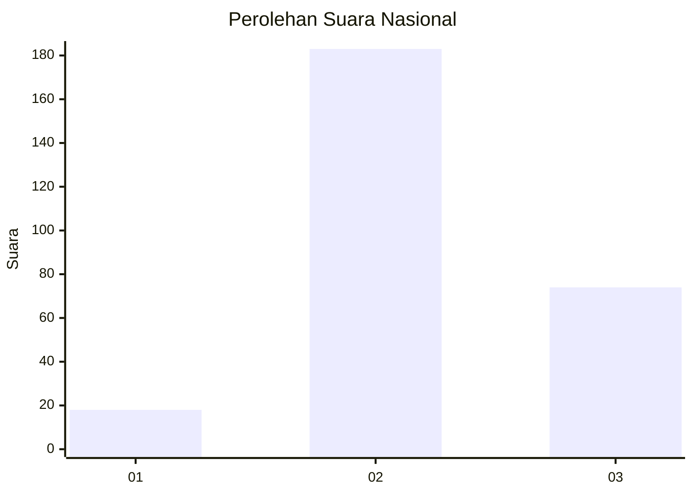

# Hasil

## Grafik

## Tabel

| No. | Nama Paslon    | Suara | Suara (raw) | Persentase |
|:--- |:-------------- | -----:| -----------:| ----------:|
| 1   | ANIES MUHAIMIN | 18    | [18][p-1]   | 6,55       |
| 2   | PRABOWO GIBRAN | 183   | [183][p-2]  | 66,55      |
| 3   | GANJAR MAHFUD  | 74    | [74][p-3]   | 26,91      |

[p-1]: https://github.com/gigit-pemilu/pemilu-2024/blob/main/pilpres/hitung-suara/sub/62-kalimantan-tengah/sub/02-kotawaringin-timur/sub/14-telawang/sub/2001-sebabi/sub/010-tps/sub/paslon-1.txt
[p-2]: https://github.com/gigit-pemilu/pemilu-2024/blob/main/pilpres/hitung-suara/sub/62-kalimantan-tengah/sub/02-kotawaringin-timur/sub/14-telawang/sub/2001-sebabi/sub/010-tps/sub/paslon-2.txt
[p-3]: https://github.com/gigit-pemilu/pemilu-2024/blob/main/pilpres/hitung-suara/sub/62-kalimantan-tengah/sub/02-kotawaringin-timur/sub/14-telawang/sub/2001-sebabi/sub/010-tps/sub/paslon-3.txt

## Foto C Plano

https://sirekap-obj-formc.kpu.go.id/296a/pemilu/ppwp/62/02/14/20/01/6202142001010-20240221-161720--2f8adf46-e502-45d0-b997-8983151ab0b2.jpg

https://sirekap-obj-formc.kpu.go.id/296a/pemilu/ppwp/62/02/14/20/01/6202142001010-20240215-044932--7659244d-cc60-4f2d-8ce5-b29036d20b08.jpg

https://sirekap-obj-formc.kpu.go.id/296a/pemilu/ppwp/62/02/14/20/01/6202142001010-20240215-045127--f608f5c0-aa6c-4248-9314-c2f81f855a61.jpg

## Metadata

| Key        | Value               |
| ---------- | ------------------- |
| Time Stamp | 2024-02-21 17:00:00 |

