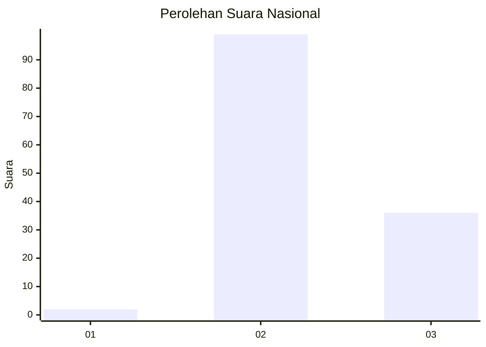
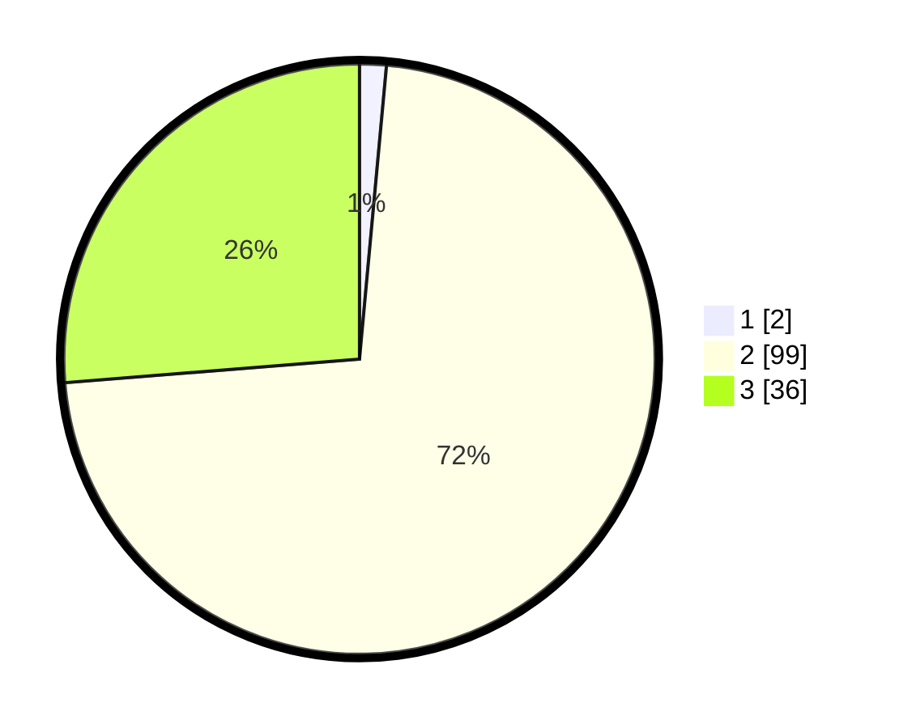

# Hasil

## Grafik

## Tabel

| No. | Nama Paslon    | Suara | Suara (raw) | Persentase |
|:--- |:-------------- | -----:| -----------:| ----------:|
| 1   | ANIES MUHAIMIN | 2     | [2][p-1]    | 1,46       |
| 2   | PRABOWO GIBRAN | 99    | [99][p-2]   | 72,26      |
| 3   | GANJAR MAHFUD  | 36    | [36][p-3]   | 26,28      |

[p-1]: https://github.com/gigit-pemilu/pemilu-2024/blob/main/pilpres/hitung-suara/sub/62-kalimantan-tengah/sub/02-kotawaringin-timur/sub/15-bukit-santuai/sub/2001-tumbang-tilap/sub/001-tps/sub/paslon-1.txt
[p-2]: https://github.com/gigit-pemilu/pemilu-2024/blob/main/pilpres/hitung-suara/sub/62-kalimantan-tengah/sub/02-kotawaringin-timur/sub/15-bukit-santuai/sub/2001-tumbang-tilap/sub/001-tps/sub/paslon-2.txt
[p-3]: https://github.com/gigit-pemilu/pemilu-2024/blob/main/pilpres/hitung-suara/sub/62-kalimantan-tengah/sub/02-kotawaringin-timur/sub/15-bukit-santuai/sub/2001-tumbang-tilap/sub/001-tps/sub/paslon-3.txt

## Foto C Plano

https://sirekap-obj-formc.kpu.go.id/458d/pemilu/ppwp/62/02/15/20/01/6202152001001-20240219-071924--bd18c3c3-87f2-40a7-a2e4-c9ac7d4c5a10.jpg

https://sirekap-obj-formc.kpu.go.id/458d/pemilu/ppwp/62/02/15/20/01/6202152001001-20240219-072012--de674286-90da-42a7-bd3c-6892d4f0e88e.jpg

https://sirekap-obj-formc.kpu.go.id/458d/pemilu/ppwp/62/02/15/20/01/6202152001001-20240219-072100--1451b63d-370a-45ea-8aad-add8c8b4ed48.jpg

## Metadata

| Key        | Value               |
| ---------- | ------------------- |
| Time Stamp | 2024-02-25 13:00:00 |

