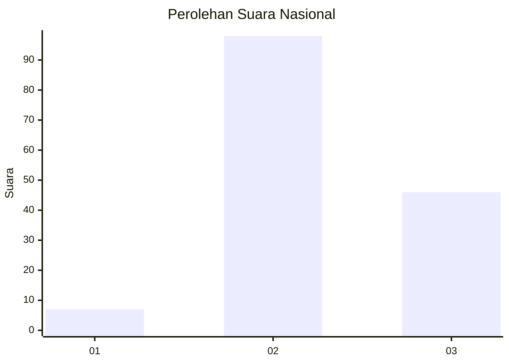
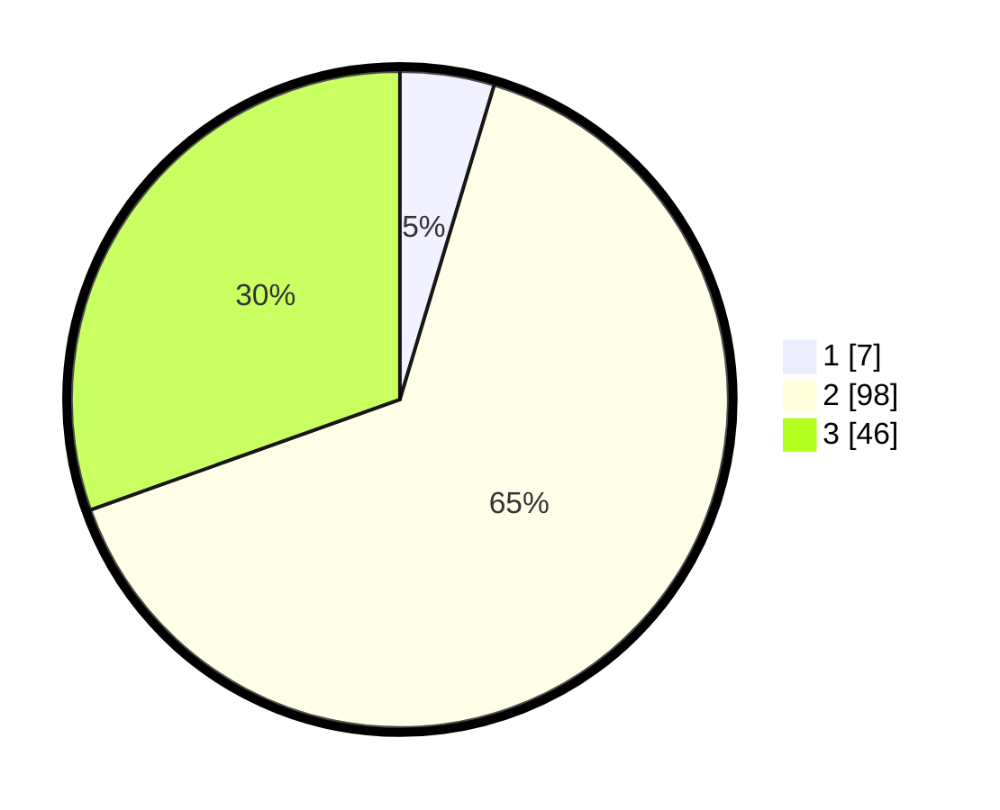

# Hasil

## Grafik

## Tabel

| No. | Nama Paslon    | Suara | Suara (raw) | Persentase |
|:--- |:-------------- | -----:| -----------:| ----------:|
| 1   | ANIES MUHAIMIN | 7     | [7][p-1]    | 4,64       |
| 2   | PRABOWO GIBRAN | 98    | [98][p-2]   | 64,90      |
| 3   | GANJAR MAHFUD  | 46    | [46][p-3]   | 30,46      |

[p-1]: https://github.com/gigit-pemilu/pemilu-2024/blob/main/pilpres/hitung-suara/sub/62-kalimantan-tengah/sub/02-kotawaringin-timur/sub/15-bukit-santuai/sub/2002-tumbang-kaminting/sub/001-tps/sub/paslon-1.txt
[p-2]: https://github.com/gigit-pemilu/pemilu-2024/blob/main/pilpres/hitung-suara/sub/62-kalimantan-tengah/sub/02-kotawaringin-timur/sub/15-bukit-santuai/sub/2002-tumbang-kaminting/sub/001-tps/sub/paslon-2.txt
[p-3]: https://github.com/gigit-pemilu/pemilu-2024/blob/main/pilpres/hitung-suara/sub/62-kalimantan-tengah/sub/02-kotawaringin-timur/sub/15-bukit-santuai/sub/2002-tumbang-kaminting/sub/001-tps/sub/paslon-3.txt

## Foto C Plano

https://sirekap-obj-formc.kpu.go.id/8fb0/pemilu/ppwp/62/02/15/20/02/6202152002001-20240219-022702--21588bed-aeef-42bf-a863-3375593a2814.jpg

https://sirekap-obj-formc.kpu.go.id/8fb0/pemilu/ppwp/62/02/15/20/02/6202152002001-20240219-022802--2c14cf60-ad2f-4c8a-bc68-60dc7e5294a5.jpg

https://sirekap-obj-formc.kpu.go.id/8fb0/pemilu/ppwp/62/02/15/20/02/6202152002001-20240219-022908--25768c57-6dbe-4eef-90e6-39e87b399d37.jpg

## Metadata

| Key        | Value               |
| ---------- | ------------------- |
| Time Stamp | 2024-02-24 22:31:28 |

