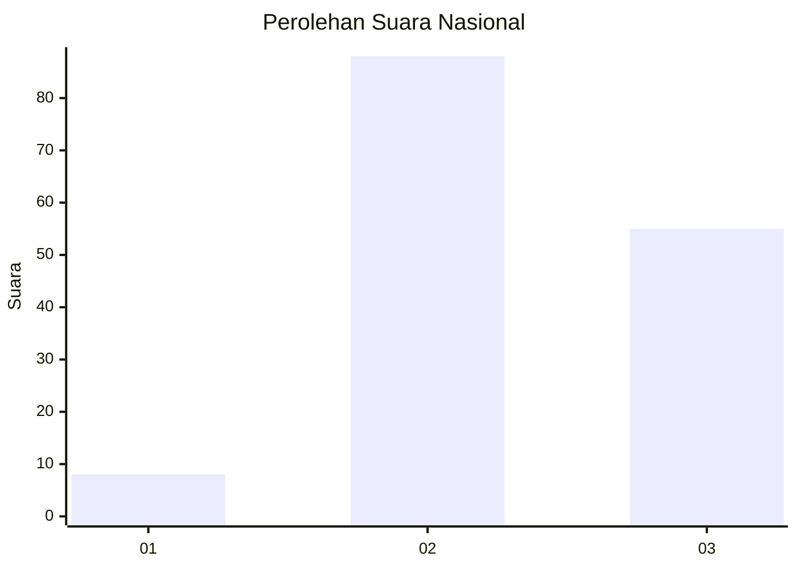
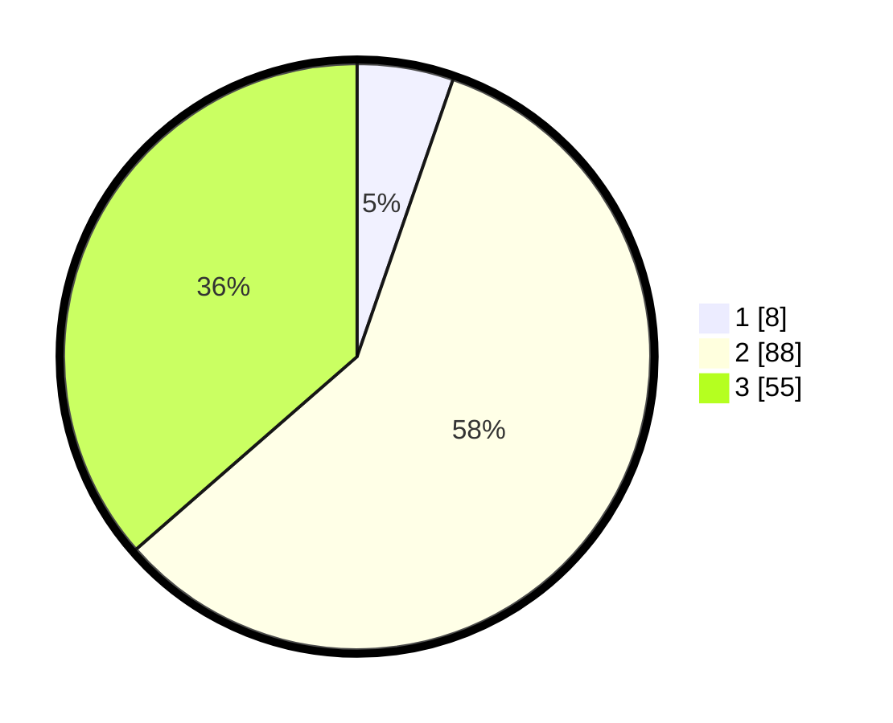

# Hasil

## Grafik

## Tabel

| No. | Nama Paslon    | Suara | Suara (raw) | Persentase |
|:--- |:-------------- | -----:| -----------:| ----------:|
| 1   | ANIES MUHAIMIN | 8     | [8][p-1]    | 5,30       |
| 2   | PRABOWO GIBRAN | 88    | [88][p-2]   | 58,28      |
| 3   | GANJAR MAHFUD  | 55    | [55][p-3]   | 36,42      |

[p-1]: https://github.com/gigit-pemilu/pemilu-2024/blob/main/pilpres/hitung-suara/sub/62-kalimantan-tengah/sub/02-kotawaringin-timur/sub/15-bukit-santuai/sub/2002-tumbang-kaminting/sub/002-tps/sub/paslon-1.txt
[p-2]: https://github.com/gigit-pemilu/pemilu-2024/blob/main/pilpres/hitung-suara/sub/62-kalimantan-tengah/sub/02-kotawaringin-timur/sub/15-bukit-santuai/sub/2002-tumbang-kaminting/sub/002-tps/sub/paslon-2.txt
[p-3]: https://github.com/gigit-pemilu/pemilu-2024/blob/main/pilpres/hitung-suara/sub/62-kalimantan-tengah/sub/02-kotawaringin-timur/sub/15-bukit-santuai/sub/2002-tumbang-kaminting/sub/002-tps/sub/paslon-3.txt

## Foto C Plano

https://sirekap-obj-formc.kpu.go.id/3c56/pemilu/ppwp/62/02/15/20/02/6202152002002-20240219-022753--d6f5a087-5667-4e56-ab2a-acdda708f99c.jpg

https://sirekap-obj-formc.kpu.go.id/3c56/pemilu/ppwp/62/02/15/20/02/6202152002002-20240219-023211--313db2ac-11b9-4cab-bc0c-29aff12febe9.jpg

https://sirekap-obj-formc.kpu.go.id/3c56/pemilu/ppwp/62/02/15/20/02/6202152002002-20240219-023038--b9732df0-7d0d-42fe-8c8d-7d34645697fa.jpg

## Metadata

| Key        | Value               |
| ---------- | ------------------- |
| Time Stamp | 2024-02-20 21:00:00 |

