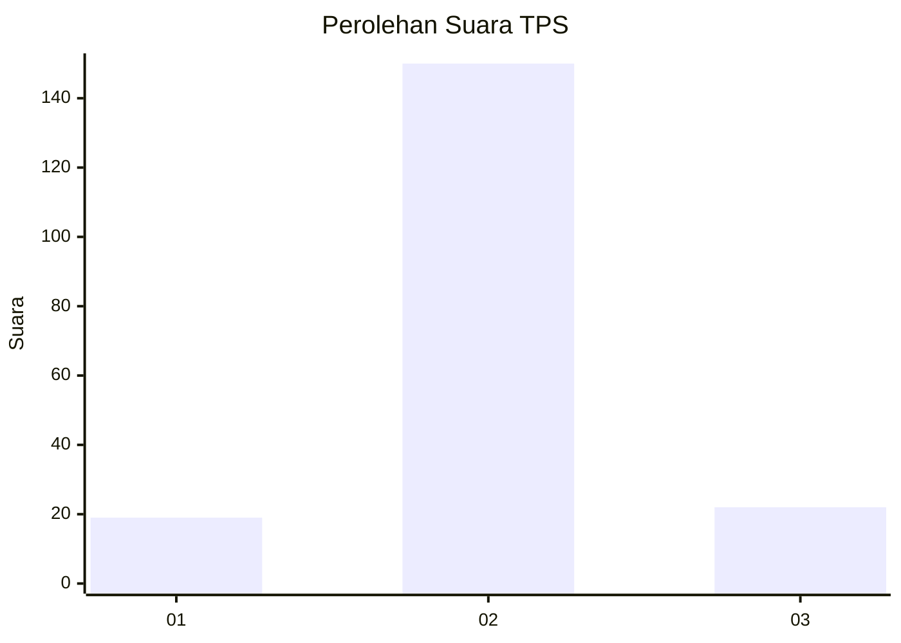
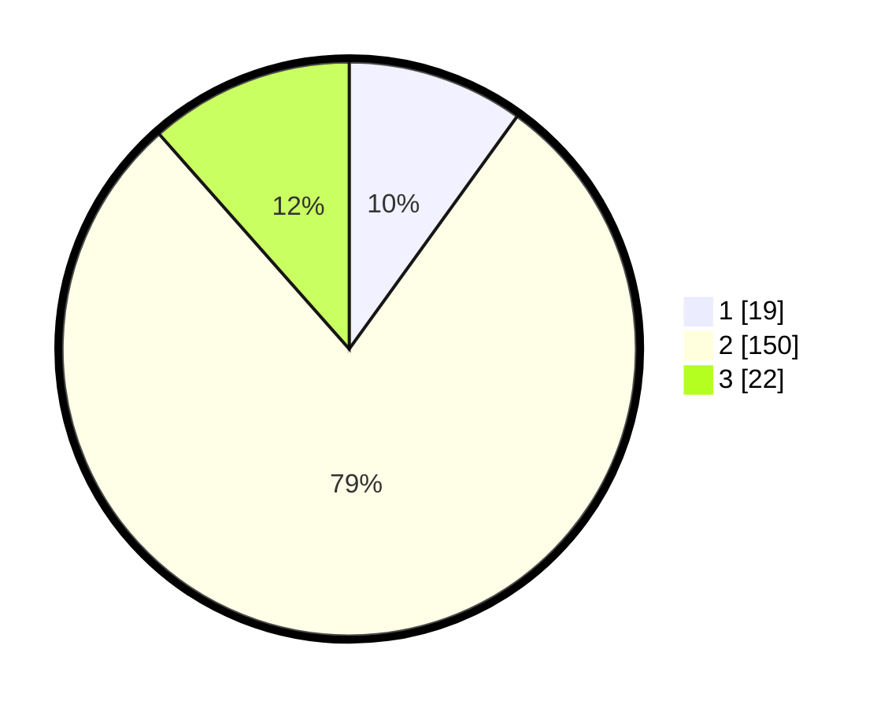

# Hasil

## Grafik

## Tabel

| No. | Nama Paslon    | Suara | Suara (raw) | Persentase |
|:--- |:-------------- | -----:| -----------:| ----------:|
| 1   | ANIES MUHAIMIN | 19    | [19][p-1]   | 9,95       |
| 2   | PRABOWO GIBRAN | 150   | [150][p-2]  | 78,53      |
| 3   | GANJAR MAHFUD  | 22    | [22][p-3]   | 11,52      |

[p-1]: https://github.com/gigit-pemilu/pemilu-2024-62-kalimantan-tengah/blob/main/pilpres/hitung-suara/sub/62-kalimantan-tengah/sub/02-kotawaringin-timur/sub/15-bukit-santuai/sub/2004-tumbang-panyahuan/sub/001-tps/sub/paslon-1.txt
[p-2]: https://github.com/gigit-pemilu/pemilu-2024-62-kalimantan-tengah/blob/main/pilpres/hitung-suara/sub/62-kalimantan-tengah/sub/02-kotawaringin-timur/sub/15-bukit-santuai/sub/2004-tumbang-panyahuan/sub/001-tps/sub/paslon-2.txt
[p-3]: https://github.com/gigit-pemilu/pemilu-2024-62-kalimantan-tengah/blob/main/pilpres/hitung-suara/sub/62-kalimantan-tengah/sub/02-kotawaringin-timur/sub/15-bukit-santuai/sub/2004-tumbang-panyahuan/sub/001-tps/sub/paslon-3.txt

## Foto C Plano

https://sirekap-obj-formc.kpu.go.id/19f8/pemilu/ppwp/62/02/15/20/04/6202152004001-20240218-200056--710198ce-1f31-433b-8874-1d2306ea76de.jpg

https://sirekap-obj-formc.kpu.go.id/19f8/pemilu/ppwp/62/02/15/20/04/6202152004001-20240218-200221--f70e095e-ea9a-4b8b-970b-838f33bed5e5.jpg

https://sirekap-obj-formc.kpu.go.id/19f8/pemilu/ppwp/62/02/15/20/04/6202152004001-20240218-200338--866734b8-ac69-4edb-8f67-0a135dd8f99c.jpg

## Metadata

| Key        | Value               |
| ---------- | ------------------- |
| Time Stamp | 2024-02-24 22:31:28 |

