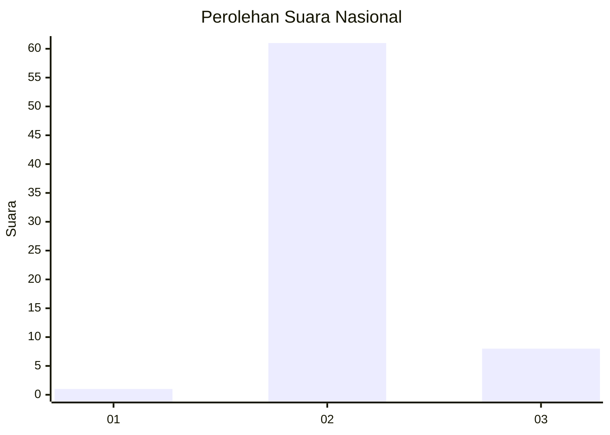
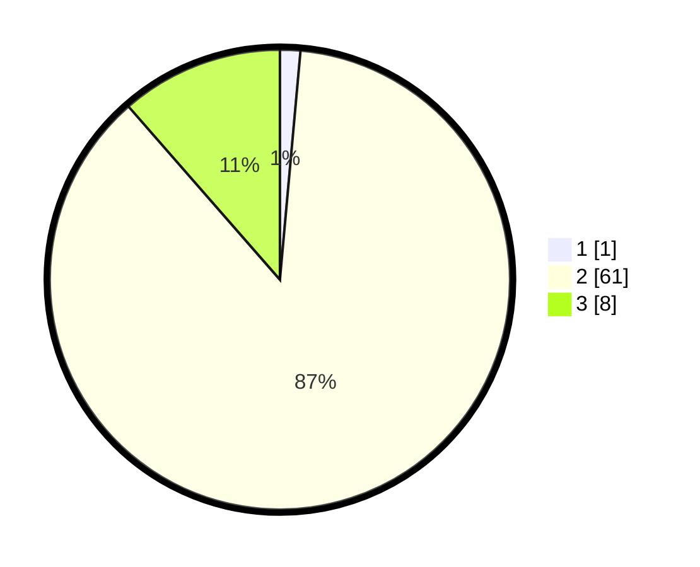

# Hasil

## Grafik

## Tabel

| No. | Nama Paslon    | Suara | Suara (raw) | Persentase |
|:--- |:-------------- | -----:| -----------:| ----------:|
| 1   | ANIES MUHAIMIN | 1     | [1][p-1]    | 1,43       |
| 2   | PRABOWO GIBRAN | 61    | [61][p-2]   | 87,14      |
| 3   | GANJAR MAHFUD  | 8     | [8][p-3]    | 11,43      |

[p-1]: https://github.com/gigit-pemilu/pemilu-2024/blob/main/pilpres/hitung-suara/sub/62-kalimantan-tengah/sub/02-kotawaringin-timur/sub/15-bukit-santuai/sub/2005-tumbang-sapia/sub/001-tps/sub/paslon-1.txt
[p-2]: https://github.com/gigit-pemilu/pemilu-2024/blob/main/pilpres/hitung-suara/sub/62-kalimantan-tengah/sub/02-kotawaringin-timur/sub/15-bukit-santuai/sub/2005-tumbang-sapia/sub/001-tps/sub/paslon-2.txt
[p-3]: https://github.com/gigit-pemilu/pemilu-2024/blob/main/pilpres/hitung-suara/sub/62-kalimantan-tengah/sub/02-kotawaringin-timur/sub/15-bukit-santuai/sub/2005-tumbang-sapia/sub/001-tps/sub/paslon-3.txt

## Foto C Plano

https://sirekap-obj-formc.kpu.go.id/6202/pemilu/ppwp/62/02/15/20/05/6202152005001-20240219-115807--74bdab28-fe77-4dbb-ad26-597c70cfd8ad.jpg

https://sirekap-obj-formc.kpu.go.id/6202/pemilu/ppwp/62/02/15/20/05/6202152005001-20240219-115907--34011ab7-3b7e-48a9-9c53-fe4415325bd0.jpg

https://sirekap-obj-formc.kpu.go.id/6202/pemilu/ppwp/62/02/15/20/05/6202152005001-20240219-120112--60f49e0f-259a-4ec2-923f-2fb157ce9b77.jpg

## Metadata

| Key        | Value               |
| ---------- | ------------------- |
| Time Stamp | 2024-02-20 21:00:00 |

