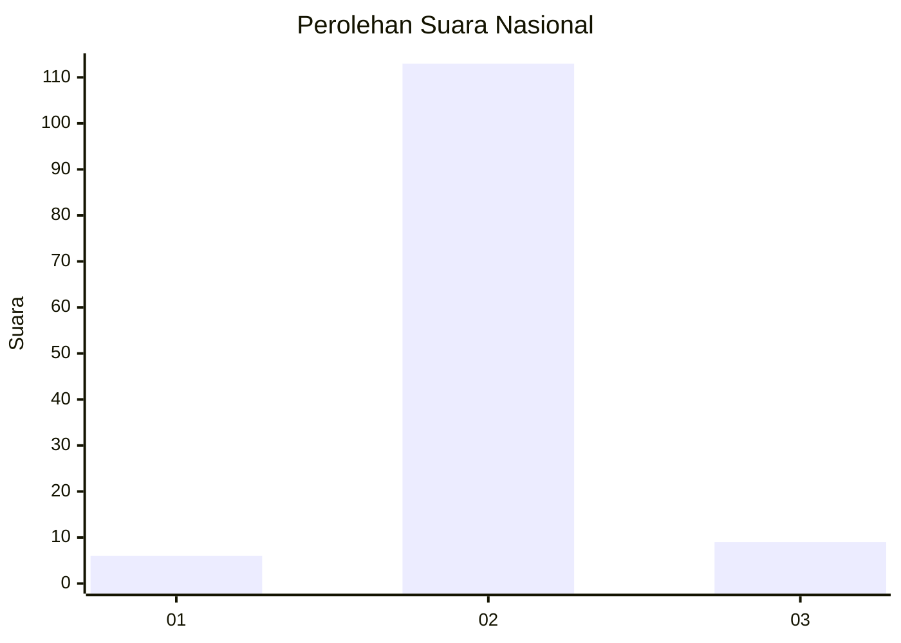
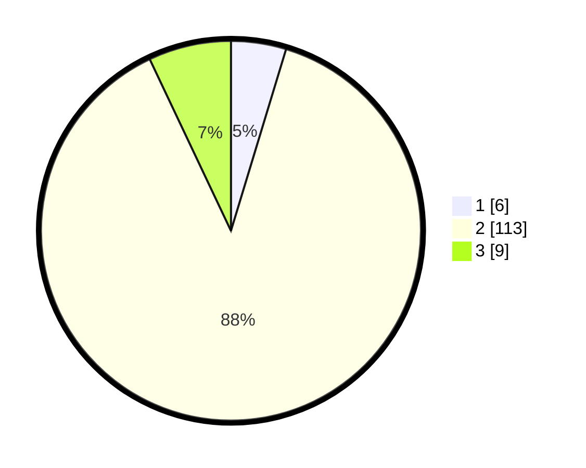

# Hasil

## Grafik

## Tabel

| No. | Nama Paslon    | Suara | Suara (raw) | Persentase |
|:--- |:-------------- | -----:| -----------:| ----------:|
| 1   | ANIES MUHAIMIN | 6     | [6][p-1]    | 4,69       |
| 2   | PRABOWO GIBRAN | 113   | [113][p-2]  | 88,28      |
| 3   | GANJAR MAHFUD  | 9     | [9][p-3]    | 7,03       |

[p-1]: https://github.com/gigit-pemilu/pemilu-2024/blob/main/pilpres/hitung-suara/sub/62-kalimantan-tengah/sub/02-kotawaringin-timur/sub/15-bukit-santuai/sub/2006-tumbang-getas/sub/001-tps/sub/paslon-1.txt
[p-2]: https://github.com/gigit-pemilu/pemilu-2024/blob/main/pilpres/hitung-suara/sub/62-kalimantan-tengah/sub/02-kotawaringin-timur/sub/15-bukit-santuai/sub/2006-tumbang-getas/sub/001-tps/sub/paslon-2.txt
[p-3]: https://github.com/gigit-pemilu/pemilu-2024/blob/main/pilpres/hitung-suara/sub/62-kalimantan-tengah/sub/02-kotawaringin-timur/sub/15-bukit-santuai/sub/2006-tumbang-getas/sub/001-tps/sub/paslon-3.txt

## Foto C Plano

https://sirekap-obj-formc.kpu.go.id/b9fc/pemilu/ppwp/62/02/15/20/06/6202152006001-20240219-001843--70bc8ee8-901a-4ab0-9692-48d596496ba5.jpg

https://sirekap-obj-formc.kpu.go.id/b9fc/pemilu/ppwp/62/02/15/20/06/6202152006001-20240219-002014--4f733f09-1c0c-40bc-b732-257bf7bb4d5b.jpg

https://sirekap-obj-formc.kpu.go.id/b9fc/pemilu/ppwp/62/02/15/20/06/6202152006001-20240219-002342--faf28356-192d-4ff5-ba23-3b29f1983766.jpg

## Metadata

| Key        | Value               |
| ---------- | ------------------- |
| Time Stamp | 2024-02-24 22:31:28 |

