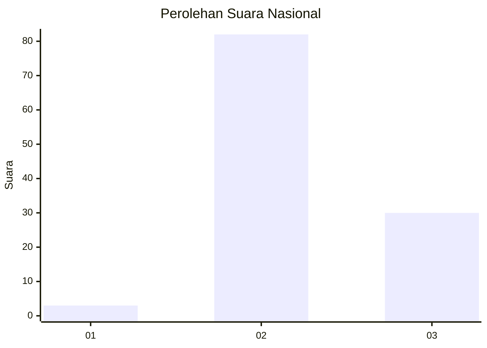
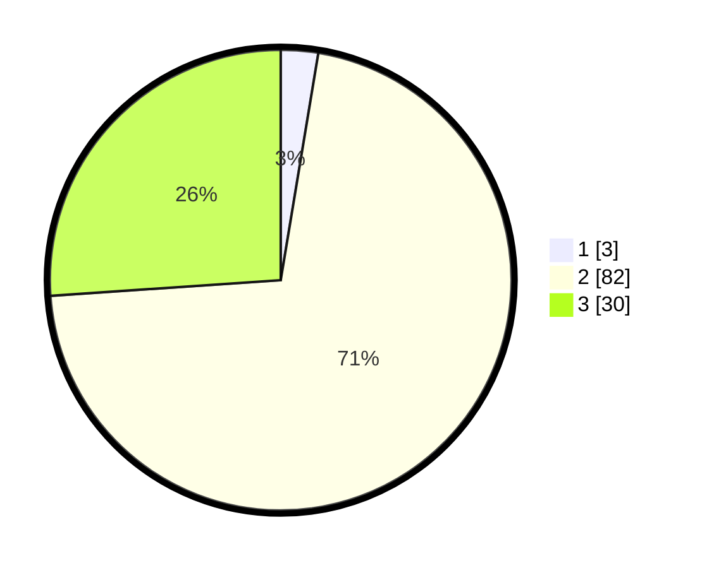

# Hasil

## Grafik

## Tabel

| No. | Nama Paslon    | Suara | Suara (raw) | Persentase |
|:--- |:-------------- | -----:| -----------:| ----------:|
| 1   | ANIES MUHAIMIN | 3     | [3][p-1]    | 2,61       |
| 2   | PRABOWO GIBRAN | 82    | [82][p-2]   | 71,30      |
| 3   | GANJAR MAHFUD  | 30    | [30][p-3]   | 26,09      |

[p-1]: https://github.com/gigit-pemilu/pemilu-2024/blob/main/pilpres/hitung-suara/sub/62-kalimantan-tengah/sub/02-kotawaringin-timur/sub/15-bukit-santuai/sub/2007-tewai-hara/sub/002-tps/sub/paslon-1.txt
[p-2]: https://github.com/gigit-pemilu/pemilu-2024/blob/main/pilpres/hitung-suara/sub/62-kalimantan-tengah/sub/02-kotawaringin-timur/sub/15-bukit-santuai/sub/2007-tewai-hara/sub/002-tps/sub/paslon-2.txt
[p-3]: https://github.com/gigit-pemilu/pemilu-2024/blob/main/pilpres/hitung-suara/sub/62-kalimantan-tengah/sub/02-kotawaringin-timur/sub/15-bukit-santuai/sub/2007-tewai-hara/sub/002-tps/sub/paslon-3.txt

## Foto C Plano

https://sirekap-obj-formc.kpu.go.id/34f8/pemilu/ppwp/62/02/15/20/07/6202152007002-20240218-165851--a1f48977-a78f-40b9-9893-6621e72c2198.jpg

https://sirekap-obj-formc.kpu.go.id/34f8/pemilu/ppwp/62/02/15/20/07/6202152007002-20240218-165957--ae3a1914-905b-4233-87b6-bcadf803062a.jpg

https://sirekap-obj-formc.kpu.go.id/34f8/pemilu/ppwp/62/02/15/20/07/6202152007002-20240218-170054--62e85e05-800f-4838-b266-89a5415a987b.jpg

## Metadata

| Key        | Value               |
| ---------- | ------------------- |
| Time Stamp | 2024-02-20 21:00:00 |

