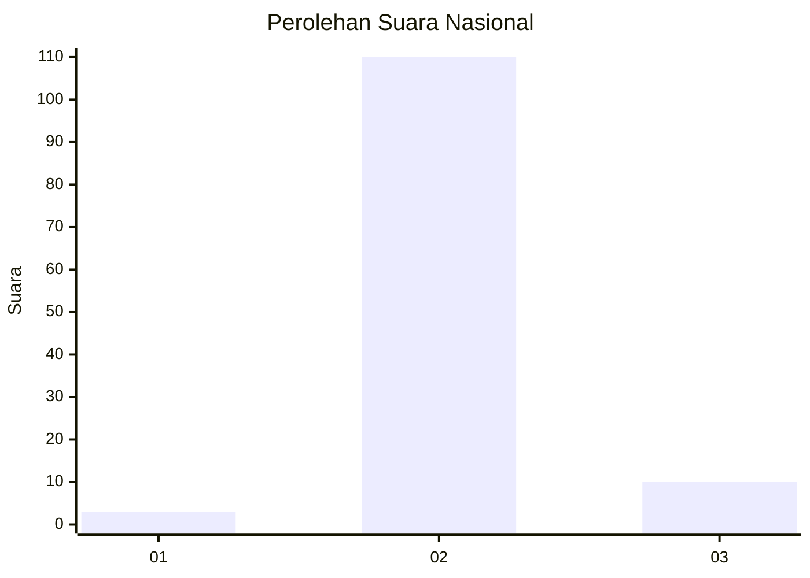
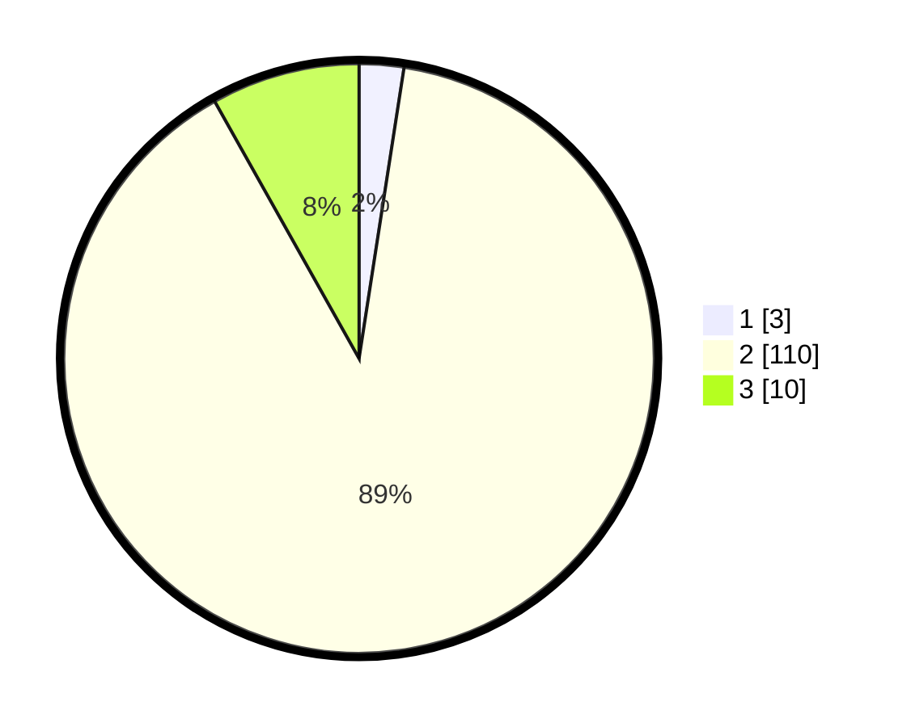

# Hasil

## Grafik

## Tabel

| No. | Nama Paslon    | Suara | Suara (raw) | Persentase |
|:--- |:-------------- | -----:| -----------:| ----------:|
| 1   | ANIES MUHAIMIN | 3     | [3][p-1]    | 2,44       |
| 2   | PRABOWO GIBRAN | 110   | [110][p-2]  | 89,43      |
| 3   | GANJAR MAHFUD  | 10    | [10][p-3]   | 8,13       |

[p-1]: https://github.com/gigit-pemilu/pemilu-2024/blob/main/pilpres/hitung-suara/sub/62-kalimantan-tengah/sub/02-kotawaringin-timur/sub/15-bukit-santuai/sub/2008-tumbang-payang/sub/002-tps/sub/paslon-1.txt
[p-2]: https://github.com/gigit-pemilu/pemilu-2024/blob/main/pilpres/hitung-suara/sub/62-kalimantan-tengah/sub/02-kotawaringin-timur/sub/15-bukit-santuai/sub/2008-tumbang-payang/sub/002-tps/sub/paslon-2.txt
[p-3]: https://github.com/gigit-pemilu/pemilu-2024/blob/main/pilpres/hitung-suara/sub/62-kalimantan-tengah/sub/02-kotawaringin-timur/sub/15-bukit-santuai/sub/2008-tumbang-payang/sub/002-tps/sub/paslon-3.txt

## Foto C Plano

https://sirekap-obj-formc.kpu.go.id/d0af/pemilu/ppwp/62/02/15/20/08/6202152008002-20240218-114905--5bd4b1a9-c7d5-4b5b-b29a-47416cc8f694.jpg

https://sirekap-obj-formc.kpu.go.id/d0af/pemilu/ppwp/62/02/15/20/08/6202152008002-20240218-114949--320c3f46-7ebb-4e83-b6cc-8a3ff733d99b.jpg

https://sirekap-obj-formc.kpu.go.id/d0af/pemilu/ppwp/62/02/15/20/08/6202152008002-20240218-115209--ecaefa87-d1eb-433e-877d-f7883c6a0d5f.jpg

## Metadata

| Key        | Value               |
| ---------- | ------------------- |
| Time Stamp | 2024-02-19 06:16:00 |

