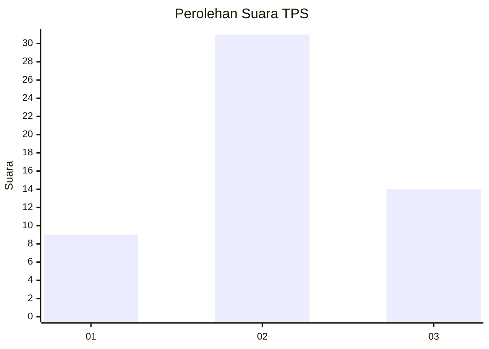
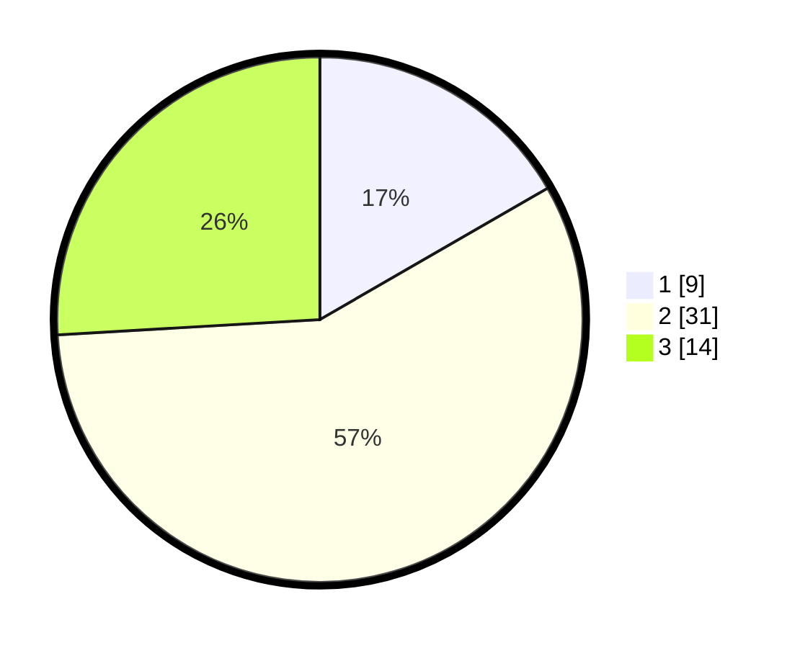

# Hasil

## Grafik

## Tabel

| No. | Nama Paslon    | Suara | Suara (raw) | Persentase |
|:--- |:-------------- | -----:| -----------:| ----------:|
| 1   | ANIES MUHAIMIN | 9     | [9][p-1]    | 16,67      |
| 2   | PRABOWO GIBRAN | 31    | [31][p-2]   | 57,41      |
| 3   | GANJAR MAHFUD  | 14    | [14][p-3]   | 25,93      |

[p-1]: https://github.com/gigit-pemilu/pemilu-2024-62-kalimantan-tengah/blob/main/pilpres/hitung-suara/sub/62-kalimantan-tengah/sub/02-kotawaringin-timur/sub/15-bukit-santuai/sub/2012-tumbang-torung/sub/002-tps/sub/paslon-1.txt
[p-2]: https://github.com/gigit-pemilu/pemilu-2024-62-kalimantan-tengah/blob/main/pilpres/hitung-suara/sub/62-kalimantan-tengah/sub/02-kotawaringin-timur/sub/15-bukit-santuai/sub/2012-tumbang-torung/sub/002-tps/sub/paslon-2.txt
[p-3]: https://github.com/gigit-pemilu/pemilu-2024-62-kalimantan-tengah/blob/main/pilpres/hitung-suara/sub/62-kalimantan-tengah/sub/02-kotawaringin-timur/sub/15-bukit-santuai/sub/2012-tumbang-torung/sub/002-tps/sub/paslon-3.txt

## Foto C Plano

https://sirekap-obj-formc.kpu.go.id/ed39/pemilu/ppwp/62/02/15/20/12/6202152012002-20240219-011524--50b4a5cd-e3ce-4352-8f01-fbeb765ef90e.jpg

https://sirekap-obj-formc.kpu.go.id/ed39/pemilu/ppwp/62/02/15/20/12/6202152012002-20240219-011620--aa5207a5-9526-4e40-9239-c627ceebc33a.jpg

https://sirekap-obj-formc.kpu.go.id/ed39/pemilu/ppwp/62/02/15/20/12/6202152012002-20240219-011817--5f65ac8d-f366-42ad-bf00-72354b9ace87.jpg

## Metadata

| Key        | Value               |
| ---------- | ------------------- |
| Time Stamp | 2024-02-25 21:00:00 |

