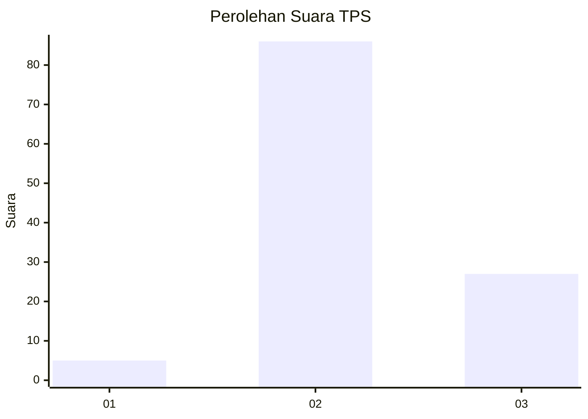
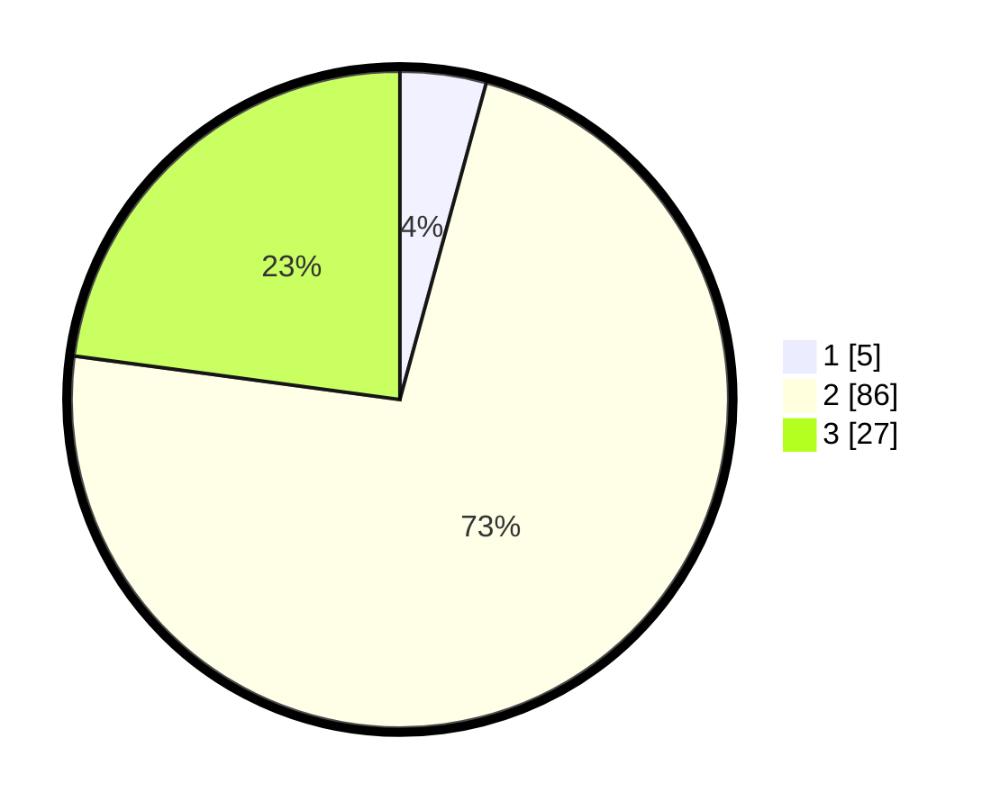

# Hasil

## Grafik

## Tabel

| No. | Nama Paslon    | Suara | Suara (raw) | Persentase |
|:--- |:-------------- | -----:| -----------:| ----------:|
| 1   | ANIES MUHAIMIN | 5     | [5][p-1]    | 4,24       |
| 2   | PRABOWO GIBRAN | 86    | [86][p-2]   | 72,88      |
| 3   | GANJAR MAHFUD  | 27    | [27][p-3]   | 22,88      |

[p-1]: https://github.com/gigit-pemilu/pemilu-2024-62-kalimantan-tengah/blob/main/pilpres/hitung-suara/sub/62-kalimantan-tengah/sub/02-kotawaringin-timur/sub/15-bukit-santuai/sub/2013-tumbang-batu/sub/003-tps/sub/paslon-1.txt
[p-2]: https://github.com/gigit-pemilu/pemilu-2024-62-kalimantan-tengah/blob/main/pilpres/hitung-suara/sub/62-kalimantan-tengah/sub/02-kotawaringin-timur/sub/15-bukit-santuai/sub/2013-tumbang-batu/sub/003-tps/sub/paslon-2.txt
[p-3]: https://github.com/gigit-pemilu/pemilu-2024-62-kalimantan-tengah/blob/main/pilpres/hitung-suara/sub/62-kalimantan-tengah/sub/02-kotawaringin-timur/sub/15-bukit-santuai/sub/2013-tumbang-batu/sub/003-tps/sub/paslon-3.txt

## Foto C Plano

https://sirekap-obj-formc.kpu.go.id/9103/pemilu/ppwp/62/02/15/20/13/6202152013003-20240219-091422--4d32213f-2654-4add-9370-6669553bac91.jpg

https://sirekap-obj-formc.kpu.go.id/9103/pemilu/ppwp/62/02/15/20/13/6202152013003-20240219-091531--2d4b391d-047f-4af0-af86-813a40120879.jpg

https://sirekap-obj-formc.kpu.go.id/9103/pemilu/ppwp/62/02/15/20/13/6202152013003-20240219-091830--588f5793-2d44-446a-8042-b3a329ab4bb6.jpg

## Metadata

| Key        | Value               |
| ---------- | ------------------- |
| Time Stamp | 2024-02-20 21:00:00 |

