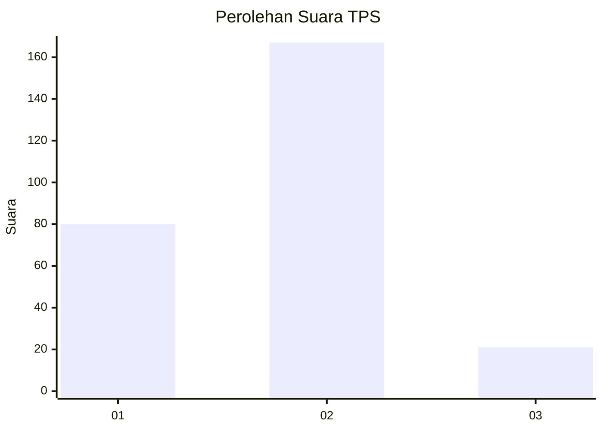
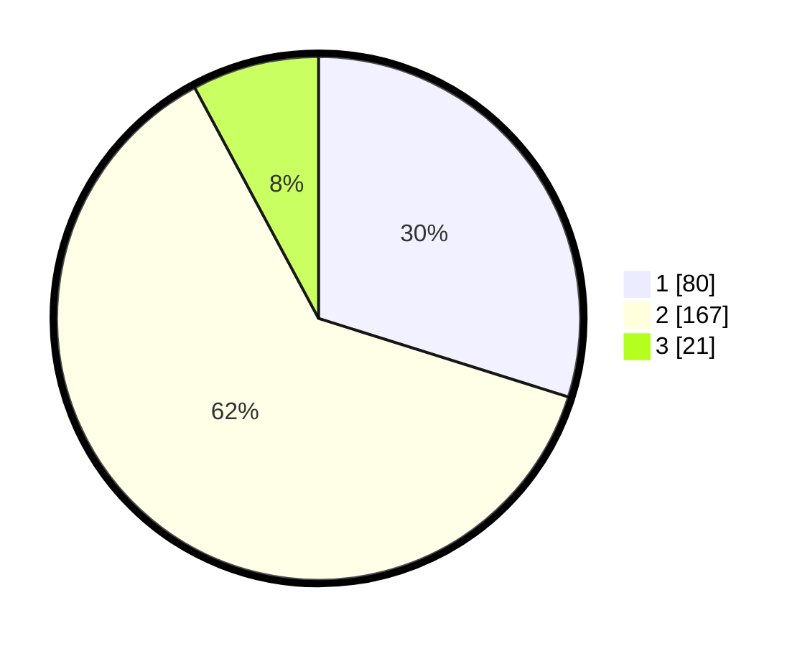

# Hasil

## Grafik

## Tabel

| No. | Nama Paslon    | Suara | Suara (raw) | Persentase |
|:--- |:-------------- | -----:| -----------:| ----------:|
| 1   | ANIES MUHAIMIN | 80    | [80][p-1]   | 29,85      |
| 2   | PRABOWO GIBRAN | 167   | [167][p-2]  | 62,31      |
| 3   | GANJAR MAHFUD  | 21    | [21][p-3]   | 7,84       |

[p-1]: https://github.com/gigit-pemilu/pemilu-2024-62-kalimantan-tengah/blob/main/pilpres/hitung-suara/sub/62-kalimantan-tengah/sub/03-kapuas/sub/01-selat/sub/1008-selat-tengah/sub/028-tps/sub/paslon-1.txt
[p-2]: https://github.com/gigit-pemilu/pemilu-2024-62-kalimantan-tengah/blob/main/pilpres/hitung-suara/sub/62-kalimantan-tengah/sub/03-kapuas/sub/01-selat/sub/1008-selat-tengah/sub/028-tps/sub/paslon-2.txt
[p-3]: https://github.com/gigit-pemilu/pemilu-2024-62-kalimantan-tengah/blob/main/pilpres/hitung-suara/sub/62-kalimantan-tengah/sub/03-kapuas/sub/01-selat/sub/1008-selat-tengah/sub/028-tps/sub/paslon-3.txt

## Foto C Plano

https://sirekap-obj-formc.kpu.go.id/aa26/pemilu/ppwp/62/03/01/10/08/6203011008028-20240226-143231--6ba398cd-cf55-43f5-a5b5-a1f98fe5bfef.jpg

https://sirekap-obj-formc.kpu.go.id/aa26/pemilu/ppwp/62/03/01/10/08/6203011008028-20240226-143429--d58a0fbb-5249-4ad4-8642-e06c64b635c7.jpg

https://sirekap-obj-formc.kpu.go.id/aa26/pemilu/ppwp/62/03/01/10/08/6203011008028-20240214-220928--7e93fe09-dd11-4b67-8a70-f644c4dc06dc.jpg

## Metadata

| Key        | Value               |
| ---------- | ------------------- |
| Time Stamp | 2024-02-28 19:00:00 |

