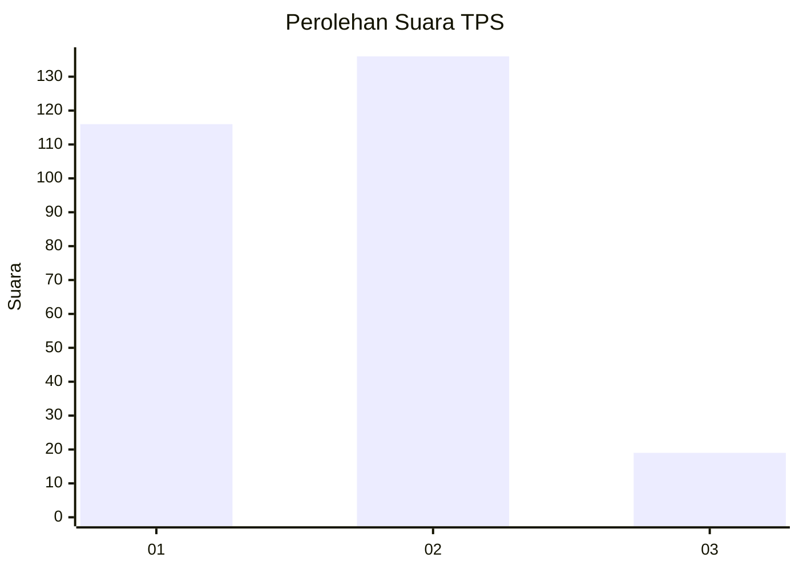
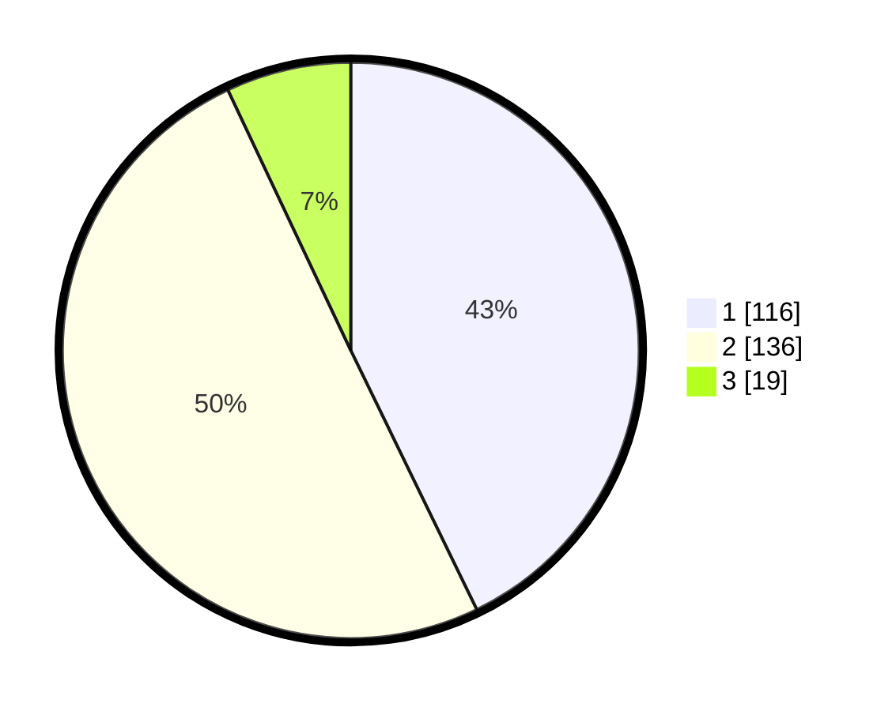

# Hasil

## Grafik

## Tabel

| No. | Nama Paslon    | Suara | Suara (raw) | Persentase |
|:--- |:-------------- | -----:| -----------:| ----------:|
| 1   | ANIES MUHAIMIN | 116   | [116][p-1]  | 42,80      |
| 2   | PRABOWO GIBRAN | 136   | [136][p-2]  | 50,18      |
| 3   | GANJAR MAHFUD  | 19    | [19][p-3]   | 7,01       |

[p-1]: https://github.com/gigit-pemilu/pemilu-2024-62-kalimantan-tengah/blob/main/pilpres/hitung-suara/sub/62-kalimantan-tengah/sub/03-kapuas/sub/01-selat/sub/1009-selat-hulu/sub/031-tps/sub/paslon-1.txt
[p-2]: https://github.com/gigit-pemilu/pemilu-2024-62-kalimantan-tengah/blob/main/pilpres/hitung-suara/sub/62-kalimantan-tengah/sub/03-kapuas/sub/01-selat/sub/1009-selat-hulu/sub/031-tps/sub/paslon-2.txt
[p-3]: https://github.com/gigit-pemilu/pemilu-2024-62-kalimantan-tengah/blob/main/pilpres/hitung-suara/sub/62-kalimantan-tengah/sub/03-kapuas/sub/01-selat/sub/1009-selat-hulu/sub/031-tps/sub/paslon-3.txt

## Foto C Plano

https://sirekap-obj-formc.kpu.go.id/dbf0/pemilu/ppwp/62/03/01/10/09/6203011009031-20240215-011744--0ae91974-4428-4f62-8d0d-756f1adac28c.jpg

https://sirekap-obj-formc.kpu.go.id/dbf0/pemilu/ppwp/62/03/01/10/09/6203011009031-20240215-011919--0df57eec-13f6-4f2a-952f-5f836e809c4c.jpg

https://sirekap-obj-formc.kpu.go.id/dbf0/pemilu/ppwp/62/03/01/10/09/6203011009031-20240215-011959--499bc547-9132-4d88-baa4-11d2a137bbc1.jpg

## Metadata

| Key        | Value               |
| ---------- | ------------------- |
| Time Stamp | 2024-02-15 15:00:29 |

