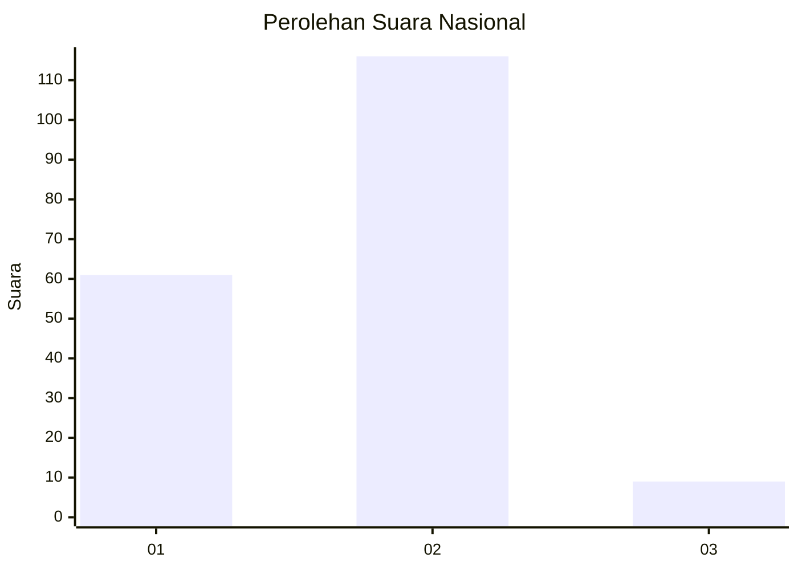
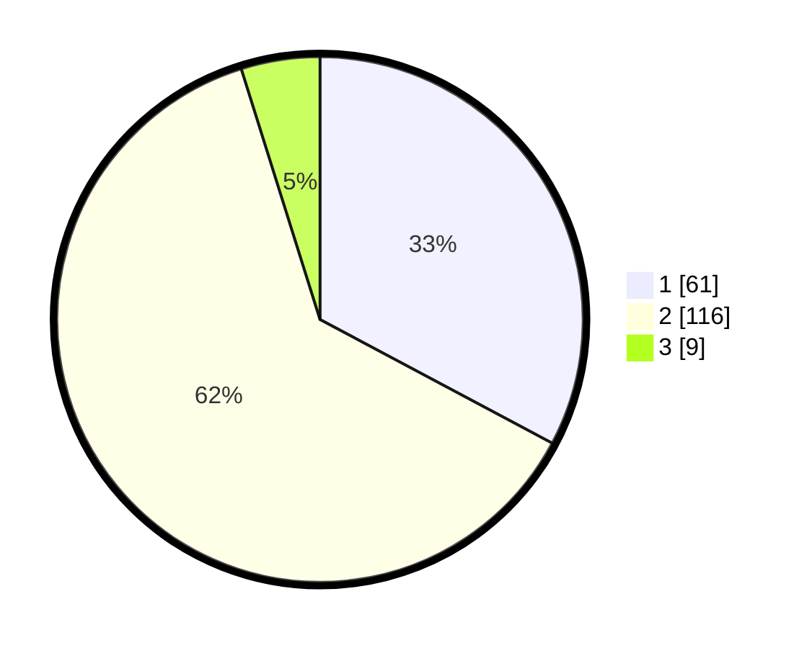

# Hasil

## Grafik

## Tabel

| No. | Nama Paslon    | Suara | Suara (raw) | Persentase |
|:--- |:-------------- | -----:| -----------:| ----------:|
| 1   | ANIES MUHAIMIN | 61    | [61][p-1]   | 32,80      |
| 2   | PRABOWO GIBRAN | 116   | [116][p-2]  | 62,37      |
| 3   | GANJAR MAHFUD  | 9     | [9][p-3]    | 4,84       |

[p-1]: https://github.com/gigit-pemilu/pemilu-2024/blob/main/pilpres/hitung-suara/sub/62-kalimantan-tengah/sub/03-kapuas/sub/02-kapuas-hilir/sub/1001-mambulau/sub/002-tps/sub/paslon-1.txt
[p-2]: https://github.com/gigit-pemilu/pemilu-2024/blob/main/pilpres/hitung-suara/sub/62-kalimantan-tengah/sub/03-kapuas/sub/02-kapuas-hilir/sub/1001-mambulau/sub/002-tps/sub/paslon-2.txt
[p-3]: https://github.com/gigit-pemilu/pemilu-2024/blob/main/pilpres/hitung-suara/sub/62-kalimantan-tengah/sub/03-kapuas/sub/02-kapuas-hilir/sub/1001-mambulau/sub/002-tps/sub/paslon-3.txt

## Foto C Plano

https://sirekap-obj-formc.kpu.go.id/aa29/pemilu/ppwp/62/03/02/10/01/6203021001002-20240214-222022--29801a7b-4058-4da9-9ad5-9e5b3298c20f.jpg

https://sirekap-obj-formc.kpu.go.id/aa29/pemilu/ppwp/62/03/02/10/01/6203021001002-20240214-214536--074be167-a6c3-4be9-9647-76f846200a6b.jpg

https://sirekap-obj-formc.kpu.go.id/aa29/pemilu/ppwp/62/03/02/10/01/6203021001002-20240214-202745--6438ce94-66f6-4071-8f75-b3108c5d4b11.jpg

## Metadata

| Key        | Value               |
| ---------- | ------------------- |
| Time Stamp | 2024-02-15 18:00:26 |

