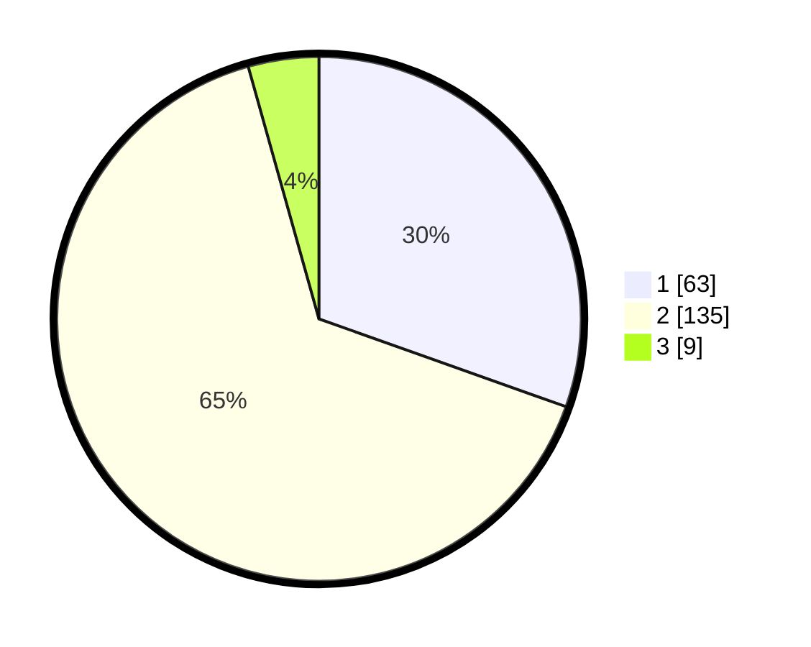

# Hasil

## Grafik

## Tabel

| No. | Nama Paslon    | Suara | Suara (raw) | Persentase |
|:--- |:-------------- | -----:| -----------:| ----------:|
| 1   | ANIES MUHAIMIN | 63    | [63][p-1]   | 30,43      |
| 2   | PRABOWO GIBRAN | 135   | [135][p-2]  | 65,22      |
| 3   | GANJAR MAHFUD  | 9     | [9][p-3]    | 4,35       |

[p-1]: https://github.com/gigit-pemilu/pemilu-2024-62-kalimantan-tengah/blob/main/pilpres/hitung-suara/sub/62-kalimantan-tengah/sub/03-kapuas/sub/02-kapuas-hilir/sub/1001-mambulau/sub/003-tps/sub/paslon-1.txt
[p-2]: https://github.com/gigit-pemilu/pemilu-2024-62-kalimantan-tengah/blob/main/pilpres/hitung-suara/sub/62-kalimantan-tengah/sub/03-kapuas/sub/02-kapuas-hilir/sub/1001-mambulau/sub/003-tps/sub/paslon-2.txt
[p-3]: https://github.com/gigit-pemilu/pemilu-2024-62-kalimantan-tengah/blob/main/pilpres/hitung-suara/sub/62-kalimantan-tengah/sub/03-kapuas/sub/02-kapuas-hilir/sub/1001-mambulau/sub/003-tps/sub/paslon-3.txt

## Foto C Plano

https://sirekap-obj-formc.kpu.go.id/65b1/pemilu/ppwp/62/03/02/10/01/6203021001003-20240215-081957--ac459b15-13fc-4f05-a4db-e9ea9b01a559.jpg

https://sirekap-obj-formc.kpu.go.id/65b1/pemilu/ppwp/62/03/02/10/01/6203021001003-20240215-082210--5006d5f3-94a3-4ebb-86a4-07c529d83354.jpg

https://sirekap-obj-formc.kpu.go.id/65b1/pemilu/ppwp/62/03/02/10/01/6203021001003-20240215-082335--b99e8477-67c2-47a5-a90b-8be483e43949.jpg

## Metadata

| Key        | Value               |
| ---------- | ------------------- |
| Time Stamp | 2024-02-15 18:00:26 |

