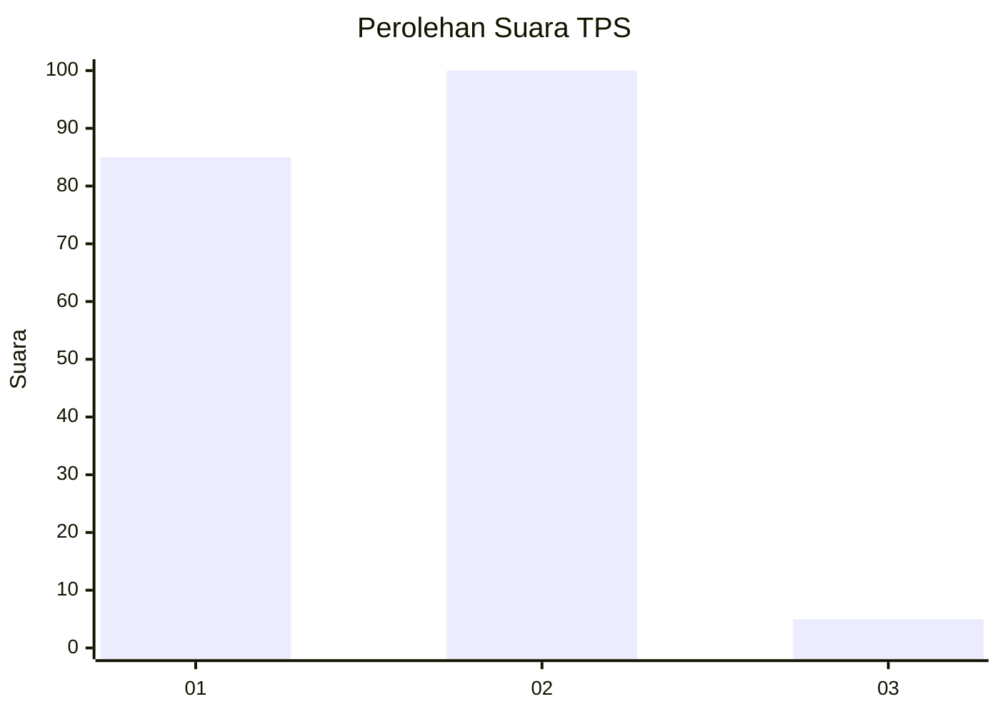
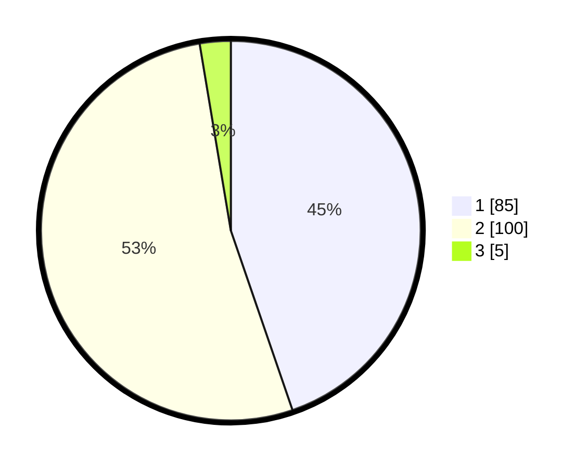

# Hasil

## Grafik

## Tabel

| No. | Nama Paslon    | Suara | Suara (raw) | Persentase |
|:--- |:-------------- | -----:| -----------:| ----------:|
| 1   | ANIES MUHAIMIN | 85    | [85][p-1]   | 44,74      |
| 2   | PRABOWO GIBRAN | 100   | [100][p-2]  | 52,63      |
| 3   | GANJAR MAHFUD  | 5     | [5][p-3]    | 2,63       |

[p-1]: https://github.com/gigit-pemilu/pemilu-2024-62-kalimantan-tengah/blob/main/pilpres/hitung-suara/sub/62-kalimantan-tengah/sub/03-kapuas/sub/02-kapuas-hilir/sub/1001-mambulau/sub/005-tps/sub/paslon-1.txt
[p-2]: https://github.com/gigit-pemilu/pemilu-2024-62-kalimantan-tengah/blob/main/pilpres/hitung-suara/sub/62-kalimantan-tengah/sub/03-kapuas/sub/02-kapuas-hilir/sub/1001-mambulau/sub/005-tps/sub/paslon-2.txt
[p-3]: https://github.com/gigit-pemilu/pemilu-2024-62-kalimantan-tengah/blob/main/pilpres/hitung-suara/sub/62-kalimantan-tengah/sub/03-kapuas/sub/02-kapuas-hilir/sub/1001-mambulau/sub/005-tps/sub/paslon-3.txt

## Foto C Plano

https://sirekap-obj-formc.kpu.go.id/05bc/pemilu/ppwp/62/03/02/10/01/6203021001005-20240217-205532--cd755393-79bc-4dc1-b5c6-fb69e6d331ef.jpg

https://sirekap-obj-formc.kpu.go.id/05bc/pemilu/ppwp/62/03/02/10/01/6203021001005-20240214-201122--a071bb01-c102-4f7b-84e9-b68d55bd8de1.jpg

https://sirekap-obj-formc.kpu.go.id/05bc/pemilu/ppwp/62/03/02/10/01/6203021001005-20240214-201214--6b6eb42c-37e1-4528-8bfd-21163861aeb1.jpg

## Metadata

| Key        | Value               |
| ---------- | ------------------- |
| Time Stamp | 2024-02-19 06:16:00 |

