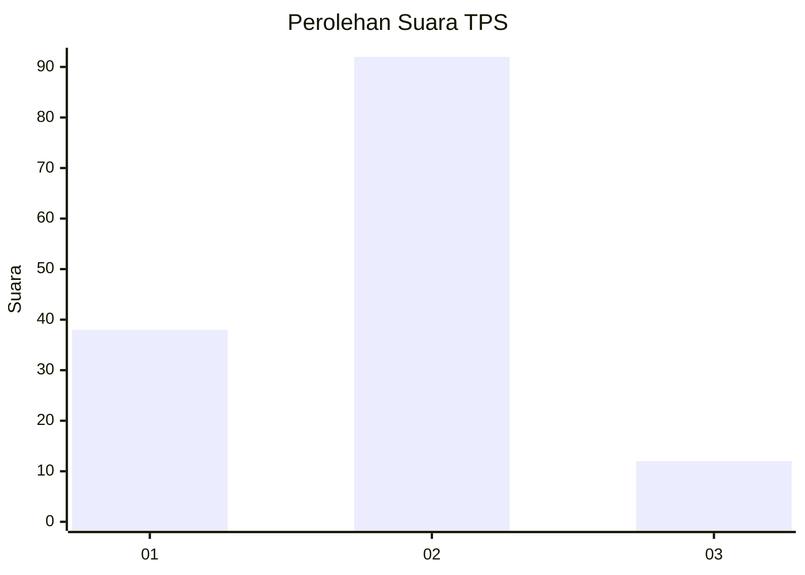
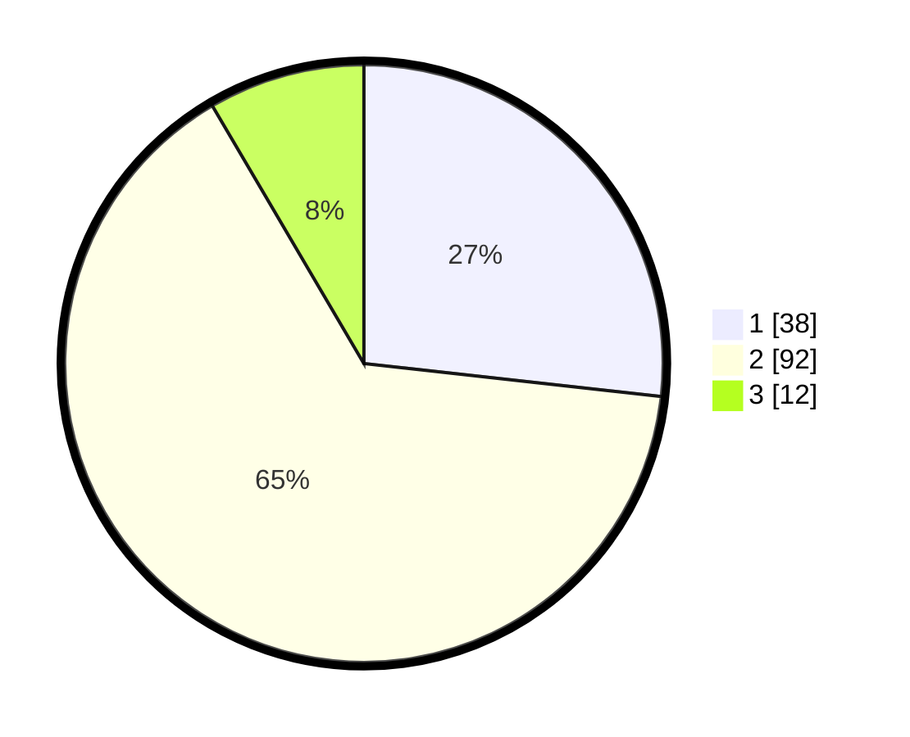

# Hasil

## Grafik

## Tabel

| No. | Nama Paslon    | Suara | Suara (raw) | Persentase |
|:--- |:-------------- | -----:| -----------:| ----------:|
| 1   | ANIES MUHAIMIN | 38    | [38][p-1]   | 26,76      |
| 2   | PRABOWO GIBRAN | 92    | [92][p-2]   | 64,79      |
| 3   | GANJAR MAHFUD  | 12    | [12][p-3]   | 8,45       |

[p-1]: https://github.com/gigit-pemilu/pemilu-2024-62-kalimantan-tengah/blob/main/pilpres/hitung-suara/sub/62-kalimantan-tengah/sub/03-kapuas/sub/02-kapuas-hilir/sub/2008-saka-batur/sub/004-tps/sub/paslon-1.txt
[p-2]: https://github.com/gigit-pemilu/pemilu-2024-62-kalimantan-tengah/blob/main/pilpres/hitung-suara/sub/62-kalimantan-tengah/sub/03-kapuas/sub/02-kapuas-hilir/sub/2008-saka-batur/sub/004-tps/sub/paslon-2.txt
[p-3]: https://github.com/gigit-pemilu/pemilu-2024-62-kalimantan-tengah/blob/main/pilpres/hitung-suara/sub/62-kalimantan-tengah/sub/03-kapuas/sub/02-kapuas-hilir/sub/2008-saka-batur/sub/004-tps/sub/paslon-3.txt

## Foto C Plano

https://sirekap-obj-formc.kpu.go.id/9f69/pemilu/ppwp/62/03/02/20/08/6203022008004-20240215-060711--9a0a194d-b6f1-4a2c-8389-e03cec0de3d4.jpg

https://sirekap-obj-formc.kpu.go.id/9f69/pemilu/ppwp/62/03/02/20/08/6203022008004-20240215-061049--4b5cd6b0-ab0b-4a3e-8d4f-c31a5bc421b6.jpg

https://sirekap-obj-formc.kpu.go.id/9f69/pemilu/ppwp/62/03/02/20/08/6203022008004-20240215-061641--2094ee71-c3d5-459d-a257-92d8334f1bef.jpg

## Metadata

| Key        | Value               |
| ---------- | ------------------- |
| Time Stamp | 2024-02-15 15:30:25 |

