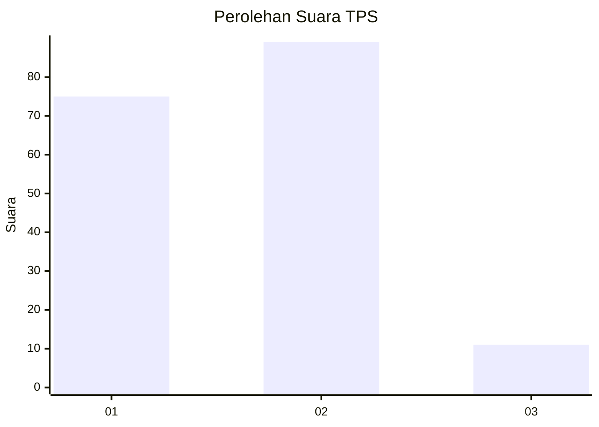
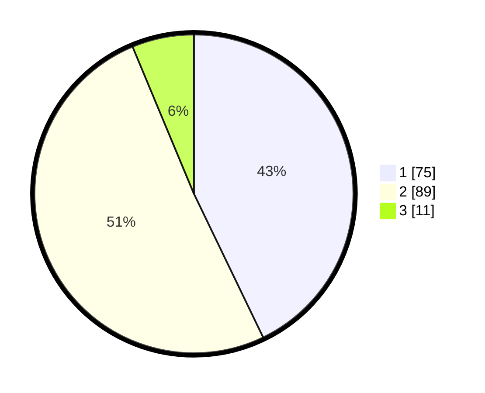

# Hasil

## Grafik

## Tabel

| No. | Nama Paslon    | Suara | Suara (raw) | Persentase |
|:--- |:-------------- | -----:| -----------:| ----------:|
| 1   | ANIES MUHAIMIN | 75    | [75][p-1]   | 42,86      |
| 2   | PRABOWO GIBRAN | 89    | [89][p-2]   | 50,86      |
| 3   | GANJAR MAHFUD  | 11    | [11][p-3]   | 6,29       |

[p-1]: https://github.com/gigit-pemilu/pemilu-2024-62-kalimantan-tengah/blob/main/pilpres/hitung-suara/sub/62-kalimantan-tengah/sub/03-kapuas/sub/03-kapuas-timur/sub/2001-anjir-serapat-timur/sub/001-tps/sub/paslon-1.txt
[p-2]: https://github.com/gigit-pemilu/pemilu-2024-62-kalimantan-tengah/blob/main/pilpres/hitung-suara/sub/62-kalimantan-tengah/sub/03-kapuas/sub/03-kapuas-timur/sub/2001-anjir-serapat-timur/sub/001-tps/sub/paslon-2.txt
[p-3]: https://github.com/gigit-pemilu/pemilu-2024-62-kalimantan-tengah/blob/main/pilpres/hitung-suara/sub/62-kalimantan-tengah/sub/03-kapuas/sub/03-kapuas-timur/sub/2001-anjir-serapat-timur/sub/001-tps/sub/paslon-3.txt

## Foto C Plano

https://sirekap-obj-formc.kpu.go.id/52aa/pemilu/ppwp/62/03/03/20/01/6203032001001-20240221-084102--d22f8631-9803-432a-8f45-ce592a1c7c99.jpg

https://sirekap-obj-formc.kpu.go.id/52aa/pemilu/ppwp/62/03/03/20/01/6203032001001-20240221-084214--63c6f223-5715-4da7-b5df-102d2ae449c1.jpg

https://sirekap-obj-formc.kpu.go.id/52aa/pemilu/ppwp/62/03/03/20/01/6203032001001-20240221-084140--ca4fda7a-8d78-4b58-9651-b5c663bf2fc2.jpg

## Metadata

| Key        | Value               |
| ---------- | ------------------- |
| Time Stamp | 2024-02-25 14:00:00 |

