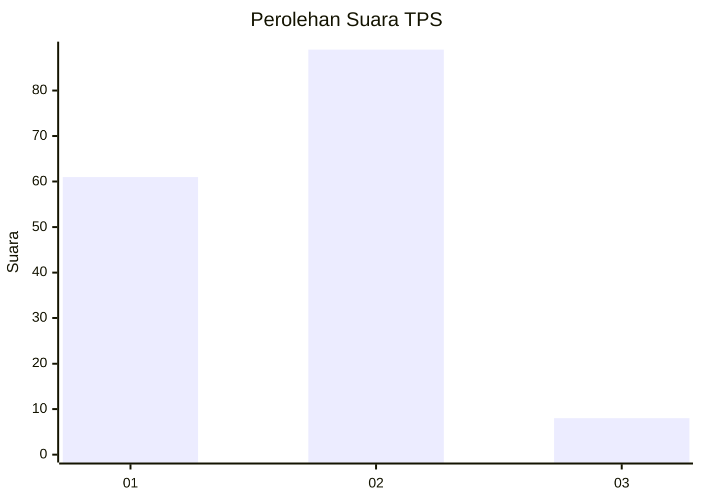
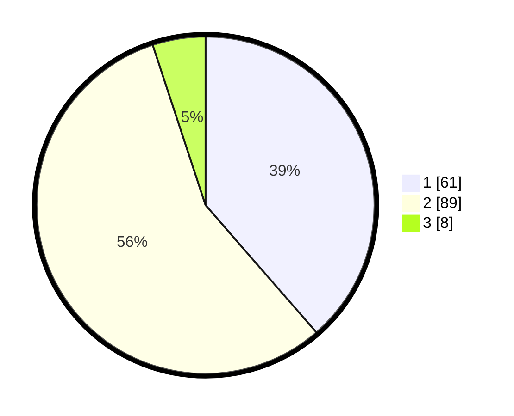

# Hasil

## Grafik

## Tabel

| No. | Nama Paslon    | Suara | Suara (raw) | Persentase |
|:--- |:-------------- | -----:| -----------:| ----------:|
| 1   | ANIES MUHAIMIN | 61    | [61][p-1]   | 38,61      |
| 2   | PRABOWO GIBRAN | 89    | [89][p-2]   | 56,33      |
| 3   | GANJAR MAHFUD  | 8     | [8][p-3]    | 5,06       |

[p-1]: https://github.com/gigit-pemilu/pemilu-2024-62-kalimantan-tengah/blob/main/pilpres/hitung-suara/sub/62-kalimantan-tengah/sub/03-kapuas/sub/03-kapuas-timur/sub/2001-anjir-serapat-timur/sub/002-tps/sub/paslon-1.txt
[p-2]: https://github.com/gigit-pemilu/pemilu-2024-62-kalimantan-tengah/blob/main/pilpres/hitung-suara/sub/62-kalimantan-tengah/sub/03-kapuas/sub/03-kapuas-timur/sub/2001-anjir-serapat-timur/sub/002-tps/sub/paslon-2.txt
[p-3]: https://github.com/gigit-pemilu/pemilu-2024-62-kalimantan-tengah/blob/main/pilpres/hitung-suara/sub/62-kalimantan-tengah/sub/03-kapuas/sub/03-kapuas-timur/sub/2001-anjir-serapat-timur/sub/002-tps/sub/paslon-3.txt

## Foto C Plano

https://sirekap-obj-formc.kpu.go.id/e6e1/pemilu/ppwp/62/03/03/20/01/6203032001002-20240221-084616--7b90a2d4-6a24-4af4-892a-08d4a6109d53.jpg

https://sirekap-obj-formc.kpu.go.id/e6e1/pemilu/ppwp/62/03/03/20/01/6203032001002-20240221-084649--2b4a5fee-0429-466f-beca-540c4e0d3f46.jpg

https://sirekap-obj-formc.kpu.go.id/e6e1/pemilu/ppwp/62/03/03/20/01/6203032001002-20240221-084721--7dedd740-dc12-4885-97ce-f9089e8d9ad3.jpg

## Metadata

| Key        | Value               |
| ---------- | ------------------- |
| Time Stamp | 2024-02-25 14:00:00 |

